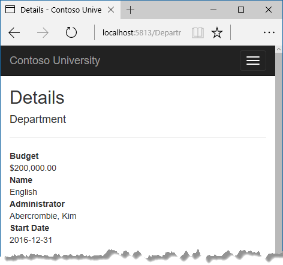
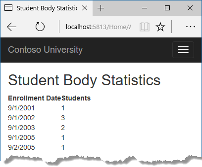
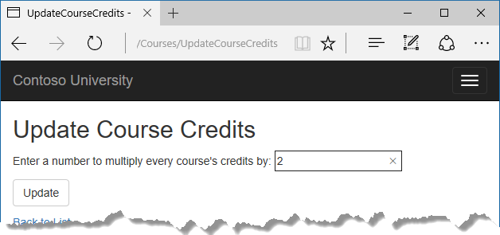
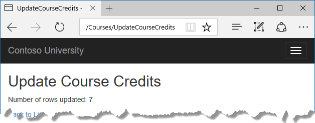

# 高级主题
Contoso 大学示例 Web 应用程序演示如何使用实体框架（EF）Core 2.0 和 Visual Studio 2017 创建 ASP.NET Core 2.0 MVC Web 应用程序。 如欲了解更多本教程相关信息，请参阅 [一、入门](./chapters/start.md)。  
在前面的教程中，您实现了 Table-per-Hierarchy 继承。 本教程介绍几个有用的知识点，当您掌握如何使用 Entity Framework Core 开发 ASP.NET Core Web 应用并进行部署的基础知识后， 需要了解这些主题。
### 原始 SQL 查询
使用 Entity Framework 的优点之一是，它避免了将代码绑定到一个特定的数据存储方法。它通过为您生成 SQL 查询和命令来实现这一点，同时将你从SQL查询编写中解放出来。但是，总有一些意外的场景需要你运行手动创建的 SQL 查询。 对于这些场景，EF Code First API 包含有让您能够将 SQL 命令直接传递到数据库的方法。 在 EF Core 1 中有以下选项。
* 使用 `Dbset.FromSql` 返回实体类型的查询方法。 返回的对象必须是 Dbset 对象期待的类型，然后这些数据将自动被数据上下文(Database Context)进行跟踪，除非你手动 [关闭跟踪](https://docs.microsoft.com/en-us/aspnet/core/data/ef-mvc/crud#no-tracking-queries)。
* 使用 `Database.ExecuteSqlCommand` 执行无查询结果返回的命令。  
如果你需要运行的查询返回类型不是实体类型，你可以通过 EF 提供的数据库连接使用 ADO.NET 。 返回的数据将不会被数据库上下文跟踪，即使你使用此方法检索实体类型。
在 Web 应用程序中执行 SQL 命令时总是如此，您必须采取预防措施来保护您的站点免受 SQL 注入攻击。 一种方法是使用参数化查询来确保网页提交的字符串不能被解释为 SQL 命令。 在本教程中，您将在把用户输入集成到查询中时使用参数化查询。
### 调用返回实体的查询
`DbSet<Tentity>` 类提供了一种方法，可以使用该方法执行返回类型为 TEntity 实体的查询。 想要看它是如何工作的，你可以通过更改 Department 控制器的 Details 方法中的代码来进行。
在 DepartmentsController.cs 文件， Details 方法中，用 FromSql 方法调用替换检索部门的代码，如以下突出显示的代码所示：
``` cs
public async Task<IActionResult> Details(int? id)
{
    if (id == null)
    {
        return NotFound();
    }

    string query = "SELECT * FROM Department WHERE DepartmentID = {0}";
    var department = await _context.Departments
        .FromSql(query, id)
        .Include(d => d.Administrator)
        .AsNoTracking()
        .SingleOrDefaultAsync();

    if (department == null)
    {
        return NotFound();
    }

    return View(department);
}
```
为验证新代码是否工作正常，请选择 Deparment 菜单，然后点击其中任一部门的 Detail 链接。  
  
### 调用返回其他类型的查询
之前，您为关于页面创建了一个学生统计表格，显示每个日期的学生注册人数。 您从学生实体集合（_context.Students）获得了数据，并使用 LINQ 将结果投影到 EnrollmentDateGroup 视图模型对象列表中。 现在假设你不想使用 LINQ 而想直接编写 SQL 。要做到这一点，你需要运行一个 SQL 查询，返回一些并非实体对象的东西。 在 EF Core 1.0 中，一种方法是从 EF 获取数据库连接并编写 ADO.NET 代码。
在 HomeController.cs 中，用下面的代码替换 About 方法：
``` cs
public async Task<ActionResult> About()
{
    List<EnrollmentDateGroup> groups = new List<EnrollmentDateGroup>();
    var conn = _context.Database.GetDbConnection();
    try
    {
        await conn.OpenAsync();
        using (var command = conn.CreateCommand())
        {
            string query = "SELECT EnrollmentDate, COUNT(*) AS StudentCount "
                + "FROM Person "
                + "WHERE Discriminator = 'Student' "
                + "GROUP BY EnrollmentDate";
            command.CommandText = query;
            DbDataReader reader = await command.ExecuteReaderAsync();

            if (reader.HasRows)
            {
                while (await reader.ReadAsync())
                {
                    var row = new EnrollmentDateGroup { EnrollmentDate = reader.GetDateTime(0), StudentCount = reader.GetInt32(1) };
                    groups.Add(row);
                }
            }
            reader.Dispose();
        }
    }
    finally
    {
        conn.Close();
    }
    return View(groups);
}
```
添加了一行 using 声明：
``` cs
using System.Data.Common;
```
运行应用并转到关于页面。 它显示与以前一样的数据。  
  
### 调用更新查询
假设 Contoso 大学的管理员希望在数据库中执行全局更改，例如更改每门课程的学分数。 如果大学有大量的课程，将它们全部作为实体进行检索并单独进行更改将是低效的。 在本节中，您将实现一个网页，使用户能够指定一个因子来更改所有课程的学分数，然后通过执行 SQL UPDATE 语句来进行更改。 该网页如下图所示：  
  
在 CoursesContoller.cs 中，为 HttpGet 和 HttpPost 添加 UpdateCourseCredits 方法：
``` cs
public IActionResult UpdateCourseCredits()
{
    return View();
}

[HttpPost]
public async Task<IActionResult> UpdateCourseCredits(int? multiplier)
{
    if (multiplier != null)
    {
        ViewData["RowsAffected"] = 
            await _context.Database.ExecuteSqlCommandAsync(
                "UPDATE Course SET Credits = Credits * {0}",
                parameters: multiplier);
    }
    return View();
}
```
当控制器处理 HttpGet 请求时，ViewData [“RowsAffected”] 中将不返回任何内容，视图显示一个空的文本框和一个提交按钮，如上图所示。  
当点击 Update 按钮时，HttpPost 方法被调用， 参数 multiplier 得到文本框中输入的值。 然后代码执行 SQL 更新 Courses 数据表，并将受影响的行数返回到 ViewData 供视图使用。 当视图获得 RowsAffected 值时，显示更新的行数。  
在解决方案资源管理器中，右键单击 Views/Courses 文件夹，然后单击 添加>新建项。
在 添加新项 对话框中， 点击左侧面板中 “已安装” 下的 “ASP.NET"， 再点击 "MVC View Page (中文：MVC 视图页)"，并为新视图命名 UpdateCourseCredits.cshtml 。
在 Views/Courses/UpdateCourseCredits.cshtml 中，用以下代码替换模板代码：
``` html
@{
    ViewBag.Title = "UpdateCourseCredits";
}

<h2>Update Course Credits</h2>

@if (ViewData["RowsAffected"] == null)
{
    <form asp-action="UpdateCourseCredits">
        <div class="form-actions no-color">
            <p>
                Enter a number to multiply every course's credits by: @Html.TextBox("multiplier")
            </p>
            <p>
                <input type="submit" value="Update" class="btn btn-default" />
            </p>
        </div>
    </form>
}
@if (ViewData["RowsAffected"] != null)
{
    <p>
        Number of rows updated: @ViewData["RowsAffected"]
    </p>
}
<div>
    @Html.ActionLink("Back to List", "Index")
</div>
```
通过点击 Courses 链接，然后在地址栏 URL 后面加入 `/UpdateCourseCredits` (例如: http://localhost:5813/Courses/UpdateCourseCredits) 的方法可以运行 UpdateCourseCredits 方法。 在文本框中输入一个数字：  
  
点击 Update 。 你可以看到受影响的行数：  
  
点击 Back to List 查看修改学分后的课程列表。  
请注意，在生产代码中，须确保更新总是确保数据是有效的。 此处的简化代码可能导致学分数字大于 5 （通常学分有一个固定范围 0-5 ）。 更新查询将可以正常工作，但无效的数据可能将导致系统的其他部分产生意外的结果（因为预先假设学分应该在 0-5 之间）。  
有关如何使用原始 SQL 查询的信息， 请参阅 [Raw SQL Queries](https://docs.microsoft.com/ef/core/querying/raw-sql) 。
### 检查发送到数据库的 SQL 语句
有时能够看到发送到数据库的实际 SQL 查询会很有帮助。 EF Core 自动使用 ASP.NET Core 内置的日志记录功能记录查询和更新中包含的 SQL 日志。 在本节中，您将看到一些SQL 日志记录的例子。  
打开 StudentsController.cs 并在 Details 方法 `if (student == null)` 语句上设置一个断点。
在 Debug 模式下运行应用程序， 并转至 `学生` 的 `详细` 页面。
转到输出显示调试窗口输出，你可以看到对应的查询语句：
``` sql
Microsoft.EntityFrameworkCore.Database.Command:Information: Executed DbCommand (56ms) [Parameters=[@__id_0='?'], CommandType='Text', CommandTimeout='30']
SELECT TOP(2) [s].[ID], [s].[Discriminator], [s].[FirstName], [s].[LastName], [s].[EnrollmentDate]
FROM [Person] AS [s]
WHERE ([s].[Discriminator] = N'Student') AND ([s].[ID] = @__id_0)
ORDER BY [s].[ID]
Microsoft.EntityFrameworkCore.Database.Command:Information: Executed DbCommand (122ms) [Parameters=[@__id_0='?'], CommandType='Text', CommandTimeout='30']
SELECT [s.Enrollments].[EnrollmentID], [s.Enrollments].[CourseID], [s.Enrollments].[Grade], [s.Enrollments].[StudentID], [e.Course].[CourseID], [e.Course].[Credits], [e.Course].[DepartmentID], [e.Course].[Title]
FROM [Enrollment] AS [s.Enrollments]
INNER JOIN [Course] AS [e.Course] ON [s.Enrollments].[CourseID] = [e.Course].[CourseID]
INNER JOIN (
    SELECT TOP(1) [s0].[ID]
    FROM [Person] AS [s0]
    WHERE ([s0].[Discriminator] = N'Student') AND ([s0].[ID] = @__id_0)
    ORDER BY [s0].[ID]
) AS [t] ON [s.Enrollments].[StudentID] = [t].[ID]
ORDER BY [t].[ID]
```
你会注意到一些可能让你感到意外的东西：SQL 从 Person 表中选择最多 2 行（TOP（2））。 SingleOrDefaultAsync 方法并不是解析为服务器上的一行。 原因如下：
* 如果查询可能返回多个行，该方法返回 null。
* 若要确定查询是否将返回多个行，EF 必须检查是否它返回至少为 2。
请注意，您不必使用调试模式并在断点处停止以在“输出”窗口中获取日志输出。这只是一个方便的方法来停止日志记录在你想看看输出点。 如果你不这样做，日志继续输出，你必须向前滚动滚动条才能找到你感兴趣的部分。
### 仓储和单元工作模式
许多开发人员编写代码来实现仓储和单元工作模式，作为与 Entity Framework 一起工作的包装器。 这些模式旨在创建应用程序中数据访问层和业务逻辑层之间的抽象层。实现这些模式可以帮助您将应用程序与数据存储区中的更改隔离开来，并且可以促进自动化单元测试或测试驱动开发（TDD）。但是，编写额外的代码来实现这些模式并不总使用 EF 开发应用程序的最佳选择，原因如下：
* EF 上下文类本身已经将你的代码与特定的数据存储代码分离开了。
* EF 上下文类也可以充当 `Unit of Work` 类来更新数据库。
* EF 包含实现 TDD 的特性，无需编写仓储库代码。
有关如何实现仓储和单元工作模式， 请参阅 [the Entity Framework 5 Version of this tutorial series.](https://docs.microsoft.com/aspnet/mvc/overview/older-versions/getting-started-with-ef-5-using-mvc-4/implementing-the-repository-and-unit-of-work-patterns-in-an-asp-net-mvc-application) 。
Entity Framework Core 实现了一个内存数据库提供程序。有关更多信息， 请参阅 [Testing with InMemory](https://docs.microsoft.com/ef/core/miscellaneous/testing/in-memory) 。
### 自动更改检测
实体框架通过将实体的当前值与原始值进行比较来确定实体如何改变（以及因此需要将哪些更新发送到数据库）。 原始值在实体被查询或附加时被存储。 一些导致自动更改检测的方法如下：
* DbContext.SaveChagnes
* DbContext.Entry
* ChangeTracker.Entries
如果您正在跟踪大量实体，并且您在循环中多次调用其中一个方法，则可以通过使用 ChangeTracker.AutoDetectChangesEnabled 属性临时关闭自动更改检测来显着提高性能。例如：
``` cs
_context.ChangeTracker.AutoDetectChangesEnabled = false;
```
### Entity Framework Core 源代码及开发计划
Entity Framework Core 的源代码托管在  [https://github.com/aspnet/EntityFrameworkCore](https://github.com/aspnet/EntityFrameworkCore) 。 源码仓库中包含 夜间构建， 问题跟踪， 功能规范， 设计会议记录以及未来发展的路线图。 你可以提交或发行错误，并作出贡献。
尽管源代码是开放的，但 Entity Framework Core 得到了微软的全面支持。 微软 Entity Framework Core 团队保持对贡献的控制，哪些可以被接受，并对所有的代码修改进行测试，以确保每个发行版的质量。
### 从现有数据库进行逆向工程
要从现有数据库中反向得到数据模型和实体类， 使用 `scaffold-dbcontext` 命令， 请参阅 [getting-started tutorial](https://docs.microsoft.com/ef/core/get-started/aspnetcore/existing-db)  / [入门教程](https://docs.microsoft.com/zh-cn/ef/core/get-started/aspnetcore/existing-db)。
### 使用 dynamic LINQ 来简化排序选择代码
在 [本教程第三章](./ofpg.md) 中， 展示了如何通过在 switch 语句中对列名进行硬编码来编写 LINQ 代码。 此处只有两列可供选择，可以正常工作，但当你有很多列时，代码可能会变得冗长。 为了解决这个问题，可以使用 EF.Property 方法以字符串的形式指定属性的名称。 要尝试这种方法，请使用以下代码替换 StudentsController 中的 Index 方法。
``` cs
public async Task<IActionResult> Index(
    string sortOrder,
    string currentFilter,
    string searchString,
    int? page)
{
    ViewData["CurrentSort"] = sortOrder;
    ViewData["NameSortParm"] = 
        String.IsNullOrEmpty(sortOrder) ? "LastName_desc" : "";
    ViewData["DateSortParm"] = 
        sortOrder == "EnrollmentDate" ? "EnrollmentDate_desc" : "EnrollmentDate";

    if (searchString != null)
    {
        page = 1;
    }
    else
    {
        searchString = currentFilter;
    }

    ViewData["CurrentFilter"] = searchString;

    var students = from s in _context.Students
                   select s;
    
    if (!String.IsNullOrEmpty(searchString))
    {
        students = students.Where(s => s.LastName.Contains(searchString)
                               || s.FirstMidName.Contains(searchString));
    }

    if (string.IsNullOrEmpty(sortOrder))
    {
        sortOrder = "LastName";
    }

    bool descending = false;
    if (sortOrder.EndsWith("_desc"))
    {
        sortOrder = sortOrder.Substring(0, sortOrder.Length - 5);
        descending = true;
    }

    if (descending)
    {
        students = students.OrderByDescending(e => EF.Property<object>(e, sortOrder));
    }
    else
    {
        students = students.OrderBy(e => EF.Property<object>(e, sortOrder));
    }

    int pageSize = 3;
    return View(await PaginatedList<Student>.CreateAsync(students.AsNoTracking(), 
        page ?? 1, pageSize));
}
```
### 后续步骤
本篇完成了 如何使用 Entity Framewrok Core 创建 ASP.NET MVC Web 应用程序 的教程。
如欲了解有关 EF Core 的更多信息， 请参阅 [Entity Framework Core 文档](https://docs.microsoft.com/ef/core) 。 还有一本书可供选择： [Entity Framework in Action](https://www.manning.com/books/entity-framework-core-in-action) 。
有关如何部署一个 WEB 应用，请参阅 [Host and depoly](https://docs.microsoft.com/en-us/aspnet/core/host-and-deploy/index) 。
与 ASP.NET Core MVC 相关的其他主题（如身份验证和授权）的信息，请参阅 [ASP.NET Core 文档](https://docs.microsoft.com/aspnet/core/)。
### 致谢
Tom Dykstra 和 Rick Anderson（twitter @RickAndMSFT）编写了这个教程。 Rowan Miller，Diego Vega 和 Entity Framework 团队的其他成员协助代码审查，并帮助调试
在编写教程代码时出现的问题。
### 常见错误
**ContosoUniversity.dll used by another process**
错误信息：
> Cannot open '...bin\Debug\netcoreapp1.0\ContosoUniversity.dll' for writing -- 'The process cannot access the file '...\bin\Debug\netcoreapp1.0\ContosoUniversity.dll' because it is being used by another process.  

解决方案：  
停止 IIS Express 中的站点。 找到 Windows 系统托盘中的 IIS Express ，右键点击图标，选择 Contoso University 站点，单击停止站点。  
**Migration scaffolded with no code in Up and Down methods** 
可能的原因：  
EF CLI 命令不会自动关闭和保存文件。 如果你在运行 migrations add 命令时有未保存的修改， EF 将找不到你所做的修改。
解决方案：
运行 `migrations remove` 命令， 保存你的代码修改，然后重新运行 `migrations add` 命令。
**Errors while running database update(运行数据库更新命令时出错)**  
在已有数据的数据库中进行架构更改，可能会发生其他错误。如果遇到无法解析的迁移错误，则可以更改连接字符串中的数据库名称或删除数据库。 使用新的数据库，不需要迁移任何数据，update-database 命令更可能完成而不会出错。  
最简单的方法是在appsettings.json中重命名数据库。 下一次运行数据库更新时，将创建一个新的数据库。  
要在 SSOX 中删除一个数据库， 右键点击数据库，单击 `删除` ， 在 `删除数据库` 对话框中选项关闭现有连接，然后单击 `确定` 。
若要使用 CLI 删除数据库，运行 `database drop` CLI 命令：
``` console
dotnet ef database drop
```
**Error locating SQL Server instance（无法定位SQL Server 实例）**
错误信息：
> A network-related or instance-specific error occurred while establishing a connection to SQL Server. The server was not found or was not accessible. Verify that the instance name is correct and that SQL Server is configured to allow remote connections. (provider: SQL Network Interfaces, error: 26 - Error Locating Server/Instance Specified)

解决方案：
检查连接字符串。 如果您手动删除了数据库文件，则更改构造字符串中的数据库名称以重建新的数据库。

