# 创建复杂的数据模型

Contoso 大学示例 Web 应用程序演示如何使用实体框架（EF）Core 2.0 和 Visual Studio 2017 创建 ASP.NET Core 2.0 MVC Web 应用程序。 如欲了解更多本教程相关信息，请参阅 [一、入门](./chapters/start.md)

在前面的教程中，您使用由三个实体组成的简单数据模型。 在本章中， 您将添加多个实体和关系，并将通过指定格式化、验证以及数据库映射规则来自定义数据模型。

完成时，实体类构成的完整数据模型如下图所示：

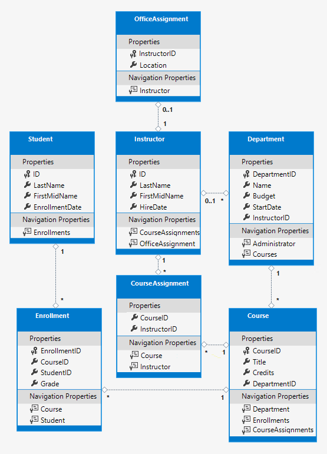

## 使用特性自定义数据模型

在本节中，你将了解如何通过使用指定格式设置，验证和数据库的映射规则的属性来自定义数据模型。 然后在接下来的几节中，通过添加特性到类中，以及添加新的类来完成完整的 School 数据模型。

#### ```DataType``` 特性（attribute）

对于学生注册日期，目前所有的网页同时显示日期和时间，虽然您关注的只是日期。通过使用数据注解特性，您可以只在一个地方进行代码更改，然后所有显示注册日期的格式将得到修正。 为了演示如何达成此目的，您将在 ```Student``` 类的 ```EnrollementDate``` 属性上添加一个 ```Attribute``` （特性）。

在 ```Models/Student.cs``` 中，添加 ```System.ComponentModel.DataAnnotations``` 命名空间的引用，并在 ```EnrollmentDate``` 属性上添加 ```DataType``` 和 ```DisplayFormat``` 特性，如下代码所示：

<pre>
using System;
using System.Collections.Generic;
<span style="background-color: #FF0;">using System.ComponentModel.DataAnnotations;</span>

namespace ContosoUniversity.Models
{
    public class Student
    {
        public int ID { get; set; }
        public string LastName { get; set; }
        public string FirstMidName { get; set; }

        <span style="background-color: #FF0;">[DataType(DataType.Date)]
        [DisplayFormat(DataFormatString = "{0:yyyy-MM-dd}", ApplyFormatInEditMode = true)]</span>
        public DateTime EnrollmentDate { get; set; }

        public ICollection<Enrollment> Enrollments { get; set; }
    }
}
</pre>

```DataType``` 特性用于指定更为准确的数据库类型。在这个例子中，我们只想跟踪日期，而不是日期和时间。 DataType 枚举中包含许多数据类型，例如 Date, Time, PhoneNumber, Currency, EmailAddress, 等等。应用程序还可通过 DataType 特性自动提供类型特定的功能。例如，可以为 DataType.EmailAddress 创建 mailto: 链接，并且可以在支持 HTML5 的浏览器中为 DataType.Date 提供日期选择器。 DataType 特性生成 HTML5 浏览器可以理解的 HTML 5 data- (发音为 data dash) 。 DataType 特性不提供任何验证。

DataType.Date 不指定显示日期的格式。 默认情况下，数据字段基于服务器 CultureInfo 的默认格式显示。

DisplayFormat 特性用于显式指定日期格式：

``` cs
[DisplayFormat(DataFormatString = "{0:yyyy-MM-dd}", ApplyFormatInEditMode = true)]
```

```ApplyFormatInEditMode``` 设置在文本框编辑模式下也应用数据格式。（有时候您可能不愿意在某些字段上实现 -- 例如，对于货币值，您可能不想在文本框编辑模式下出现货币符号。)

您可以单独使用 ```DisplayFormat``` 特性， 但通常情况下，同时使用 ```DataType``` 比较好。 ```DataType``` 特性传达的是数据的语义而不是如何在屏幕上显示，并提供了您无法从使用 ```Displayformat``` 中得到的好处：

* 浏览器可以启用 HTML5 功能 （例如显示一个日历控件、 区域设置对应的货币符号、 电子邮件链接，某些客户端输入验证，等等。）。

* 默认情况下，浏览器将根据区域设置采用正确的格式呈现数据。

有关详细信息，请参阅 [\<input> tag helper documentation](https://docs.microsoft.com/en-us/aspnet/core/mvc/views/working-with-forms#the-input-tag-helper) 。

运行应用程序，转到 Student Index 页，可以看到，Enrollment Date 字段不再显示时间。 其他使用 Student 模型的视图也一样。

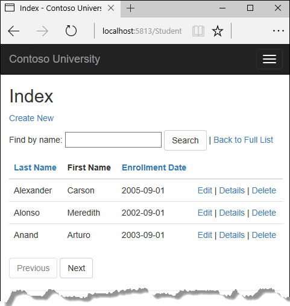

#### ```StringLength``` 特性

您还可以通过使用特性来指定数据验证规则及验证错误消息。 ```StringLength``` 特性设置在数据库中保存的最大长度，并为 ASP.NET MVC 应用提供客户端和服务端验证。 您还可以在这个特性中指定最小字符串长度，但最小值对数据库结构没有任何影响。

现在假设您想确保用户不能在名字中输入超过50个字符。 为了添加此限制， 在 ```LastName``` 和 ```FirstMidName``` 属性上添加 ```StringLength``` 特性，如下所示：

<pre>
using System;
using System.Collections.Generic;
using System.ComponentModel.DataAnnotations;

namespace ContosoUniversity.Models
{
    public class Student
    {
        public int ID { get; set; }

        <span style="background-color: #FF0;">[StringLength(50)]</span>
        public string LastName { get; set; }
        <span style="background-color: #FF0;">[StringLength(50, ErrorMessage = "First name cannot be longer than 50 characters.")]</span>
        public string FirstMidName { get; set; }
        

        [DataType(DataType.Date)]
        [DisplayFormat(DataFormatString = "{0:yyyy-MM-dd}", ApplyFormatInEditMode = true)]
        public DateTime EnrollmentDate { get; set; }

        public ICollection<Enrollment> Enrollments { get; set; }
    }
}
</pre>

```StringLength``` 特性并无法阻止用户在名字中输入空格。可以使用 ```RegularExpress``` （正则表达式）特性来限制输入。例如，下面的代码要求第一个字符是大写且其余的字符都是字母：

``` cs
[RegularExpression(@"^[A-Z]+[a-zA-Z''-'\s]*$")]
```

```MaxLength``` 特性提供了类似于 ```StringLength``` 特性的功能，但也没有提供客户端验证功能。

现在，数据模型已更改，并需要将此更改反映到数据库结构中。 您将使用迁移来更新数据库结构，同时不会丢失在使用应用程序过程中已经输入数据库的数据。

保存所做的更改并生成项目。 然后在项目文件夹中打开命令窗口并输入以下命令：

``` console
dotnet ef migrations add MaxLengthOnNames
```

``` console
dotnet ef database update
```

```migrations add``` 命令警告说可能发生数据丢失，因为更改导致两个数据列的最大长度变短。 迁移功能创建了一个名为 ```<时间戳>_MaxLengthOnNames.cs``` 的文件。 此文件中的 ```Up``` 方法将会更新数据库结构，以匹配当前数据模型。 ```database update``` 命令负责执行此代码。

Entity Framework 使用迁移文件名前的时间戳对迁移进行排序。 你可以在运行 update-database 命令前, 创建多个迁移，这样所有的迁移将按照创建顺序依次应用。

运行应用，转至 Student 页面，点击 Create New ， 并在 First Name 、Last Name 中输入超过 50 个字符。 当你单击创建，客户端验证显示一条错误消息。

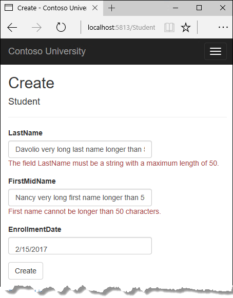

#### ```Column``` 特性

特性还可用于控制如何类和属性映射到数据库。假设你已将 FirstMidName 用于 first-name 字段（因为字段中还包含 middle name）。但同时你又希望数据库中的列名为 FirstName， 因为编写针对数据库查询的用户习惯于该名称。 使用 ```Column``` 特性可以达成此映射要求。

```Column``` 特性指定当创建数据库时，映射到 Student表的 FirstMidName 属性将被命名为 FirstName。 换句话说， 当你的代码引用 Student.FirstMidName时， 数据读和写都是发生在 Student 表的 FirstName 列。 如果未指定列名称，系统使用属性名作为列名。

在 Student.cs 文件中， 添加 System.ComponentModel.DataAnnotations.Schema 命名空间引用，并在 FirstMidName 属性添加 ```column``` 特性，如下代码中高亮所示：

<pre>
using System;
using System.Collections.Generic;
using System.ComponentModel.DataAnnotations;
<span style="background-color: #FF0;">using System.ComponentModel.DataAnnotations.Schema;</span>

namespace ContosoUniversity.Models
{
    public class Student
    {
        public int ID { get; set; }
        [StringLength(50)]
        public string LastName { get; set; }
        [StringLength(50, ErrorMessage = "First name cannot be longer than 50 characters.")]
        <span style="background-color: #FF0;">[Column("FirstName")]</span>
        public string FirstMidName { get; set; }
        [DataType(DataType.Date)]
        [DisplayFormat(DataFormatString = "{0:yyyy-MM-dd}", ApplyFormatInEditMode = true)]
        public DateTime EnrollmentDate { get; set; }

        public ICollection<Enrollment> Enrollments { get; set; }
    }
}
</pre>

```Column``` 特性的添加改变了 SchoolContext 的模型，导致与数据库不再匹配。

保存所做的更改并生成项目。 然后在项目文件夹中打开命令窗口并输入以下命令以创建另一个迁移：

``` console
dotnet ef migrations add ColumnFirstName
```

``` console
dotnet ef database update
```

在 SQL Server 对象资源管理器，通过双击 Student 表打开 Student 表设计视图。

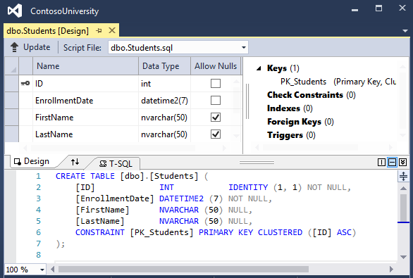

应用前两个迁移之前，FirstName 和 LastName 列为 nvarchar (max) 类型。 而现在是 nvarchar(50) 类型，并且相应的列从 FirstMidName 更改为 FirstName。

> ### 备注
> 如果您完成下列部分中创建的所有实体类之前尝试编译，可能会收到编译器错误。

## 最终的 Student 实体更改 

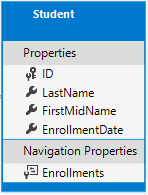

在 Models/Student.cs 文件中，替换早期代码为如下代码。其中有修改的部分以高亮显示。

<pre>
using System;
using System.Collections.Generic;
using System.ComponentModel.DataAnnotations;
using System.ComponentModel.DataAnnotations.Schema;

namespace ContosoUniversity.Models
{
    public class Student
    {
        public int ID { get; set; }
        <span style="background-color: #FF0;">[Required]</span>
        [StringLength(50)]
        <span style="background-color: #FF0;">[Display(Name = "Last Name")]</span>
        public string LastName { get; set; }
        <span style="background-color: #FF0;">[Required]</span>
        [StringLength(50, ErrorMessage = "First name cannot be longer than 50 characters.")]
        [Column("FirstName")]
        <span style="background-color: #FF0;">[Display(Name = "First Name")]</span>
        public string FirstMidName { get; set; }
        [DataType(DataType.Date)]
        [DisplayFormat(DataFormatString = "{0:yyyy-MM-dd}", ApplyFormatInEditMode = true)]
        <span style="background-color: #FF0;">[Display(Name = "Enrollment Date")]</span>
        public DateTime EnrollmentDate { get; set; }
        <span style="background-color: #FF0;">[Display(Name = "Full Name")]
        public string FullName
        {
            get
            {
                return LastName + ", " + FirstMidName;
            }
        }</span>

        public ICollection<Enrollment> Enrollments { get; set; }
    }
}
</pre>

#### ```Required``` 特性

```Required``` 特性使得名字属性成为必填字段。 无需为不可为空类型指定 ```Required``` 特性，如值类型（Datetime, int, double, float 等。）。 不可为空类型自动被视为必填字段。

您也可以移除 ```Require``` 特性，并代之以 ```StringLenght``` 特性中的一个最小长度参数。

``` cs
[Display(Name = "Last Name")]
[StringLength(50, MinimumLength=1)]
public string LastName { get; set; }
```

```Display``` 特性

```Display``` 特性指定文本框的标题应为 "First Name", "Last Name", "Full Name" 及 "Enrollment Date" 而不是使用属性名。（属性名单词中没有空格）。

#### FullName 计算属性

FullName 是一个计算属性， 由两个其他属性合并返回一个值。 因此它仅有一个 get 访问器，数据库中不会有 FullName 列生成。

## 创建 Instructor 实体

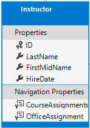

创建Models/Instructor.cs，并替换为以下代码：

```cs
using System;
using System.Collections.Generic;
using System.ComponentModel.DataAnnotations;
using System.ComponentModel.DataAnnotations.Schema;

namespace ContosoUniversity.Models
{
    public class Instructor
    {
        public int ID { get; set; }

        [Required]
        [Display(Name = "Last Name")]
        [StringLength(50)]
        public string LastName { get; set; }

        [Required]
        [Column("FirstName")]
        [Display(Name = "First Name")]
        [StringLength(50)]
        public string FirstMidName { get; set; }

        [DataType(DataType.Date)]
        [DisplayFormat(DataFormatString = "{0:yyyy-MM-dd}", ApplyFormatInEditMode = true)]
        [Display(Name = "Hire Date")]
        public DateTime HireDate { get; set; }

        [Display(Name = "Full Name")]
        public string FullName
        {
            get { return LastName + ", " + FirstMidName; }
        }

        public ICollection<CourseAssignment> CourseAssignments { get; set; }
        public OfficeAssignment OfficeAssignment { get; set; }
    }
}
```

注意到在 Student 和 Instructor 实体中有多个相同的属性。 在本系列教程的 [Implementing Inheritance] 中，您将重构此代码以消除冗余。

多个特性可以放在一行上， 因此你可以像下面这样写 HireDate 的特性。

``` cs
[DataType(DataType.Date),Display(Name = "Hire Date"),DisplayFormat(DataFormatString = "{0:yyyy-MM-dd}", ApplyFormatInEditMode = true)]    
```

### CourseAssignments 和 OfficeAssignment 导航属性

```CourseAssignments``` 和 ```OfficeAssignment``` 属性是导航属性。

一个 Instructor （教师）可以教授任意数量的 Course （课程），因此 ```CourseAssignments``` 定义为集合。

``` cs
public ICollection<CourseAssignment> CourseAssignments { get; set; }
```

如果导航属性可以包含多个实体，其类型必须是一个可以添加、删除和更新的实体列表。 您可以指定为 ICollection<T> 、List<T> 或者 HashSet<T> 类型。 如果您指定为 ICollection<T> 类型， EF 默认创建为一个 HashSet<T> 集合类型。

关于为何这是 CouseAssignment 实体集合，将在下面的多对多关系一节中详细阐述。

Contoso 大学的业务规则指出，一个 Instructor （教师）只能有最多一个 office （办公室），因此 OfficeAssignment 属性只包含一个 OfficeAssignment 实体 （在未分配办公室的情况下也可能为空）。

``` cs 
public OfficeAssignment OfficeAssignment { get; set; }
```

## 创建 OfficeAssignment 实体

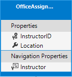

创建 Models/OfficeAssignment.cs 替换为以下代码：

```
using System.ComponentModel.DataAnnotations;
using System.ComponentModel.DataAnnotations.Schema;

namespace ContosoUniversity.Models
{
    public class OfficeAssignment
    {
        [Key]
        public int InstructorID { get; set; }
        [StringLength(50)]
        [Display(Name = "Office Location")]
        public string Location { get; set; }

        public Instructor Instructor { get; set; }
    }
}
```

#### ```Key``` 特性

在 Instructor 和 OfficeAssignment 实体间有一个 “一 对 零或一” 的关系。 一个 OfficeAssignment 实体只与分配给的 Instructor 有关系，因此其主键也同时是连接到 Instructor 实体的外键。 但是， Entity Framework 无法自动识别 InstructorID 作为此实体的主键，因为其名称未遵循 ID 或 <类名>ID 的命名约定。 因此，我们使用 ```Key``` 特性来标识 InstructorID 作为主键。

``` cs
[Key]
public int InstructorID { get; set; }
```

如果实体已经有主键，但你想要用不同于 <类名>ID 或 ID 的属性名的时候，你也可以使用 ```Key``` 特性。

默认情况下， EF 将 ```Key``` 处理为 non-database-generated （非数据库生成），因为此列是用于识别关系。

#### ```Instructor``` 导航属性

```Instructor``` 实体有一个可为空的 OfficeAssignment 导航属性（因为教师可能没有分配一个办公室）， ```OfficeAssignment``` 实体有一个不可为空的 ```Instructor``` 导航属性（当没有教师的时候，一个 OfficeAssignment - 办公室分配不可能存在 -- InstructorID 不可为空）。 当 Instructor 实体具有相关的 OfficeAssignment 实体时，两个实体都有一个指向对方的导航属性。

您可以在 ```Instructor``` 导航属性前加一个 ```Required``` 特性以指定必须有相关的 Instructor ， 但实际无需这样做，因为 InstructorID 外键 （同时也是此表的主键）本就是不可为空的。

## 修改 Course 实体

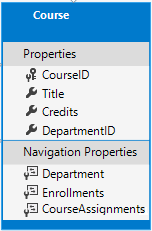

在 Models/Course.cs 文件中，使用如下代码替换之前的代码。 更改位置采用高亮显示。

<pre>
using System.Collections.Generic;
<span style="background-color: #FF0;">using System.ComponentModel.DataAnnotations;</span>
using System.ComponentModel.DataAnnotations.Schema;

namespace ContosoUniversity.Models
{
    public class Course
    {
        [DatabaseGenerated(DatabaseGeneratedOption.None)]
        <span style="background-color: #FF0;">[Display(Name = "Number")]</span>
        public int CourseID { get; set; }

        <span style="background-color: #FF0;">[StringLength(50, MinimumLength = 3)]</span>
        public string Title { get; set; }

        <span style="background-color: #FF0;">[Range(0, 5)]</span>
        public int Credits { get; set; }

        <span style="background-color: #FF0;">public int DepartmentID { get; set; }</span>

        <span style="background-color: #FF0;">public Department Department { get; set; }</span>
        public ICollection<Enrollment> Enrollments { get; set; }
        <span style="background-color: #FF0;">public ICollection<CourseAssignment> CourseAssignments { get; set; }</span>
    }
}
</pre>

```Course``` 实体有一个 DepartmentID 外键属性和一个 Department 导航属性用于指向相关的 Department 实体。

当您已经拥有相关实体的导航属性时， Entity Framework 不强求你一定要添加一个外键属性到数据模型中。 EF 可以在需要的时候自动在数据库中创建外键及外键的影子属性。 但是，数据模型中具有外键可以使更新更简单、 更高效。例如，当您提取一个 Course 实体用于编辑时， 如果你没有声明加载的话，Department 实体是空的，当您要更新 Course 实体时，您将需要先读取 Department 实体。 如果外键属性 DepartmentID 包含在数据模型中，则您无需在更新前读取 Department 实体。

#### ```DatabaseGenerated``` 特性

在 CourseID 属性上标注的 ```DatabaseGenerated``` 特性与 ```None``` 参数指定主键值有用户而不是数据库生成。

```cs 
[DatabaseGenerated(DatabaseGeneratedOption.None)]
[Display(Name = "Number")]
public int CourseID { get; set; }
```

默认情况下，实体框架假定主键值都由数据库生成。 这是大部分情况下您希望的。但是，对于 Course 实体， 您将使用一个用户指定的课程号码，比如 1000 系列用于一个部门，2000 系列用于另外一个部门，依此类推。

```DatabaseGenerated``` 特性也可用于生成默认值， 比如在数据库中用于记录数据行创建或更新日期的列。有关详细信息，请参阅  [Generated Properties] 。

#### 外键和导航属性

Course 实体中的外键属性和导航属性反映了以下关系：

一个课程将分配到一个部门，如上面提到的一样，这儿有一个 DepartmentID 外键和一个 Department 导航属性。

``` cs
public int DepartmentID { get; set; }
public Department Department { get; set; }
```

一个课程可以有任意多的学生注册， 因此 Enrollments 导航属性是个集合：

``` cs
public ICollection<Enrollment> Enrollments { get; set; }
```

一个课程可能由多个教师执教，因此 CourseAssignments 导航属性是个集合（CourseAssignment 类型稍后解释）。

``` cs
public ICollection<CourseAssignment> CourseAssignments { get; set; }
```

## 创建 Department 实体

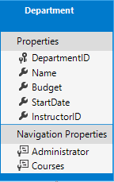

创建 Models/Department.cs 并替换为以下代码：

``` cs
using System;
using System.Collections.Generic;
using System.ComponentModel.DataAnnotations;
using System.ComponentModel.DataAnnotations.Schema;

namespace ContosoUniversity.Models
{
    public class Department
    {
        public int DepartmentID { get; set; }

        [StringLength(50, MinimumLength = 3)]
        public string Name { get; set; }

        [DataType(DataType.Currency)]
        [Column(TypeName = "money")]
        public decimal Budget { get; set; }

        [DataType(DataType.Date)]
        [DisplayFormat(DataFormatString = "{0:yyyy-MM-dd}", ApplyFormatInEditMode = true)]
        [Display(Name = "Start Date")]
        public DateTime StartDate { get; set; }

        public int? InstructorID { get; set; }

        public Instructor Administrator { get; set; }
        public ICollection<Course> Courses { get; set; }
    }
}
```

#### ```Column``` 特性

早前您使用 Column 特性更改列名映射。在 Department 实体代码中， Column 特性用于更改 SQL 数据类型映射，以便此列在数据库中使用 SQL Server 的 money 类型。

``` cs
[Column(TypeName="money")]
public decimal Budget { get; set; }
```

列映射通常并无必要， 因为 Entity Framework 会基于您给属性定义的 CLR 类型，为您选择适合的 SQL Server 数据类型。 CLR decimal 类型映射到 SQL Server 的 deccimal 类型。 不过，本例中，您指定此列将用于保存货币金额，money 数据类型更为合适。

#### 外键和导航属性

外键和导航属性反映了以下关系：

一个部门可以有或者没有管理员，一个管理员总是一个教师。因此 InstructorID 属性用于指向 Instructor 实体的外键，```int``` 后面的 ```?``` 表示这个属性是可为空属性。 导航属性命名为 Administrator 但实际上包含的是 Instructor 实体。

``` cs
public int? InstructorID { get; set; }
public Instructor Administrator { get; set; }
```

一个部门可能有多个课程，因此有一个 Course 导航属性：
``` cs
public ICollection<Course> Courses { get; set; }
```

> ### 备注
> 按照约定，Entity Framework 对不为空外键和多对多关系实施级联删除。 这可能导致循环的级联删除规则，当您添加一个迁移时，会引发异常。 例如，如果您定义 Department.InstructorID 属性可为空， EF 会配置一个级联删除规则，用于删除部门， 而这并不是您所希望发生的。 如果您的业务规则要求 InstructorID 属性不可为空，那么您必须使用如下的 fluent API 语句来禁用关系上的级联删除规则。
> ``` cs
> modelBuilder.Entity<Department>()
>   .HasOne(d => d.Administrator)
>   .WithMany()
>   .OnDelete(DeleteBehavior.Restrict)
> ```

## 修改 Enrollment 实体

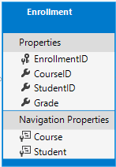

在 Models/Enrollment.cs 文件中，使用以下代码替换之前的代码：

<pre>
<span style="background-color: #FF0;">using System.ComponentModel.DataAnnotations;
using System.ComponentModel.DataAnnotations.Schema;</span>

namespace ContosoUniversity.Models
{
    public enum Grade
    {
        A, B, C, D, F
    }

    public class Enrollment
    {
        public int EnrollmentID { get; set; }
        public int CourseID { get; set; }
        public int StudentID { get; set; }
        <span style="background-color: #FF0;">[DisplayFormat(NullDisplayText = "No grade")]</span>
        public Grade? Grade { get; set; }

        public Course Course { get; set; }
        public Student Student { get; set; }
    }
}
</pre>

#### 外键和导航属性

外键属性和导航属性反映了以下关系：

一个注册记录只对应一个课程， 因此这儿有一个 CourseID 外键属性和一个 Course 导航属性。

``` cs
public int CourseID { get; set; }
public Course Course { get; set; }
```

一个注册记录只对应一个学生， 因此这儿有一个 StudentID 外键属性和一个 Student 导航属性。

``` cs
public int StudentID { get; set; }
public Student Student { get; set; }
```

## 多对多关系

在 Student 和 Course 实体间，存在着一个多对多的关系， Enrollment 实体作为一个多对多的关联表在数据库中承载关系及相关信息。承载相关信息意味着 Enrollment 数据表除了包含关联表的外键之外，还包含其他数据。（在这里，包含一个主键和一个年级属性）

下图在一个实体关系图表中展示这些关系。（这个关系图表使用 Entity Framework Power Tools for EF 6.x 生成； 创建关系图表不在本教程范围内，此处关系图表仅用于展示用途。）

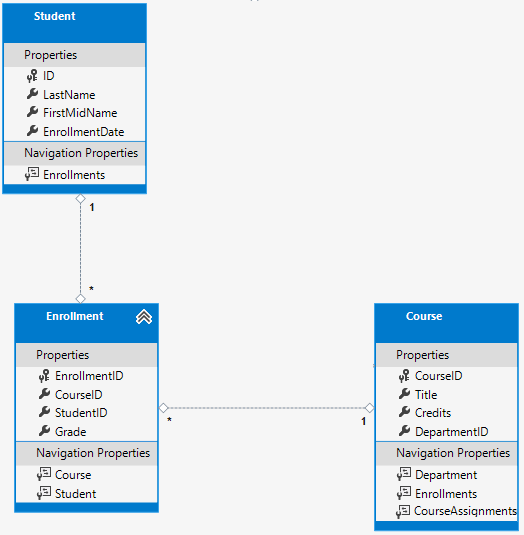

Each relationship line has a 1 at one end and an asterisk (*) at the other, indicating a one-to-many relationship.

每一条关系连线都有一端显示 ```1``` 和另外一端显示 ```*``` ，以表明这是一个一对多的关系。

If the Enrollment table didn't include grade information, it would only need to contain the two foreign keys CourseID and StudentID. In that case, it would be a many-to-many join table without payload (or a pure join table) in the database. The Instructor and Course entities have that kind of many-to-many relationship, and your next step is to create an entity class to function as a join table without payload.

假设 Enrollment 表不包括年级信息，只需要包含两个外键 CourseID 和 StudentID 。 在这种情况下， 它将是一个没有有效负载的多对多关联表（或者说是一个纯粹的关联表）。 Instructor 和 Course 实体就具有这种多对多关系， 您下一步就将创建一个没有有效负载的实体类充当关联表。

（EF 6.x 支持隐式多对多关联表，但 EF Core 不支持。 有关详细信息，请参阅 [discussion in the EF Core GitHub repository](https://github.com/aspnet/EntityFramework/issues/1368) 。）

## ```CourseAssignment``` 实体

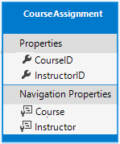

使用如下代码创建 Models/CourseAssignment.cs 文件：

``` cs
using System;
using System.Collections.Generic;
using System.ComponentModel.DataAnnotations;
using System.ComponentModel.DataAnnotations.Schema;

namespace ContosoUniversity.Models
{
    public class CourseAssignment
    {
        public int InstructorID { get; set; }
        public int CourseID { get; set; }
        public Instructor Instructor { get; set; }
        public Course Course { get; set; }
    }
}
```

#### 关联实体名称

在数据库中需要有一个关联表用于 Instructor <-> Courses 的多对多关系， 并且以实体集合方式体现。 常规做法是命名一个关联实体 EntityName1EntityName2， 在这里就是 CourseInstructor 。 但是， 我们建议您选择一个可以描述这种关系的名称。 数据模型一开始总是简单的，然后逐步增长，从不需要有效负载的纯关联表到需要有效负载。理想状态下，关联实体将在业务领域中拥有其自然名称。例如，书籍(Books)和客户(Customers)之间可以通过评分(Ratings)进行关联。 对于当前这个关系， CourseAssignment 是一个比 CourseInstructor 更好的选择。

#### 复合键

由于外键不可为空，并且唯一的标识每一个数据行，这儿无需一个另外的主键。 InstructorID 和 CourseID 属性可以充当复合主键。 在 EF 中标识复合主键的唯一方式是使用 Fluent API 方式 （无法通过特性标注实现）。在下一节中您将看到如何配置复合主键。

复合主键确保了当你有多个行对应一个课程，以及多个行对应一个教师，同时又可以避免出现多个行对应同一个教师同一个课程的情况出现。 Enrollment 关联实体定义了自身的主键， 因此可能会出现这种重复项。 若要防止此类重复的存在，您可以在外键字段上添加唯一索引，或者配置 Enrollment 使用类似于 CourseAssignment 的复合主键。 有关详细信息，请参阅 [Index （索引）](https://docs.microsoft.com/ef/core/modeling/indexes) 。

## 更新数据库上下文

在 Data/SchoolContext.cs 文件中， 添加如下高亮显示的代码：

<pre>
using ContosoUniversity.Models;
using Microsoft.EntityFrameworkCore;

namespace ContosoUniversity.Data
{
    public class SchoolContext : DbContext
    {
        public SchoolContext(DbContextOptions<SchoolContext> options) : base(options)
        {
        }

        public DbSet<Course> Courses { get; set; }
        public DbSet<Enrollment> Enrollments { get; set; }
        public DbSet<Student> Students { get; set; }
<span style="background-color: #FF0;">        public DbSet<Department> Departments { get; set; }
        public DbSet<Instructor> Instructors { get; set; }
        public DbSet<OfficeAssignment> OfficeAssignments { get; set; }
        public DbSet<CourseAssignment> CourseAssignments { get; set; }</span>

        protected override void OnModelCreating(ModelBuilder modelBuilder)
        {
            modelBuilder.Entity<Course>().ToTable("Course");
            modelBuilder.Entity<Enrollment>().ToTable("Enrollment");
            modelBuilder.Entity<Student>().ToTable("Student");
            <span style="background-color: #FF0;">
            modelBuilder.Entity<Department>().ToTable("Department");
            modelBuilder.Entity<Instructor>().ToTable("Instructor");
            modelBuilder.Entity<OfficeAssignment>().ToTable("OfficeAssignment");
            modelBuilder.Entity<CourseAssignment>().ToTable("CourseAssignment");

            modelBuilder.Entity<CourseAssignment>()
                .HasKey(c => new { c.CourseID, c.InstructorID });</span>
        }
    }
}
</pre>

这些代码添加了新的实体，并配置 CourseAssignment 实体的复合主键。

## 使用 Fluent API 代替 attributes （特性）

DbContext 类中的 OnModelCreating 方法使用 fluent API 配置 EF 的行为。 之所以将这些 API 称为 fluent（流畅的），因为通常用于将多个方法连接成为一条语句，比如下面这个来自 [EF Core documentation](https://docs.microsoft.com/ef/core/modeling/#methods-of-configuration) 的例子：

``` cs
protected override void OnModelCreating(ModelBuilder modelBuilder)
{
    modelBuilder.Entity<Blog>()
        .Property(b => b.Url)
        .IsRequired();
}
```

在本教程中， 仅为不能使用特性标注的数据库映射使用 fluent API 。然而， 您也可以用 fluent API 指定大部分您可以使用特性实现的格式，验证和映射规则。 某些特性，如 MinimumLength 不能使用 fluent API 设定。 如前所述， MinimumLength 不会修改架构，而仅用于客户端和服务端验证规则。

有些开发人员中意排他的使用 fluent API 方式，这样可以保持实体类干净。 如果您愿意，可以混合使用特性和 fluent API 方式， 只有少数自定义项只能使用 fluent API 完成，但通常的做法是选择其中的一种方式，并尽可能贯彻始终。 如果您同时使用两者，请记住，当两者设置产生冲突的时候， fluent API 将会覆盖特性的设置。

有关 attributes vs. fluent API 的更多信息，请参阅 [Methods of configuration](https://docs.microsoft.com/ef/core/modeling/#methods-of-configuration) 。

## 显示关系的实体图表

下图是使用 Entity Framework Power Tools 创建的完整学校模型的图表。


除了一条“一对多”关系线外， 您还可以在 Instructor 和 OfficeAssignment 实体间看到一个“一对零或一”关系线（1 - 0..1），以及 Instructor 和 Department 实体间的“零或一对多”关系线（0..1 - *）。

## 给数据库填充测试数据

使用以下代码替换 Data/DbInitializer.cs 文件中的代码，以提供新建实体的测试数据。

``` cs
using System;
using System.Linq;
using Microsoft.EntityFrameworkCore;
using Microsoft.Extensions.DependencyInjection;
using ContosoUniversity.Models;

namespace ContosoUniversity.Data
{
    public static class DbInitializer
    {
        public static void Initialize(SchoolContext context)
        {
            //context.Database.EnsureCreated();

            // Look for any students.
            if (context.Students.Any())
            {
                return;   // DB has been seeded
            }

            var students = new Student[]
            {
                new Student { FirstMidName = "Carson",   LastName = "Alexander",
                    EnrollmentDate = DateTime.Parse("2010-09-01") },
                new Student { FirstMidName = "Meredith", LastName = "Alonso",
                    EnrollmentDate = DateTime.Parse("2012-09-01") },
                new Student { FirstMidName = "Arturo",   LastName = "Anand",
                    EnrollmentDate = DateTime.Parse("2013-09-01") },
                new Student { FirstMidName = "Gytis",    LastName = "Barzdukas",
                    EnrollmentDate = DateTime.Parse("2012-09-01") },
                new Student { FirstMidName = "Yan",      LastName = "Li",
                    EnrollmentDate = DateTime.Parse("2012-09-01") },
                new Student { FirstMidName = "Peggy",    LastName = "Justice",
                    EnrollmentDate = DateTime.Parse("2011-09-01") },
                new Student { FirstMidName = "Laura",    LastName = "Norman",
                    EnrollmentDate = DateTime.Parse("2013-09-01") },
                new Student { FirstMidName = "Nino",     LastName = "Olivetto",
                    EnrollmentDate = DateTime.Parse("2005-09-01") }
            };

            foreach (Student s in students)
            {
                context.Students.Add(s);
            }
            context.SaveChanges();

            var instructors = new Instructor[]
            {
                new Instructor { FirstMidName = "Kim",     LastName = "Abercrombie",
                    HireDate = DateTime.Parse("1995-03-11") },
                new Instructor { FirstMidName = "Fadi",    LastName = "Fakhouri",
                    HireDate = DateTime.Parse("2002-07-06") },
                new Instructor { FirstMidName = "Roger",   LastName = "Harui",
                    HireDate = DateTime.Parse("1998-07-01") },
                new Instructor { FirstMidName = "Candace", LastName = "Kapoor",
                    HireDate = DateTime.Parse("2001-01-15") },
                new Instructor { FirstMidName = "Roger",   LastName = "Zheng",
                    HireDate = DateTime.Parse("2004-02-12") }
            };

            foreach (Instructor i in instructors)
            {
                context.Instructors.Add(i);
            }
            context.SaveChanges();

            var departments = new Department[]
            {
                new Department { Name = "English",     Budget = 350000,
                    StartDate = DateTime.Parse("2007-09-01"),
                    InstructorID  = instructors.Single( i => i.LastName == "Abercrombie").ID },
                new Department { Name = "Mathematics", Budget = 100000,
                    StartDate = DateTime.Parse("2007-09-01"),
                    InstructorID  = instructors.Single( i => i.LastName == "Fakhouri").ID },
                new Department { Name = "Engineering", Budget = 350000,
                    StartDate = DateTime.Parse("2007-09-01"),
                    InstructorID  = instructors.Single( i => i.LastName == "Harui").ID },
                new Department { Name = "Economics",   Budget = 100000,
                    StartDate = DateTime.Parse("2007-09-01"),
                    InstructorID  = instructors.Single( i => i.LastName == "Kapoor").ID }
            };

            foreach (Department d in departments)
            {
                context.Departments.Add(d);
            }
            context.SaveChanges();

            var courses = new Course[]
            {
                new Course {CourseID = 1050, Title = "Chemistry",      Credits = 3,
                    DepartmentID = departments.Single( s => s.Name == "Engineering").DepartmentID
                },
                new Course {CourseID = 4022, Title = "Microeconomics", Credits = 3,
                    DepartmentID = departments.Single( s => s.Name == "Economics").DepartmentID
                },
                new Course {CourseID = 4041, Title = "Macroeconomics", Credits = 3,
                    DepartmentID = departments.Single( s => s.Name == "Economics").DepartmentID
                },
                new Course {CourseID = 1045, Title = "Calculus",       Credits = 4,
                    DepartmentID = departments.Single( s => s.Name == "Mathematics").DepartmentID
                },
                new Course {CourseID = 3141, Title = "Trigonometry",   Credits = 4,
                    DepartmentID = departments.Single( s => s.Name == "Mathematics").DepartmentID
                },
                new Course {CourseID = 2021, Title = "Composition",    Credits = 3,
                    DepartmentID = departments.Single( s => s.Name == "English").DepartmentID
                },
                new Course {CourseID = 2042, Title = "Literature",     Credits = 4,
                    DepartmentID = departments.Single( s => s.Name == "English").DepartmentID
                },
            };

            foreach (Course c in courses)
            {
                context.Courses.Add(c);
            }
            context.SaveChanges();

            var officeAssignments = new OfficeAssignment[]
            {
                new OfficeAssignment {
                    InstructorID = instructors.Single( i => i.LastName == "Fakhouri").ID,
                    Location = "Smith 17" },
                new OfficeAssignment {
                    InstructorID = instructors.Single( i => i.LastName == "Harui").ID,
                    Location = "Gowan 27" },
                new OfficeAssignment {
                    InstructorID = instructors.Single( i => i.LastName == "Kapoor").ID,
                    Location = "Thompson 304" },
            };

            foreach (OfficeAssignment o in officeAssignments)
            {
                context.OfficeAssignments.Add(o);
            }
            context.SaveChanges();

            var courseInstructors = new CourseAssignment[]
            {
                new CourseAssignment {
                    CourseID = courses.Single(c => c.Title == "Chemistry" ).CourseID,
                    InstructorID = instructors.Single(i => i.LastName == "Kapoor").ID
                    },
                new CourseAssignment {
                    CourseID = courses.Single(c => c.Title == "Chemistry" ).CourseID,
                    InstructorID = instructors.Single(i => i.LastName == "Harui").ID
                    },
                new CourseAssignment {
                    CourseID = courses.Single(c => c.Title == "Microeconomics" ).CourseID,
                    InstructorID = instructors.Single(i => i.LastName == "Zheng").ID
                    },
                new CourseAssignment {
                    CourseID = courses.Single(c => c.Title == "Macroeconomics" ).CourseID,
                    InstructorID = instructors.Single(i => i.LastName == "Zheng").ID
                    },
                new CourseAssignment {
                    CourseID = courses.Single(c => c.Title == "Calculus" ).CourseID,
                    InstructorID = instructors.Single(i => i.LastName == "Fakhouri").ID
                    },
                new CourseAssignment {
                    CourseID = courses.Single(c => c.Title == "Trigonometry" ).CourseID,
                    InstructorID = instructors.Single(i => i.LastName == "Harui").ID
                    },
                new CourseAssignment {
                    CourseID = courses.Single(c => c.Title == "Composition" ).CourseID,
                    InstructorID = instructors.Single(i => i.LastName == "Abercrombie").ID
                    },
                new CourseAssignment {
                    CourseID = courses.Single(c => c.Title == "Literature" ).CourseID,
                    InstructorID = instructors.Single(i => i.LastName == "Abercrombie").ID
                    },
            };

            foreach (CourseAssignment ci in courseInstructors)
            {
                context.CourseAssignments.Add(ci);
            }
            context.SaveChanges();

            var enrollments = new Enrollment[]
            {
                new Enrollment {
                    StudentID = students.Single(s => s.LastName == "Alexander").ID,
                    CourseID = courses.Single(c => c.Title == "Chemistry" ).CourseID,
                    Grade = Grade.A
                },
                    new Enrollment {
                    StudentID = students.Single(s => s.LastName == "Alexander").ID,
                    CourseID = courses.Single(c => c.Title == "Microeconomics" ).CourseID,
                    Grade = Grade.C
                    },
                    new Enrollment {
                    StudentID = students.Single(s => s.LastName == "Alexander").ID,
                    CourseID = courses.Single(c => c.Title == "Macroeconomics" ).CourseID,
                    Grade = Grade.B
                    },
                    new Enrollment {
                        StudentID = students.Single(s => s.LastName == "Alonso").ID,
                    CourseID = courses.Single(c => c.Title == "Calculus" ).CourseID,
                    Grade = Grade.B
                    },
                    new Enrollment {
                        StudentID = students.Single(s => s.LastName == "Alonso").ID,
                    CourseID = courses.Single(c => c.Title == "Trigonometry" ).CourseID,
                    Grade = Grade.B
                    },
                    new Enrollment {
                    StudentID = students.Single(s => s.LastName == "Alonso").ID,
                    CourseID = courses.Single(c => c.Title == "Composition" ).CourseID,
                    Grade = Grade.B
                    },
                    new Enrollment {
                    StudentID = students.Single(s => s.LastName == "Anand").ID,
                    CourseID = courses.Single(c => c.Title == "Chemistry" ).CourseID
                    },
                    new Enrollment {
                    StudentID = students.Single(s => s.LastName == "Anand").ID,
                    CourseID = courses.Single(c => c.Title == "Microeconomics").CourseID,
                    Grade = Grade.B
                    },
                new Enrollment {
                    StudentID = students.Single(s => s.LastName == "Barzdukas").ID,
                    CourseID = courses.Single(c => c.Title == "Chemistry").CourseID,
                    Grade = Grade.B
                    },
                    new Enrollment {
                    StudentID = students.Single(s => s.LastName == "Li").ID,
                    CourseID = courses.Single(c => c.Title == "Composition").CourseID,
                    Grade = Grade.B
                    },
                    new Enrollment {
                    StudentID = students.Single(s => s.LastName == "Justice").ID,
                    CourseID = courses.Single(c => c.Title == "Literature").CourseID,
                    Grade = Grade.B
                    }
            };

            foreach (Enrollment e in enrollments)
            {
                var enrollmentInDataBase = context.Enrollments.Where(
                    s =>
                            s.Student.ID == e.StudentID &&
                            s.Course.CourseID == e.CourseID).SingleOrDefault();
                if (enrollmentInDataBase == null)
                {
                    context.Enrollments.Add(e);
                }
            }
            context.SaveChanges();
        }
    }
}
```

正如您在第一篇教程中看到的， 大多数的代码只是创建一个简单的实体对象，并将数据写入对应的属性中。请注意多对多关系是如何处理的：代码通过创建 Enrollments 及 CourseAssignment 关联实体集合来创建关系。

### 添加迁移

保存所做更改并生成项目。然后在项目文件夹打开命令窗口，输入 migrations add 命令（暂时先别运行更新数据库的命令）：

```console
dotnet ef migrations add ComplexDataModel
```

您会收到一条可能丢失数据的警告消息。

``` text
An operation was scaffolded that may result in the loss of data. Please review the migration for accuracy.
Done. To undo this action, use 'ef migrations remove'
```

如果您此时尝试执行数据库更新命令的话，您会收到如下错误消息：

``` console
The ALTER TABLE statement conflicted with the FOREIGN KEY constraint "FK_dbo.Course_dbo.Department_DepartmentID". The conflict occurred in database "ContosoUniversity", table "dbo.Department", column 'DepartmentID'.
```

有时候，当您在已有数据上执行迁移，为了满足外键约束，您需要在数据库中插入一些 stub data （存根数据，这个翻译并不能让人满意，目前在有关 TDD 测试驱动开发中也是用的这个翻译）。 在生成的代码中， Up 方法在 Course 表中添加了一个不可为空的 DepartmentID 外键。如果代码运行时， Course 表中已经存在数据行，则 AddColumn 操作将会失败，因为 SQL Server 不知道在那一个不可为空的列中该放入何值。 对于本教程来说，您将在一个新的数据库上运行迁移，但对于一个生产环境中的应用程序来说，您必须想办法对现有数据实现迁移，下面的说明展示一个如何执行该操作的示例。

要在现有数据上让迁移顺利工作，您必须手工修改代码以提供新建列一个默认值，创建一个名为 “temp” 的存根（stub）部门用于默认部门。结果是，在 Up 方法运行后，现有的课程将全部与 “Temp” 部门关联。

* 打开 {时间戳}_ComplexDataModel.cs 文件。

* 注释掉在 Course 表中添加 DepartmentID 列的代码行。

<pre>
migrationBuilder.AlterColumn<string>(
    name: "Title",
    table: "Course",
    maxLength: 50,
    nullable: true,
    oldClrType: typeof(string),
    oldNullable: true);
                
    <span style="background-color: #FF0;">//migrationBuilder.AddColumn<int>(
//    name: "DepartmentID",
//    table: "Course",
//    nullable: false,
//    defaultValue: 0);</span>
</pre>

* 在创建 Department 表的代码后面，加入下方高亮代码：

<pre>
migrationBuilder.CreateTable(
    name: "Department",
    columns: table => new
    {
        DepartmentID = table.Column<int>(nullable: false)
            .Annotation("SqlServer:ValueGenerationStrategy", SqlServerValueGenerationStrategy.IdentityColumn),
        Budget = table.Column<decimal>(type: "money", nullable: false),
        InstructorID = table.Column<int>(nullable: true),
        Name = table.Column<string>(maxLength: 50, nullable: true),
        StartDate = table.Column<DateTime>(nullable: false)
    },
    constraints: table =>
    {
        table.PrimaryKey("PK_Department", x => x.DepartmentID);
        table.ForeignKey(
            name: "FK_Department_Instructor_InstructorID",
            column: x => x.InstructorID,
            principalTable: "Instructor",
            principalColumn: "ID",
            onDelete: ReferentialAction.Restrict);
    });

            
<span style="background-color: #FF0;">migrationBuilder.Sql("INSERT INTO dbo.Department (Name, Budget, StartDate) VALUES ('Temp', 0.00, GETDATE())");
// Default value for FK points to department created above, with
// defaultValue changed to 1 in following AddColumn statement.

migrationBuilder.AddColumn<int>(
    name: "DepartmentID",
    table: "Course",
    nullable: false,
    defaultValue: 1);</span>
</pre>

在生产环境的应用程序中，您将会编写代码或脚本添加部门及部门关联的课程。然后就不再需要 “Temp” 部门或 Course.DepartmentID 列的默认值。

保存所做的更改并生成项目。

## 更改连接字符串，并更新数据库

现在您在 DbInitializer 类中有新代码用于添加测试数据到一个空的数据库。 要让 EF 创建一个新的空数据库， 可以通过修改 appsettings.json 中的连接字符串的数据库名称到 ContosoUniversity3 或者其他您的电脑未使用的名称。

``` json
{
  "ConnectionStrings": {
    "DefaultConnection": "Server=(localdb)\\mssqllocaldb;Database=ContosoUniversity3;Trusted_Connection=True;MultipleActiveResultSets=true"
  },
```

保存更改到 appsettings.json 。

> ### 备注
> 作为对不断变化的数据库名称的替代方法，您可以删除数据库。 使用SQL Server 对象资源管理器(SSOX) 或database dropCLI 命令：
> ``` console
> dotnet ef database drop 
> ```

修改数据库名称或者删除数据库后， 在命令行窗口运行数据库更新命令以让迁移生效。

``` console
dotnet ef database update
```

运行应用程序，DbInitializer.Initialize 方法运行并填充新的数据库。

在 SSOX （SQL Server 资源管理器）打开数据库， 展开表节点以查看是否已创建的所有表。（如果您的 SSOX 仍旧保留打开状态，则点击刷新按钮。）

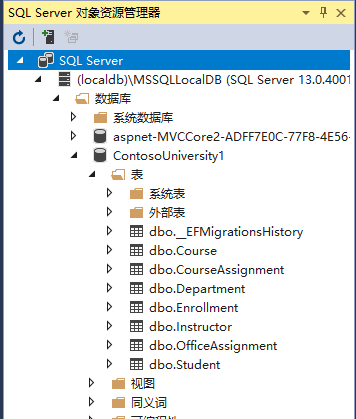

运行应用程序，触发初始化代码并填充测试数据到数据库。

右键点击 CourseAssignment 表，选择“查看数据”来验证其中确有数据。

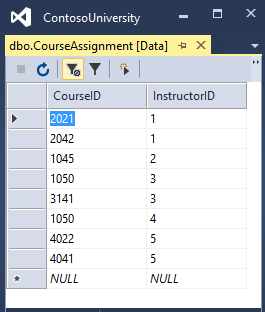

## 小结

现在您有了一个更复杂的数据模型和对应的数据库。在以下教程中，你将了解有关如何访问相关的数据的详细信息。


