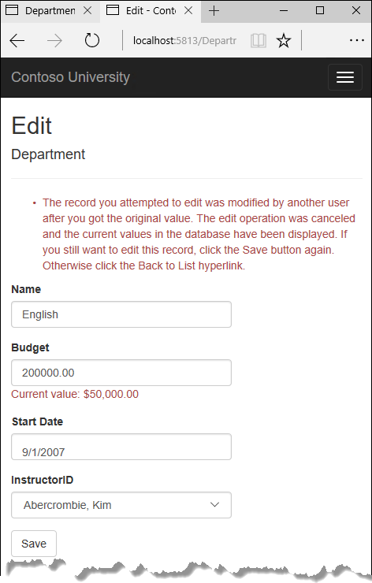
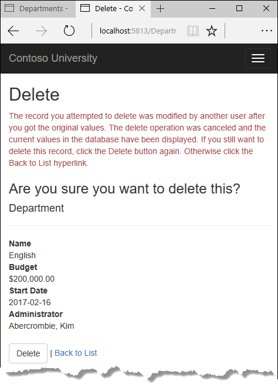
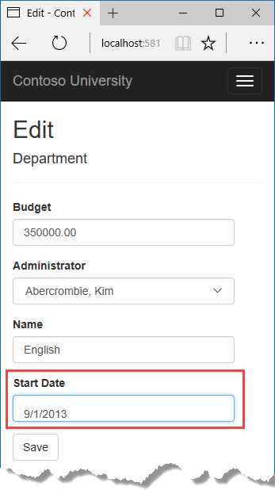
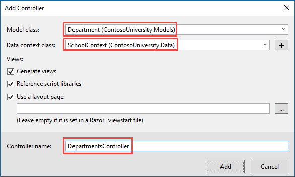
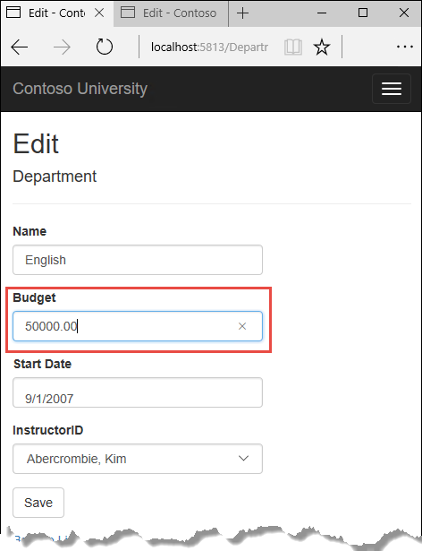
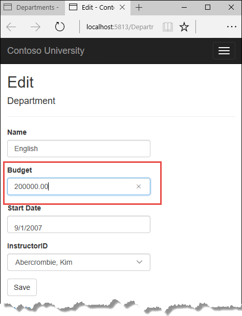
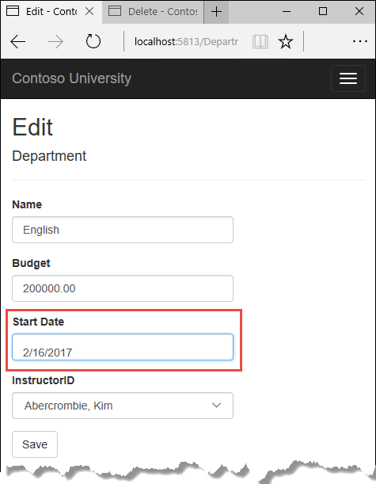

# 解决并发冲突

Contoso 大学示例 Web 应用程序演示如何使用实体框架（EF）Core 2.0 和 Visual Studio 2017 创建 ASP.NET Core 2.0 MVC Web 应用程序。 如欲了解更多本教程相关信息，请参阅 [一、入门](./chapters/start.md)

在前面的教程中，您学习了如何更新数据, 本教程展示当有多个用户在同一时间更新同一个实体时，如何处理冲突。  
您将创建与Department实体一起工作的网页，并处理并发错误。 下面的插图显示了“编辑”和“删除”页面，包括发生并发冲突时显示的一些消息。



## 并发冲突

当一个用户显示一个实体的数据以便编辑它，然后另一个用户在第一个用户的更改写入数据库之前更新同一个实体的数据时，会发生并发冲突。 如果您不启用这种冲突的检测，则最后更新数据库的人员将覆盖其他用户的更改。 在许多应用程序中，这个风险是可以接受的：如果用户很少，或者更新很少，或者如果一些更改被覆盖并不重要，那么并发编程的代价可能会超过这个好处。 在这种情况下，您不必配置应用程序来处理并发冲突。  
### 悲观并发（锁定）  
如果您的应用程序确实需要防止并发情况下的意外数据丢失，一种方法可行的方法是使用数据库锁定。 这被称为悲观并发。 例如，在从数据库读取一行之前，请求锁定为只读或更新访问。 如果锁定更新访问权限的行，则不允许其他用户将该行锁定为只读或更新访问权限，因为他们将获得正在更改的数据副本。 如果您锁定一行以进行只读访问，则其他人也可以将其锁定为只读访问权限，但不能进行更新。  
锁的管理有许多缺点。一来会造成编程的复杂性。二来锁需要大量的数据库管理资源，可能会导致性能问题。由于这些原因，并不是所有的数据库管理系统都支持悲观并发。 EF Core 没有提供对它的内置支持，本教程中也不会告诉你如何实现它。
### 乐观并发
替代悲观并发的是乐观并发。 乐观并发意味着允许发生并发冲突，然后在适当的情况下做出反应。 例如，Jane访问“部门编辑”页面，并将英文部门的预算金额从$ 350,000.00更改为$ 0.00。  

在 Jane 单击 `Save` 之前，John 访问同一页上，将 `Start Date` 从 9/1/2007 更改为 9/1/2013 。

然后 Jane 先点击 `Save` 按钮进行保存，并在浏览器返回 Index 页面时看到自己所做的修改。

然后，John 在一个仍然显示 $350,000.00 预算的 Edit 页面点击 Save 。 接下来发生的事情取决于你如何处理并发冲突。
以下是一些可能的选项：
* 您可以跟踪用户修改了哪个属性，并仅更新数据库中的相应列。  
在示例场景中，不会有数据丢失，因为两个用户更新的是不同的属性。 下一次有人浏览 English 部门时，他们会同时看到 Jane 和 John 的修改 - 开始日期为2013年9月1日，预算为零美元。 这种更新方法可以减少可能导致数据丢失的冲突次数，但是如果对实体的相同属性进行竞争性更改，则不能避免数据丢失。 实体框架是否以这种方式工作取决于你如何实现你的更新代码。 在 Web 应用程序中通常是不实际的，因为它可能要求您保持大量的状态，以便跟踪实体的所有原始属性值以及新值。 维护大量状态可能会影响应用程序的性能，因为它要么需要服务器资源，要么必须包含在网页本身（例如隐藏字段）或 cookie 中。
* 你可以让 John 的更改覆盖 Jane 的更改。  .
下次有人浏览 English 部门时，他们将会看到2013年9月1日和恢复的 $350,000.00 值。 这被称为“客户端赢”或“最后赢”场景。 （来自客户端的所有值优先于数据存储区中的值。）如本节的介绍中所述，如果您没有对并发处理进行任何编码，这种场景会自动生效。
* 您可以防止 John 的更改在数据库中更新。  
通常情况下，您将显示一条错误消息，向用户显示数据的当前状态，并允许用户重新应用他的更改，如果用户仍然想要进行更改的话。 这被称为 “存储赢” 场景。 （数据存储值优先于客户端提交的值。）您将在本教程中实现 “存储赢”场景。 这种方法可以确保在用户不知道正在发生的事情的情况下，不会覆盖任何更改。
### 检测并发冲突  
您可以通过处理 Entity Framework 抛出的 DbConcurrencyException 异常来解决冲突。 为了知道何时抛出这些异常，EF 必须能够检测到冲突。 因此，您必须适当地配置数据库和数据模型。 一些启用冲突检测的选项包括以下内容：
* 在数据库表中，包含一个跟踪列，可用于确定某行已更改。 然后，您可以配置 EF 以将该列包含在 SQL Update 或 Delete 命令的 Where 子句中。
跟踪列的数据类型通常是 `rowversion` 。 `rowversion` 值是一个序列号，每次更新该行时都会增加。 在更新或删除命令中，Where 子句包含跟踪列的原始值（原始行版本）。 如果正在更新的行已被其他用户更改，则 `rowversion` 列中的值与原始值不同，所以 Update 或 Delete 语句由于 Where 子句而找不到要更新的行。 当 EF 发现 Update 或 Delete 命令没有更新行（即受影响的行数为零）时，它将其解释为并发冲突。  
* 配置 EF 以在数据表的 Update 和 Delete 命令 Where 子句中包含每个列的原始值。  
与第一个选项一样，如果行自第一次读取以来已更改，那么Where子句将不会返回要更新的行，Entity Framework 会将其解释为并发冲突。 对于有许多列的数据库表，这种方法可能会导致非常大的 Where 子句，并且可能要求您维护大量的状态。 如前所述，维护大量状态会影响应用程序的性能。 因此通常不建议使用这种方法，这也不是本教程中使用的方法。  
如果您想要实现这种并发方法，你必须在你要进行并发跟踪的实体中所有非主键属性添加 `ConcurrencyCheck` 特性标记。 该更改使 EF 能够将所有列包含在 Update 和 Delete 语句的 SQL Where 子句中。  
在本教程的其余部分，您将向 `Department` 实体添加一个 `rowversion` 跟踪属性，创建一个控制器和视图，然后进行测试以验证一切正常。
### 在 Department 实体中添加跟踪属性。
在 `Models/Department.cs` ，添加名为 `RowVersion` 的跟踪属性：
``` cs
using System;
using System.Collections.Generic;
using System.ComponentModel.DataAnnotations;
using System.ComponentModel.DataAnnotations.Schema;

namespace ContosoUniversity.Models
{
    public class Department
    {
        public int DepartmentID { get; set; }

        [StringLength(50, MinimumLength = 3)]
        public string Name { get; set; }

        [DataType(DataType.Currency)]
        [Column(TypeName = "money")]
        public decimal Budget { get; set; }

        [DataType(DataType.Date)]
        [DisplayFormat(DataFormatString = "{0:yyyy-MM-dd}", ApplyFormatInEditMode = true)]
        [Display(Name = "Start Date")]
        public DateTime StartDate { get; set; }

        public int? InstructorID { get; set; }

        [Timestamp]
        public byte[] RowVersion { get; set; }

        public Instructor Administrator { get; set; }
        public ICollection<Course> Courses { get; set; }
    }
}
```
`Timestamp` 特性标注指定对应列将包含在 Where 子句的 Update 和 Delete 命令发送到数据库。  
如果您喜欢意使用 Fluent API ，可以使用 `IsConcurrencyToken` 方法（在 Data / SchoolContext.cs 中）指定跟踪属性，如以下示例所示：
``` cs
modelBuilder.Entity<Department>()
    .Property(p => p.RowVersion).IsConcurrencyToken();
```
[] RowVersion { get; set; }

        public Instructor Administrator { get; set; }
        public ICollection<Course> Courses { get; set; }
    }
}
```
`Timestamp` 特性标注指定对应列将包含在 Where 子句的 Update 和 Delete 命令发送到数据库。  
如果您喜欢意使用 Fluent API ，可以使用 `IsConcurrencyToken` 方法（在 Data / SchoolContext.cs 中）指定跟踪属性，如以下示例所示：
``` cs
modelBuilder.Entity<Department>()
    .Property(p => p.RowVersion).IsConcurrencyToken();
```
通过添加一个属性，你改变了数据库模型，所以你需要做一个数据库迁移操作。  
保存更改并生成项目，然后在命令窗口中输入以下命令：  
``` bash
dotnet ef migrations add RowVersion
```
``` bash
dotnet ef database update
```
### 创建 Department 控制器和视图
使用脚手架创建 Department 控制器和视图，如同前面创建 Students, Courses 和Instructors 控制器及视图一样。

在DepartmentsController.cs文件中，将出现的四个 "FirstMidName" 更改为 "FullName" ，这样部门管理员下拉列表将包含教师的完整名称而不是只是最后一个名称。  
``` cs
ViewData["InstructorID"] = new SelectList(_context.Instructors, "ID", "FullName", department.InstructorID);
```
### 更改 Department Index 视图
脚手架引擎在 Index 视图中创建了一个 RowVersion 列，但该字段不应显示。  
用以下代码替换 `Views/Departments/Index.cshtml` ：
``` html
@model IEnumerable<ContosoUniversity.Models.Department>

@{
    ViewData["Title"] = "Departments";
}

<h2>Departments</h2>

<p>
    <a asp-action="Create">Create New</a>
</p>
<table class="table">
    <thead>
        <tr>
            <th>
                @Html.DisplayNameFor(model => model.Name)
            </th>
            <th>
                @Html.DisplayNameFor(model => model.Budget)
            </th>
            <th>
                @Html.DisplayNameFor(model => model.StartDate)
            </th>
            <th>
                @Html.DisplayNameFor(model => model.Administrator)
            </th>
            <th></th>
        </tr>
    </thead>
    <tbody>
        @foreach (var item in Model)
        {
            <tr>
                <td>
                    @Html.DisplayFor(modelItem => item.Name)
                </td>
                <td>
                    @Html.DisplayFor(modelItem => item.Budget)
                </td>
                <td>
                    @Html.DisplayFor(modelItem => item.StartDate)
                </td>
                <td>
                    @Html.DisplayFor(modelItem => item.Administrator.FullName)
                </td>
                <td>
                    <a asp-action="Edit" asp-route-id="@item.DepartmentID">Edit</a> |
                    <a asp-action="Details" asp-route-id="@item.DepartmentID">Details</a> |
                    <a asp-action="Delete" asp-route-id="@item.DepartmentID">Delete</a>
                </td>
            </tr>
        }
    </tbody>
</table>
```
这些修改包括，将标题更改为 “Departments”，删除 RowVersion 列，并显示管理员的 Full Name ，而不是 First Name。  
### 更改 Departments 控制器中的 Edit 方法
在 HttpGet `Edit` 方法和 `Details` 方法中，添加 `AsNoTracking` 。 在 HttpGet `Edit` 方法中，为管理员添加贪婪加载。
``` cs
var department = await _context.Departments
    .Include(i => i.Administrator)
    .AsNoTracking()
    .SingleOrDefaultAsync(m => m.DepartmentID == id);
```
用以下代码替换 HttpPost `Edit` 方法的现有代码：
``` cs
[HttpPost]
[ValidateAntiForgeryToken]
public async Task<IActionResult> Edit(int? id, byte[] rowVersion)
{
    if (id == null)
    {
        return NotFound();
    }

    var departmentToUpdate = await _context.Departments.Include(i => i.Administrator).SingleOrDefaultAsync(m => m.DepartmentID == id);

    if (departmentToUpdate == null)
    {
        Department deletedDepartment = new Department();
        await TryUpdateModelAsync(deletedDepartment);
        ModelState.AddModelError(string.Empty,
            "Unable to save changes. The department was deleted by another user.");
        ViewData["InstructorID"] = new SelectList(_context.Instructors, "ID", "FullName", deletedDepartment.InstructorID);
        return View(deletedDepartment);
    }

    _context.Entry(departmentToUpdate).Property("RowVersion").OriginalValue = rowVersion;

    if (await TryUpdateModelAsync<Department>(
        departmentToUpdate,
        "",
        s => s.Name, s => s.StartDate, s => s.Budget, s => s.InstructorID))
    {
        try
        {
            await _context.SaveChangesAsync();
            return RedirectToAction(nameof(Index));
        }
        catch (DbUpdateConcurrencyException ex)
        {
            var exceptionEntry = ex.Entries.Single();
            var clientValues = (Department)exceptionEntry.Entity;
            var databaseEntry = exceptionEntry.GetDatabaseValues();
            if (databaseEntry == null)
            {
                ModelState.AddModelError(string.Empty,
                    "Unable to save changes. The department was deleted by another user.");
            }
            else
            {
                var databaseValues = (Department)databaseEntry.ToObject();

                if (databaseValues.Name != clientValues.Name)
                {
                    ModelState.AddModelError("Name", $"Current value: {databaseValues.Name}");
                }
                if (databaseValues.Budget != clientValues.Budget)
                {
                    ModelState.AddModelError("Budget", $"Current value: {databaseValues.Budget:c}");
                }
                if (databaseValues.StartDate != clientValues.StartDate)
                {
                    ModelState.AddModelError("StartDate", $"Current value: {databaseValues.StartDate:d}");
                }
                if (databaseValues.InstructorID != clientValues.InstructorID)
                {
                    Instructor databaseInstructor = await _context.Instructors.SingleOrDefaultAsync(i => i.ID == databaseValues.InstructorID);
                    ModelState.AddModelError("InstructorID", $"Current value: {databaseInstructor?.FullName}");
                }

                ModelState.AddModelError(string.Empty, "The record you attempted to edit "
                        + "was modified by another user after you got the original value. The "
                        + "edit operation was canceled and the current values in the database "
                        + "have been displayed. If you still want to edit this record, click "
                        + "the Save button again. Otherwise click the Back to List hyperlink.");
                departmentToUpdate.RowVersion = (byte[])databaseValues.RowVersion;
                ModelState.Remove("RowVersion");
            }
        }
    }
    ViewData["InstructorID"] = new SelectList(_context.Instructors, "ID", "FullName", departmentToUpdate.InstructorID);
    return View(departmentToUpdate);
}
```
代码首先尝试读取要更新的部门。 如果 `SingleOrDefaultAsync` 方法返回 `null` ，则该部门被另一个用户删除。 在这种情况下，代码将使用发布的表单值创建一个部门实体，以便编辑页面可以重新显示并显示错误消息。 或者，如果只显示错误消息而不重新显示部门字段，则不必重新创建部门实体。  
视图将原始的 RowVersion 值存储在一个隐藏字段中， `Edit` 方法在 RowVersion 参数中接收该值。 在调用 `SaveChanges` 之前，需要将原始的 `RowVersion` 属性值放入实体中。
``` cs
_context.Entry(departmentToUpdate).Property("RowVersion").OriginalValue = rowVersion;
```
这样的话，当 EF 创建 SQL Update 命令时，该命令将包含一个查找原始 RowVersion 值的 WHERE子句。 如果没有行受到 `UPDATE` 命令的影响（没有行具有原始 RowVersion 值），Entity Framework 将抛出 DbUpdateConcurrencyException 异常。
位于异常代码块中的 catch 代码部分，获取受影响的 Department 实体，其中包含异常对象已被更新的值。
``` cs
var exceptionEntry = ex.Entries.Single();
```
`Entries` 集合中只包含一个 EntityEntry 对象。你可以使用这个对象得到用户输入的新值以及当前数据库中的值。
``` cs
var clientValues = (Department)exceptionEntry.Entity;
var databaseEntry = exceptionEntry.GetDatabaseValues();
```
代码为 “编辑” 页面上输入的与数据库不同的值的每列添加自定义错误消息（为简洁起见，此处仅显示一个字段）。
``` cs
var databaseValues = (Department)databaseEntry.ToObject();

if (databaseValues.Name != clientValues.Name)
{
    ModelState.AddModelError("Name", $"Current value: {databaseValues.Name}");
```
最后，代码将 departmentToUpdate 的 `RowVersion` 值设置为从数据库中检索的新值。 当重新显示编辑页面时，这个新的 `RowVersion` 值将被存储在隐藏字段中，并且当用户下次单击保存时，将只捕获自编辑页面重新显示以来发生的并发错误。
``` cs
departmentToUpdate.RowVersion = (byte[])databaseValues.RowVersion;
ModelState.Remove("RowVersion");
```
ModelState.Remove 语句是必需的，因为 ModelState 具有旧的 RowVersion 值。 在视图中，当两者都存在时，字段的 ModelState 值优先于模型属性值。
### 更改 Department Edit 视图
在 `Views/Departments/Edit.cshtml` 文件中， 做如下修改：
* 添加一个隐藏字段用于存储 `RowVersion` 属性值，紧跟在 DepartmentID 属性的隐藏字段之后。
* 添加一个 "Select Administrator" 选项到下拉框中。
``` html
@model ContosoUniversity.Models.Department

@{
    ViewData["Title"] = "Edit";
}

<h2>Edit</h2>

<h4>Department</h4>
<hr />
<div class="row">
    <div class="col-md-4">
        <form asp-action="Edit">
            <div asp-validation-summary="ModelOnly" class="text-danger"></div>
            <input type="hidden" asp-for="DepartmentID" />
            <input type="hidden" asp-for="RowVersion" />
            <div class="form-group">
                <label asp-for="Name" class="control-label"></label>
                <input asp-for="Name" class="form-control" />
                <span asp-validation-for="Name" class="text-danger"></span>
            </div>
            <div class="form-group">
                <label asp-for="Budget" class="control-label"></label>
                <input asp-for="Budget" class="form-control" />
                <span asp-validation-for="Budget" class="text-danger"></span>
            </div>
            <div class="form-group">
                <label asp-for="StartDate" class="control-label"></label>
                <input asp-for="StartDate" class="form-control" />
                <span asp-validation-for="StartDate" class="text-danger"></span>
            </div>
            <div class="form-group">
                <label asp-for="InstructorID" class="control-label"></label>
                <select asp-for="InstructorID" class="form-control" asp-items="ViewBag.InstructorID">
                    <option value="">-- Select Administrator --</option>
                </select>
                <span asp-validation-for="InstructorID" class="text-danger"></span>
            </div>
            <div class="form-group">
                <input type="submit" value="Save" class="btn btn-default" />
            </div>
        </form>
    </div>
</div>

<div>
    <a asp-action="Index">Back to List</a>
</div>

@section Scripts {
    @{await Html.RenderPartialAsync("_ValidationScriptsPartial");}
}
```
### 在编辑页中测试并发冲突
运行应用并转至 Department Index 页面。 右键单击编辑 Enghlist 部门并选择在新选项卡中打开，然后单击编辑 English 部门的超链接。 此时在两个浏览器选项卡显示同一条信息。
更改第一个浏览器选项卡中的字段，然后单击保存。

浏览器转至 Index 页面并显示修改后的值。  
更改第二个浏览器选项卡中的字段。  

单击“保存” 。 你看到一条错误消息：  

再次点击 `Save` 按钮， 你在第二个选项卡中输入的值将被保存。你可以在转至 Index 页面后看到保存后的值。
## 更改 Delete 页面
对于删除页面， EF 检测并发冲突的方式与编辑页面类似。 在显示 HttpGet Delete 页面时，视图中包含一个原始的 RowVersion 值。 当用户确认删除是，该值用于 HttpPost Delete 方法。EF 创建 SQL Delete 方法时，在 Where 子句中包含原始的 RowVersion 值。 如果命令导致零行记录受到影响（意味着在显示删除确认页面后，行记录被改变），则会抛出并发异常，调用 HttpGet Delete 方法，设置错误标志为 true ，重新显示包含错误信息的确认页面。还有一种返回零行的可能是该行被其他用户删除，在这种情况下，不会显示错误消息。
### 更改 Department 控制器中的 Delete 方法
在 `DepartmentsController.cs` 文件中， 使用以下代码替换 HttpGet Delete 方法：
``` cs 
public async Task<IActionResult> Delete(int? id, bool? concurrencyError)
{
    if (id == null)
    {
        return NotFound();
    }

    var department = await _context.Departments
        .Include(d => d.Administrator)
        .AsNoTracking()
        .SingleOrDefaultAsync(m => m.DepartmentID == id);
    if (department == null)
    {
        if (concurrencyError.GetValueOrDefault())
        {
            return RedirectToAction(nameof(Index));
        }
        return NotFound();
    }

    if (concurrencyError.GetValueOrDefault())
    {
        ViewData["ConcurrencyErrorMessage"] = "The record you attempted to delete "
            + "was modified by another user after you got the original values. "
            + "The delete operation was canceled and the current values in the "
            + "database have been displayed. If you still want to delete this "
            + "record, click the Delete button again. Otherwise "
            + "click the Back to List hyperlink.";
    }

    return View(department);
}
```
该方法接受一个可选参数，参数指示是否在并发错误之后重新显示页面。 如果此标志为真，并且指定的部门不再存在，则表示记录被其他用户删除。 这种情况下，代码将重定向到索引页面。 如果这个标志是真的，并且该部门存在，则表示其他用户修改了记录。 在这种情况下，代码使用 ViewData 向视图发送错误消息。
用以下代码替换 HttpPost Delete 方法（名为 DeleteConfirmed ）中的代码：
``` cs
[HttpPost]
[ValidateAntiForgeryToken]
public async Task<IActionResult> Delete(Department department)
{
    try
    {
        if (await _context.Departments.AnyAsync(m => m.DepartmentID == department.DepartmentID))
        {
            _context.Departments.Remove(department);
            await _context.SaveChangesAsync();
        }
        return RedirectToAction(nameof(Index));
    }
    catch (DbUpdateConcurrencyException /* ex */)
    {
        //Log the error (uncomment ex variable name and write a log.)
        return RedirectToAction(nameof(Delete), new { concurrencyError = true, id = department.DepartmentID });
    }
}
```
在您刚刚替换的脚手架代码中，此方法仅接受记录ID：
``` cs
public async Task<IActionResult> DeleteConfirmed(int id)
```
你将此参数修改为 Department 实体。这使 EF 除了记录键之外，还可以访问 RowVersion 属性值。
``` cs
public async Task<IActionResult> Delete(Department department)
```
您还将操作方法名称从 DeleteConfirmed 更改为 Delete 。 脚手架代码使用名称 DeleteConfirmed 给 HttpPost 方法一个唯一的签名。 （CLR要求重载的方法有不同的方法参数。）现在签名是唯一的，你可以用回 MVC 约定，使用相同 HttpPost,HttpGet Delete 方法名称。  
如果部门已被删除，则 AnyAsync 方法返回 false ，应用程序返回到 Index 方法。  
如果捕获并发错误，代码将重新显示 “删除确认” 页面，并提供一个标志，指示页面显示并发错误消息。  
###更改 Delete 视图
在 `Views/Departments/Delete.cshtml` 文件中，使用以下代码替换脚手架代码。代码添加了一个错误信息字段，DepartmentID 隐藏字段及 RowVersion 属性。 
``` html
@model ContosoUniversity.Models.Department

@{
    ViewData["Title"] = "Delete";
}

<h2>Delete</h2>

<p class="text-danger">@ViewData["ConcurrencyErrorMessage"]</p>

<h3>Are you sure you want to delete this?</h3>
<div>
    <h4>Department</h4>
    <hr />
    <dl class="dl-horizontal">
        <dt>
            @Html.DisplayNameFor(model => model.Name)
        </dt>
        <dd>
            @Html.DisplayFor(model => model.Name)
        </dd>
        <dt>
            @Html.DisplayNameFor(model => model.Budget)
        </dt>
        <dd>
            @Html.DisplayFor(model => model.Budget)
        </dd>
        <dt>
            @Html.DisplayNameFor(model => model.StartDate)
        </dt>
        <dd>
            @Html.DisplayFor(model => model.StartDate)
        </dd>
        <dt>
            @Html.DisplayNameFor(model => model.Administrator)
        </dt>
        <dd>
            @Html.DisplayFor(model => model.Administrator.FullName)
        </dd>
    </dl>
    
    <form asp-action="Delete">
        <input type="hidden" asp-for="DepartmentID" />
        <input type="hidden" asp-for="RowVersion" />
        <div class="form-actions no-color">
            <input type="submit" value="Delete" class="btn btn-default" /> |
            <a asp-action="Index">Back to List</a>
        </div>
    </form>
</div>
```
这会做出以下更改：
* 在 h2 和 h3 标题头之间，添加一错误信息。
* 在 Administrator 字段中，用 FullName 代替 FirstMidName。
* 移除 RowVersion 字段
* 添加一个 隐藏的 RowVerion 属性。
运行应用并转到部门索引页。 右键单击删除 English 部门，选择 “在新选项卡中打开超级链接”，然后在第一个选项卡中单击编辑 English 部门的超链接。  
在第一个选项窗口中，任意修改一个值，单击 Save ：

在第二个选项卡上，单击 Delete 。 你会看到并发冲突错误信息，并看到以数据库最新值显示的 Departments 实体值。

如果你再次点击 Delete ，则将转至 Index 页面，并看到该部门已被删除。

## 更改 Details 及 Create 视图
您可以选择是否清理详细信息和创建视图中的脚手架代码。
替换 Views/Departments/Details.cshtml 中的代码，删除 RowVersion 列并显示管理员的全名。
``` html
@model ContosoUniversity.Models.Department

@{
    ViewData["Title"] = "Details";
}

<h2>Details</h2>

<div>
    <h4>Department</h4>
    <hr />
    <dl class="dl-horizontal">
        <dt>
            @Html.DisplayNameFor(model => model.Name)
        </dt>
        <dd>
            @Html.DisplayFor(model => model.Name)
        </dd>
        <dt>
            @Html.DisplayNameFor(model => model.Budget)
        </dt>
        <dd>
            @Html.DisplayFor(model => model.Budget)
        </dd>
        <dt>
            @Html.DisplayNameFor(model => model.StartDate)
        </dt>
        <dd>
            @Html.DisplayFor(model => model.StartDate)
        </dd>
        <dt>
            @Html.DisplayNameFor(model => model.Administrator)
        </dt>
        <dd>
            @Html.DisplayFor(model => model.Administrator.FullName)
        </dd>
    </dl>
</div>
<div>
    <a asp-action="Edit" asp-route-id="@Model.DepartmentID">Edit</a> |
    <a asp-action="Index">Back to List</a>
</div>
```
替换 Views/Departments/Create.cshtml 中的代码，在下拉框中添加一个选项。
``` html
@model ContosoUniversity.Models.Department

@{
    ViewData["Title"] = "Create";
}

<h2>Create</h2>

<h4>Department</h4>
<hr />
<div class="row">
    <div class="col-md-4">
        <form asp-action="Create">
            <div asp-validation-summary="ModelOnly" class="text-danger"></div>
            <div class="form-group">
                <label asp-for="Name" class="control-label"></label>
                <input asp-for="Name" class="form-control" />
                <span asp-validation-for="Name" class="text-danger"></span>
            </div>
            <div class="form-group">
                <label asp-for="Budget" class="control-label"></label>
                <input asp-for="Budget" class="form-control" />
                <span asp-validation-for="Budget" class="text-danger"></span>
            </div>
            <div class="form-group">
                <label asp-for="StartDate" class="control-label"></label>
                <input asp-for="StartDate" class="form-control" />
                <span asp-validation-for="StartDate" class="text-danger"></span>
            </div>
            <div class="form-group">
                <label asp-for="InstructorID" class="control-label"></label>
                <select asp-for="InstructorID" class="form-control" asp-items="ViewBag.InstructorID">
                    <option value="">-- Select Administrator --</option>
                </select>
            </div>
            <div class="form-group">
                <input type="submit" value="Create" class="btn btn-default" />
            </div>
        </form>
    </div>
</div>

<div>
    <a asp-action="Index">Back to List</a>
</div>

@section Scripts {
    @{await Html.RenderPartialAsync("_ValidationScriptsPartial");}
}
```

## 小结
这章节完成了并发冲突处理的介绍。 如欲了解 EF Core 中有关并发的更多信息，请参阅 [Concurrency conflicts](https://docs.microsoft.com/ef/core/saving/concurrency) 。 下一个教程将介绍如何为 Instructor 和 Student 实体实现 Table Per Hierarchy 。