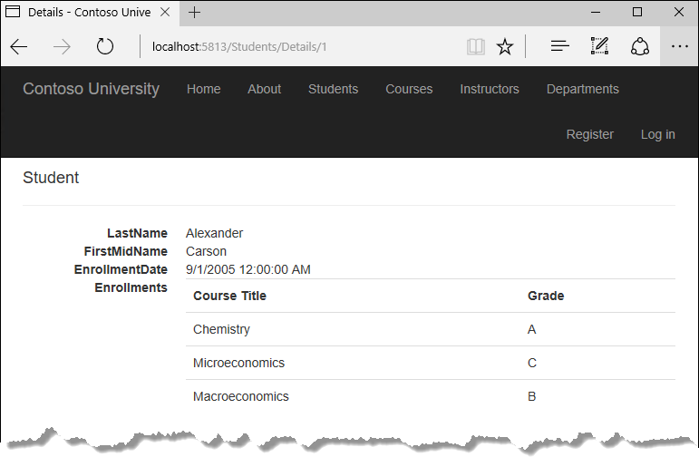
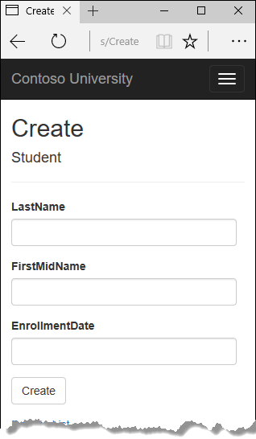
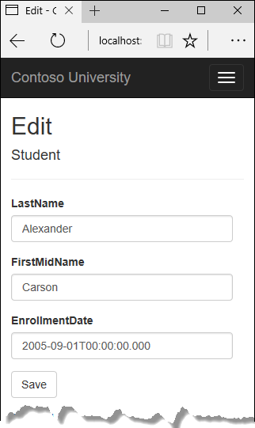
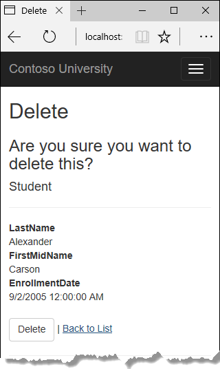
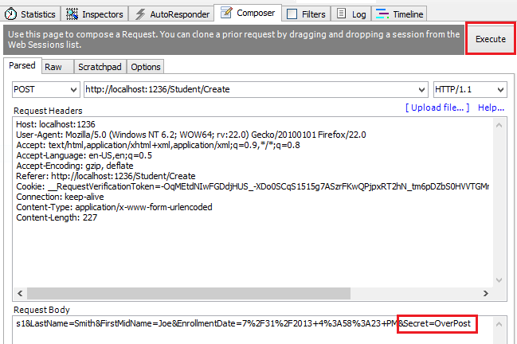
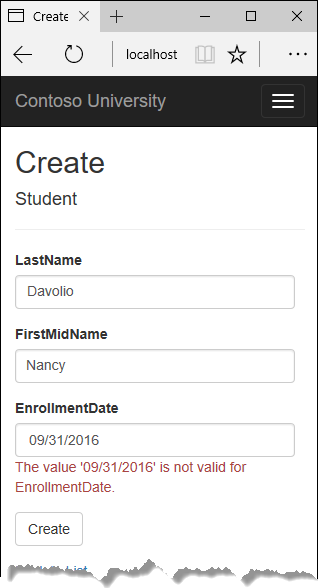
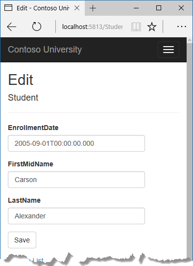

# CRUD （创建，读取，更新和删除）

在上一章节中，您创建了一个使用 Entity Framework 和 SQL Server LocalDB 存储和显示数据的 MVC 应用程序。 在本章中，将复习并学习如何自定义 MVC 基架（脚手架）在控制器和视图中生成的 CRUD 代码。

> Repository （仓储）模式是一种常见的用于在控制器和数据访问层之间实现抽象的方法。为了保证本教程足够简单，并聚焦与学习如何使用 Entity Framework 技术， 我们将不使用仓储模式。 有关如何配合 EF 使用仓储模式， 请参见 [本教材最后一个章节](./advance.md)。









## 自定义 ```Detail``` 页

学生 Index 页面的脚手架代码没有使用到 ```Enrollment``` 属性，这个属性指向一个集合。  在 Detail 页面，您将在 HTML 表格中显示该集合的内容。

在 ```Controllers/StudentsController.cs``` 中， ```Detail``` 视图对应的 Action 方法使用 ```SingleOrDefaultAsync``` 方法来检索单个 ```Student``` 实体。 添加调用 Include, ThenInclude 和 AsNoTracking 方法的代码。 如下面的代码所示。
``` cs
public async Task<IActionResult> Details(int? id)
{
    if (id == null)
    {
        return NotFound();
    }

    var student = await _context.Students
        .Include(s => s.Enrollments)
            .ThenInclude(e => e.Course)
        .AsNoTracking()
        .SingleOrDefaultAsync(m => m.ID == id);

    if (student == null)
    {
        return NotFound();
    }

    return View(student);
}
```

```Include``` 和 ```ThenInclude``` 方法让 _context （数据库上下文） 同时加载```Student.Enrollments``` 导航属性，并对每个 ```Enrollment``` 加载对应的 ```Enrollment.Course``` 导航属性。 您将在 [六、读取相关数据](./chapters/relateData.md) 章节中了解有关这些方法的更多信息。

```AsNoTracking``` 方法在当前上下文生命周期中返回的实体不会更新的情况下有助于提高性能。 您将在本章节末尾详细了解 ```AsNoTracking```。

## MVC 路由

传递给 ```Details``` 方法的键值来自路由数据。 路由数据是模型绑定器在 URL 字符串中找到的数据。 例如，默认路由指定 controller，action 和 id ：
``` cs
app.UseMvc(routes =>
{
    routes.MapRoute(
        name: "default",
        template: "{controller=Home}/{action=Index}/{id?}");
});
```

在以下URL中，默认路由将 ```Instructor``` 作为控制器，将 ```Index``` 作为操作，将 ```1``` 作为 id ; 这些就是路由数据值。

```
http://localhost:1230/Instructor/Index/1?courseID=2021
```

URL 的最后一部分 ```"?courseID=2021"``` 是一个查询字符串值。 如果将其作为查询字符串值传递，模型绑定将会将 ID 值传递给 Details 方法的 id 参数：

```
http://localhost:1230/Instructor/Index?id=1&CourseID=2021
```

在 Index 页面中，Razor 引擎的 Tag 帮助辅助声明负责创建超链接。在以下 Razor 代码中，id 参数与默认路由匹配，因此 id 被添加到路由数据中。

``` html
<a asp-action="Edit" asp-route-id="@item.ID">Edit</a>
```

当上面代码中的 item.ID 值为 6，生成如下HTML：

``` html
<a href="/Students/Edit/6">Edit</a>
```

有关 Tag Helpers 的更多信息，请参阅 [Tag helpers in ASP.NET Core](https://docs.microsoft.com/en-us/aspnet/core/mvc/views/tag-helpers/intro) 。

## 在 Detail 视图中添加 Enrollments 实体信息

打开 Views/Students/Details.cshtml 。 如下所示，可以看到，每个字段使用 ```DisplayNameFor``` 和 ```DisplayFor```  帮助方法来显示：

``` html
<dt>
    @Html.DisplayNameFor(model => model.LastName)
</dt>
<dd>
    @Html.DisplayFor(model => model.LastName)
</dd>
```

在最后一个字段之后，并在 ```</dl>``` 标记之前，添加以下代码以显示 Enrollment 列表：

``` html
<dt>
    @Html.DisplayNameFor(model => model.Enrollments)
</dt>
<dd>
    <table class="table">
        <tr>
            <th>Course Title</th>
            <th>Grade</th>
        </tr>
        @foreach (var item in Model.Enrollments)
        {
            <tr>
                <td>
                    @Html.DisplayFor(modelItem => item.Course.Title)
                </td>
                <td>
                    @Html.DisplayFor(modelItem => item.Grade)
                </td>
            </tr>
        }
    </table>
</dd>
```

粘贴代码后，如果代码缩进错误，请按 CTRL-K-D 进行更正。

这段代码循环读取 ```Enrollments``` 导航属性中的实体。 对于每个 Enrollment 实体，显示 ```Course Title``` （课程标题）和 ```Grade``` （成绩）。 课程标题从存储在 ```Enrollment``` 实体的 ```Course``` 导航属性中的 ```Course``` 实体检索。

运行应用程序，点击 Student 链接 ，然后单击任意学生的详细信息链接。 您会看到所选学生的课程和成绩列表：


## 更新 ```Create``` 页面

在 ```StudentsController.cs``` 中，修改 ```HttpPost Create``` 方法，添加一个try-catch 代码块，并从 ```Bind``` 特性中移除 ```ID``` 。

```cs
[HttpPost]
[ValidateAntiForgeryToken]
public async Task<IActionResult> Create(
    [Bind("EnrollmentDate,FirstMidName,LastName")] Student student)
{
    try
    {
        if (ModelState.IsValid)
        {
            _context.Add(student);
            await _context.SaveChangesAsync();
            return RedirectToAction(nameof(Index));
        }
    }
    catch (DbUpdateException /* ex */)
    {
        //Log the error (uncomment ex variable name and write a log.
        ModelState.AddModelError("", "Unable to save changes. " +
            "Try again, and if the problem persists " +
            "see your system administrator.");
    }
    return View(student);
}
```

这段代码将 ASP.NET MVC Model Binder （模型绑定器）创建的 ```Student``` 实体添加到 ```Students``` 实体集， 然后保存更改至数据库。模型绑定器是 ASP.NET MVC 功能，有助于更容易处理表单提交的数据;模型绑定器将发布的表单值转换为 CLR 类型，并将它们传递给参数中的action 方法，在这种情况下， 模型绑定器使用 Form 集合中的属性值为您实例化 ```Student``` 实体。

从 ```Bind``` 特性中删除了 ```ID``` ，因为 ```ID``` 是主键，SQL Server 会在添加数据行时自动设置。 来自用户的输入不设置 ```ID``` 值。

除了 ```Bind``` 特性外，```try-catch``` 代码块是您对脚手架代码进行的唯一更改。 如果在保存更改时捕获来自 ```DbUpdateException``` 的异常，则会显示通用错误消息。 ```DbUpdateException``` 异常有时由应用程序外部的东西引起，而不是编程错误，因此建议用户再次尝试。 虽然在此示例中未实现，但生产质量应用程序将记录异常。 有关更多信息，请参阅 [Monitoring and Telemetry (Building Real-World Cloud Apps with Azure)](https://docs.microsoft.com/aspnet/aspnet/overview/developing-apps-with-windows-azure/building-real-world-cloud-apps-with-windows-azure/monitoring-and-telemetry) 的 Log for insight 部分。

```ValidateAntiForgeryToken``` 特性用于防止跨域请求伪造（CSRF）攻击。 令牌由 ```FormTagHelper``` 自动注入视图，并在用户提交表单时包含该令牌。 该令牌由 ```ValidateAntiForgeryToken``` 特性验证。 有关 CSRF 的更多信息，请参阅  [Anti-Request Forgery](https://docs.microsoft.com/en-us/aspnet/core/security/anti-request-forgery) 。

## Over-Posting （过多提交） 安全提示
脚手架代码在 ```Create``` 方法中包含的 ```Bind``` 特性是在创建场景中防止出现 ```Over-Posting``` （过多提交）的一种方法。 例如，假设学生实体中包含您不希望此网页可以设置的 ```Secret``` 属性。
``` cs
public class Student
{
    public int ID { get; set; }
    public string LastName { get; set; }
    public string FirstMidName { get; set; }
    public DateTime EnrollmentDate { get; set; }
    public string Secret { get; set; }
}
```

即使您没有网页上的 ```Secret``` 字段，黑客也可以使用诸如 Fiddler 之类的工具，或者写一些 JavaScript 来发布一个 ```Secret``` 表单值。 如果没有 Binder 特性限制模型绑定器创建```Student``` 实例时可以使用的字段，模型绑定器将取得该 ```Secret``` 表单值，并用它来创建 ```Student``` 实体实例。 那么无论什么值，黑客为秘密表单字段指定的数据将在数据库中更新。 以下图像显示了 Fiddler 工具将 Secret 字段（值为 ```“OverPost”```）添加到发布的表单值。



然后，```OverPost``` 值将成功添加到插入行的 ```Secret``` 属性，尽管您从未打算让网页能够设置该属性。

在编辑场景，您可以通过先从数据库读取实体，然后调用 ```TryUpdateModel```，传递一个明确允许的属性列表，从而防止编辑场景中的 Over-Posting 攻击。 这也是本教程中使用的方法。

开发人员喜欢使用的另外一个防止 Over-Posting 攻击的方法是使用 ```ViewModel``` （视图模型），而不是直接绑定数据实体。 在 ```ViewModel``` 中仅包含需要更新的属性。 一旦 MVC 模型绑定完成，复制 ```ViewModel``` 属性到数据实体，可选择使用 ```AutoMapper``` 工具。 在实体实例上使用 ```_context.Entry``` 将其状态设置为 ```Unchanged``` ，然后在 ```ViewModel``` 中包含的每个实体属性上设置 ```Property("PropertyName")``` 的 ```IsModified``` 为 ```true``` 。 此方法可用于编辑和创建场景。

## 测试 ```Create``` 页面 

```Views/Students/Create.cshtml``` 的代码中，字段使用了 ```label```, ```Input```, ```span``` （用于展示验证消息） 等标签创建。

运行应用程序，点击 ```Student``` 链接，然后点击 ```Create```。

输入名称和日期。 尝试输入无效的日期，如果您的浏览器允许您这样做。 （某些浏览器强制您使用日期选择器。）然后单击 ```Create``` 以查看错误消息。



这是您默认获得的服务器端验证; 在后面的教程中，您将看到如何添加可以生成客户端验证代码的特性。 以下代码显示了 ```Create``` 方法中的模型验证检查。
``` cs
[HttpPost]
[ValidateAntiForgeryToken]
public async Task<IActionResult> Create(
    [Bind("EnrollmentDate,FirstMidName,LastName")] Student student)
{
    try
    {
        if (ModelState.IsValid)
        {
            _context.Add(student);
            await _context.SaveChangesAsync();
            return RedirectToAction(nameof(Index));
        }
    }
    catch (DbUpdateException /* ex */)
    {
        //Log the error (uncomment ex variable name and write a log.
        ModelState.AddModelError("", "Unable to save changes. " +
            "Try again, and if the problem persists " +
            "see your system administrator.");
    }
    return View(student);
}
```

将日期更改为有效值，然后单击 ```Create```，将会看到这个新学生出现在 ```Index``` 页面中。

## 更新 ```Edit``` 页面 

在 ```StudentController.cs``` 中，```HttpGet Edit``` 方法（没有 ```HttpPost``` 特性的那个方法）使用 ```SingleOrDefaultAsync``` 方法来检索所选的 Student 实体，就像在 ```Details``` 方法中看到的那样。 您不需要更改此方法。

**笔者建议的 ```HttpPost Edit``` 代码: 先读后更新**

使用以下代码替换 HttpPost Edit Action 方法。
``` cs
[HttpPost, ActionName("Edit")]
[ValidateAntiForgeryToken]
public async Task<IActionResult> EditPost(int? id)
{
    if (id == null)
    {
        return NotFound();
    }
    var studentToUpdate = await _context.Students.SingleOrDefaultAsync(s => s.ID == id);
    if (await TryUpdateModelAsync<Student>(
        studentToUpdate,
        "",
        s => s.FirstMidName, s => s.LastName, s => s.EnrollmentDate))
    {
        try
        {
            await _context.SaveChangesAsync();
            return RedirectToAction(nameof(Index));
        }
        catch (DbUpdateException /* ex */)
        {
            //Log the error (uncomment ex variable name and write a log.)
            ModelState.AddModelError("", "Unable to save changes. " +
                "Try again, and if the problem persists, " +
                "see your system administrator.");
        }
    }
    return View(studentToUpdate);
}
```

代码更改中，包含了防止 Over-Posting 攻击的安全最佳实践。 脚手架生成一个 ```Bind``` 特性，并将 model binder (模型绑定器) 创建的实体标记为 ```Modified``` （数据被修改）。 在许多场景中，不推荐使用那种代码，因为 ```Bind``` 特性会清除所有未在 ```Include``` 参数中出现的字段值。

新实现的代码先读取现有实体，然后按照提交表单数据中的用户输入调用 ```TryUpdateModel``` 来更新检索到的实体中的字段。 Entity Framework 自动跟踪机制在被修改的字段上打 ```Modified``` 标记，在调用 ```SaveChanges``` 方法时， Entity Framework 创建 SQL 语句来更新数据库行。并非冲突将被忽略，只有只有用户更新的数据表字段在数据库中被更新。（稍后的教程将展示如何处理并发冲突。）

防止 Over-Posting 攻击的最佳做法中，你希望被更新的字段作为 ```TryUpdateModel``` 参数列入白名单，参数列表中字段列表之前的空字符串用于表单字段名称的前缀。目前没有要保护的额外字段，但列出了要绑定的字段，这样可以确保如果将来在数据模型添加新的字段，它们将被自动保护，直到您在此处显式添加。

这样修改之后，```HttpPost Edit``` 和 ```HttpGet Edit``` 两个方法的方法签名完全相同（输入和输出类型相同），所以你可以看到，在代码中我们修改方法名为 ```EditPost```。

## 可替代的 ```HttpPost Edit``` 代码，创建然后附加

推荐的 ```HttpPost Edit``` 代码可确保仅更改的列被更新，并保留不需要包含的模型绑定的属性中的数据。然而，先读取的方法需要额外的数据库读取，并且可能导致更复杂的并发冲突处理代码。另一种方法是将由模型绑定器创建的实体附加到EF上下文并将其标记为已修改。 （不要使用此代码更新项目，此处只是演示一种可选的方法。）

``` cs
public async Task<IActionResult> Edit(int id, [Bind("ID,EnrollmentDate,FirstMidName,LastName")] Student student)
{
    if (id != student.ID)
    {
        return NotFound();
    }
    if (ModelState.IsValid)
    {
        try
        {
            _context.Update(student);
            await _context.SaveChangesAsync();
            return RedirectToAction(nameof(Index));
        }
        catch (DbUpdateException /* ex */)
        {
            //Log the error (uncomment ex variable name and write a log.)
            ModelState.AddModelError("", "Unable to save changes. " +
                "Try again, and if the problem persists, " +
                "see your system administrator.");
        }
    }
    return View(student);
}
```

仅当网页界面包含实体中的所有字段并且可以更新其中任何一个字段时，您可以使用此方法。

脚手架代码使用 create-and-attach 方法，但仅捕获 ```DbUpdateConcurrencyException``` 并发冲突异常并返回 404 错误代码。 修改后的代码捕获任何数据库更新异常并显示错误消息。

## 实体状态 （Entity States）

数据库上下文跟踪内存中的实体是否与数据库中的相应行同步，并使用此信息决定当用户调用 ```SaveChanges``` 方法时会发生什么。 例如，当您将新实体传递给 ```Add``` 方法时，该实体的状态将设置为 ```Added```。 然后当调用 ```SaveChanges``` 方法时，数据库上下文会发出 ```SQL INSERT``` 命令。

实体可能处于以下状态之一：

* ```Added``` ： 实体在数据库中不存在。 ```SaveChanges``` 方法发出一个 ```INSERT``` 语句。

* ```Unchanged``` ： ```SaveChanges``` 方法不需要对此实体做任何操作。 当您从数据库中读取实体时，实体将以此状态启动。

* ```Modified``` ：实体的某些或全部属性值已被修改。 ```SaveChanges``` 方法发出 ```UPDATE``` 语句。

* ```Deleted``` ：实体被标记为已删除。 ```SaveChanges``` 方法发出 ```DELETE``` 语句。

* ```Detached``` ： 实体没有被数据库上下文跟踪。

在桌面应用程序中，实体状态通常会自动被设置。你读取一个实体并对其某些属性值进行更改，这将导致其实体状态自动更改为 ```Modified```，然后你调用 ```SaveChanges```，Entity Framework 生成 SQL 更新语句，该语句仅更新您实际更改的属性。

而在 Web 应用程序中，读取一个实体并显示于页面用于编辑的数据库上下文在页面渲染后将被销毁（请记住，Web是无状态的 Stateless）。 当调用 ```HttpPost Edit``` 操作方法时，会创建一个新的 Web 请求，并开启一个新的 DbContext 实例。 如果您在新的上下文中重读了实体，则可以模拟桌面处理。

但是，如果您不想执行额外的读取操作，您将不得不使用由模型绑定器创建的实体对象。 执行此操作的最简单的方法是将实体状态设置为 ```Modified```，就像之前显示的其中一种 ```HttpPost Edit``` 代码一样。 然后当您调用 ```SaveChanges``` 时，Entity Framework 更新数据库行的所有列，因为上下文无法知道您更改了哪些属性。

如果您想避免 ```read-first``` 方法，但您同时希望 ```SQL UPDATE``` 语句仅更新用户实际更改的字段，代码将会更加复杂。您必须以某种方式保存原始值（例如使用隐藏字段），以便在调用 ```HttpPost Edit``` 方法时可用。 然后，您可以使用原始值创建一个 ```Student``` 实体，使用该实体的原始版本调用 ```Attach``` 方法，将实体的值更新为新值，然后调用 ```SaveChanges```。

## 测试 ```Edit``` 页面

运行应用程序，点击 Student 链接 ，然后单击 ```Edit``` 超链接。



更改一些数据，然后单击保存。 保存后跳转至 Index 页面，您将看到数据已被更改。

## 更新 ```Delete``` 页面

在 StudentController.cs 中，```HttpGet Delete``` 方法的模板代码使用 ```SingleOrDefaultAsync``` 方法来检索所选的 ```Student``` 实体，就像在 ```Details``` 和 ```Edit``` 方法中看到的一样。但为了在调用 ```SaveChanges``` 方法是实现自定义错误信息，您将向此方法及其对应视图添加一些功能。

正如你在 ```Update``` 和 ```Create``` 操作中看到的，删除操作需要两个 ```Action``` 方法。一个用于响应 ```GET``` 请求，显示一个视图，给用户批准或取消删除操作的机会。一旦用户同意删除，一个 ```POST``` 请求被创建，当发生这种情况时，调用 ```HttpPost Delete``` 方法，然后该方法执行实际的删除操作。

您将向 ```HttpPost Delete``` 方法添加一个 ```try-catch``` 代码块，以处理数据库更新时可能发生的任何错误。 如果发生错误，```HttpPost Delete``` 方法调用 ```HttpGet Delete``` 方法，传递一个指示发生错误的参数。 ```HttpGet Delete``` 方法重新显示确认页面以及错误消息，给予用户取消或再次尝试的机会。

将 ```HttpGet Delete``` 操作方法替换为以下实现了错误报告机制的代码。

``` cs
public async Task<IActionResult> Delete(int? id, bool? saveChangesError = false)
{
    if (id == null)
    {
        return NotFound();
    }

    var student = await _context.Students
        .AsNoTracking()
        .SingleOrDefaultAsync(m => m.ID == id);
    if (student == null)
    {
        return NotFound();
    }

    if (saveChangesError.GetValueOrDefault())
    {
        ViewData["ErrorMessage"] =
            "Delete failed. Try again, and if the problem persists " +
            "see your system administrator.";
    }

    return View(student);
}
```

这段代码接受一个可选参数，指示方法是否在保存更改失败后被调用。当 ```HttpGet Delete``` 方法被调用前未有保存失败的情况发生，此参数为 ```false```。 当 ```HttpPost Delete``` 方法响应数据库更新错误调用该参数时，该参数为 ```true```，一个错误消息被传递给该视图。

## ```HttpPost Delete``` 的 ```read-first``` 方法

使用以下代码替换 ```HttpPost Delete``` 操作方法（修改命名为 ```DeleteConfirmed```），该代码执行实际的删除操作并捕获任何数据库更新错误。

``` cs
[HttpPost, ActionName("Delete")]
[ValidateAntiForgeryToken]
public async Task<IActionResult> DeleteConfirmed(int id)
{
    var student = await _context.Students
        .AsNoTracking()
        .SingleOrDefaultAsync(m => m.ID == id);
    if (student == null)
    {
        return RedirectToAction(nameof(Index));
    }

    try
    {
        _context.Students.Remove(student);
        await _context.SaveChangesAsync();
        return RedirectToAction(nameof(Index));
    }
    catch (DbUpdateException /* ex */)
    {
        //Log the error (uncomment ex variable name and write a log.)
        return RedirectToAction(nameof(Delete), new { id = id, saveChangesError = true });
    }
}
```

此代码检索所选实体，然后调用 ```Remove``` 方法将实体的状态设置为 ```Deleted```。 调用 ```SaveChanges``` 时，将生成一个 ```SQL DELETE``` 命令。

## HttpPost Delete 的 create-and-attach 方法

假如在大量数据处理应用中需要优先提升性能，可以通过仅使用主键值实例化 ```Student``` 实体，然后将实体状态设置为 ```Deleted``` 来避免不必要的SQL查询。 Entity Framework 删除一个实体可以仅需如此。（不要把这段代码放在你的项目中，这里只是为了说明您可以有多种方式处理删除）  
*译者注：许多童鞋批评 Entity Framework 无谓的 read-first 消耗数据库性能，其实并不是如此，每一种策略都有其背后的深思熟虑。*

``` cs
[HttpPost]
[ValidateAntiForgeryToken]
public async Task<IActionResult> DeleteConfirmed(int id)
{
    try
    {
        Student studentToDelete = new Student() { ID = id };
        _context.Entry(studentToDelete).State = EntityState.Deleted;
        await _context.SaveChangesAsync();
        return RedirectToAction(nameof(Index));
    }
    catch (DbUpdateException /* ex */)
    {
        //Log the error (uncomment ex variable name and write a log.)
        return RedirectToAction(nameof(Delete), new { id = id, saveChangesError = true });
    }
}
```

如果实体有相关数据也应该被删除，请确保在数据库中配置了级联删除。 通过这种实体删除方法，EF 可能不会意识到有相关的实体被删除。

## 更新 Delete 视图

在 Views/Student/Delete.cshtml 中，在 h2 标题和 h3 标题之间添加错误消息，如下所示：

``` html
<h2>Delete</h2>
<p class="text-danger">@ViewData["ErrorMessage"]</p>
<h3>Are you sure you want to delete this?</h3>
```

运行应用程序，点击 Student 链接 ，然后单击一个 ```Delete``` 超链接。


点击 Delete 按钮， 将会跳转至 Index 页面，可以见到，刚刚删除的学生已经不在显示列表中。（在 [八、处理并发冲突](./chapters/concurrency.md) 中将看到错误处理代码的示例。）

## 关闭数据库连接

为了释放数据库连接所拥有的资源，上下文实例必须在完成后尽快处理。 ASP.NET Core 依赖注入机制为您处理该任务。

在 Startup.cs 中，您调用 AddDbContext 扩展方法在 ASP.NET DI 容器中配置 DbContext 类。 该方法默认将服务生命周期设置为 Scoped 。 Scoped 意味着上下文对象的生命周期与 Web 请求的使用寿命一致，Dispose 方法将在 Web 请求结束时自动调用。

## 事务处理

默认情况下，EF 隐式实现事务。 在对多个行或表进行更改，然后调用 SaveChanges 的情况下，EF 将自动确保所有更改都成功或全部失败。 如果有一些更改完成，然后发生错误，那么这些更改将自动回滚。 对于需要更多控制的场景，例如，如果要在事务中包含 Entity Framework 以外的操作 - 请参阅 [Transactions](https://docs.microsoft.com/ef/core/saving/transactions)。

## 无追踪查询

当数据库上下文检索表行并创建表示它们的实体对象时，默认情况下会跟踪内存中的实体是否与数据库中的实体同步。 内存中的数据充当缓存，并在更新实体时使用。 这种缓存在 Web 应用程序中通常是不必要的，因为上下文实例通常是短暂的（为每个请求创建一个新的实例），并且通常在再次使用该实体之前设置读取实体的上下文。

您可以通过调用 AsNoTracking 方法来禁用对内存中实体对象的跟踪。 您可能希望这样做的典型场景包括：

* 在上下文生存期间，您不需要更新任何实体，并且您不需要 EF 自动加载导航属性，而实体由单独的查询检索。 这些条件通常在控制器的HttpGet操作方法中得到满足。

* 您正在运行一个检索大量数据的查询，只有一小部分返回的数据将被更新。 关闭大型查询的跟踪可能会更有效，并且稍后为需要更新的几个实体运行查询。

* 您想要附加一个实体来更新它，但是之前您为了不同的目的检索了同一个实体。 因为实体已经被数据库上下文跟踪，所以您不能附加要更改的实体。 处理这种情况的一种方法是在较早的查询中调用 AsNoTracking。

如欲了解更多有关信息，请参阅 [Tracking vs. No-Tracking](https://docs.microsoft.com/ef/core/querying/tracking).

## 小结

您现在有一套完整的页面可以为 Student 实体执行简单的 CRUD 操作。 在下一个教程中，您将通过添加排序，筛选和分页来扩展 Index 页的功能。