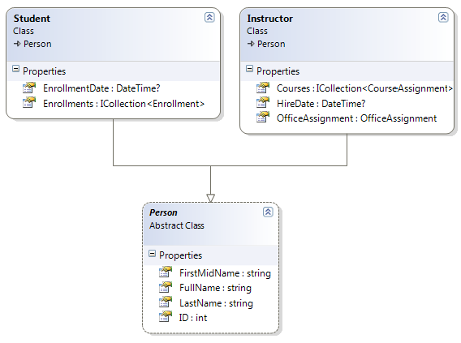

# 继承  
Contoso 大学示例 Web 应用程序演示如何使用实体框架（EF）Core 2.0 和 Visual Studio 2017 创建 ASP.NET Core 2.0 MVC Web 应用程序。 如欲了解更多本教程相关信息，请参阅 [一、入门](./chapters/start.md)。  
在上一教程中， 你学习了如何处理并发冲突异常。 本教程将会演示如何在数据模型中实现继承。  
在面向对象编程中，可以使用继承来提高代码重用。 在本教程中，您将更改 Instructor 和 Student 类，以便它们从包含 LastName 等属性的 Person 基类派生，这些属性对于 Instructor 和 Student 都是通用的。 您不会添加或更改任一网页，但您将更改一些代码，这些更改将自动反映在数据库中。  
## 将继承映射到数据库表的选项
在 School 数据模型中，Instructor 和 Student 类具有多个相同的属性：  
  
假如你想要消除在 Instructor 和 Student 实体中共享的冗余属性代码。 或者你想要写一个服务，用来格式化名字，而不必关心名字是来自于教师还是学生。你可以创建一个包含这些共享属性的 Person 基类， 然后 Instructor 和 Student 类从该类继承，如下图所示：  
  
这种继承结构可以有多种数据库实现方法。 你可以有一个 Person 表用来存储那些 Studnets 和 Instructors 共有的信息。 有一些列只应用于 Instructors (HireDate)表， 另外一些列只用于 Students (EntollmentDate)， 还有一些是共用的 (LastName, FirstName)。 通常情况下，您将有一个鉴别列来指示每行代表哪种类型。例如，对于教师值为 `Instructor` ，而对于学生值为 `Student` 。  
  
我们把这种 “通过一个数据库表实现实体继承结构” 的模式称为 table-per-hierarchy (TPH) 继承。  
另外一种方法是让数据库看起来像类继承结构。 例如， 你只在 Person 表中有名字字段， 而在 Instructor 和 Student 表中保存对应的日期字段。  
  
这种 “每一个类有一个对应数据库表” 的模式，我们称之为 table-per-type (TPT) 继承。  
还有另一种方法是将所有的非抽象类型映射到单独数据表。 一个类的所有属性，包括继承属性，都映射到对应数据表中的列。 这种模式被称为 Table-per-Concrete (TPC) 类继承。 如果你对 Person, Studnet 和 Instructor 类实现 TPC 继承，那么 Student 和 Instuctor 表实现继承后看起来和之前的并不会有什么不同。  
TPC 和 TPH 继承模式通常比 TPT 继承模式提供更好的性能，因为 TPT 模式会导致复杂的连接查询。
本教程演示如何实现 TPH 继承。 TPH 是 Entity Framework Core 支持的唯一继承模式。 你要做的就是创建一个 Person 类，将 Instructor 和 Student 类从 Person 派生出来，将这个新类添加到 DbContext 中，然后创建一个迁移。  
> **提示**  
> 在进行以下修改前，保存一份项目的副本。 这样当你遇到问题，需要重头开始时， 从保存的副本项目开始，而不是从整个系列教程重新开始，会更加轻松。
### 创建 Person 类
在 Models 文件夹中，创建 Person.cs 并用以下代码替换模板代码：
``` cs
using System.ComponentModel.DataAnnotations;
using System.ComponentModel.DataAnnotations.Schema;

namespace ContosoUniversity.Models
{
    public abstract class Person
    {
        public int ID { get; set; }

        [Required]
        [StringLength(50)]
        [Display(Name = "Last Name")]
        public string LastName { get; set; }
        [Required]
        [StringLength(50, ErrorMessage = "First name cannot be longer than 50 characters.")]
        [Column("FirstName")]
        [Display(Name = "First Name")]
        public string FirstMidName { get; set; }

        [Display(Name = "Full Name")]
        public string FullName
        {
            get
            {
                return LastName + ", " + FirstMidName;
            }
        }
    }
}
```
### 让 Student 和 Instuctor 类从 Person 类继承。  
在 Instructor.cs 中，让 Instructor 类从 Person 类派生，删除主键和名称字段。 代码如下所示：
``` cs
using System;
using System.Collections.Generic;
using System.ComponentModel.DataAnnotations;
using System.ComponentModel.DataAnnotations.Schema;

namespace ContosoUniversity.Models
{
    public class Instructor : Person
    {
        [DataType(DataType.Date)]
        [DisplayFormat(DataFormatString = "{0:yyyy-MM-dd}", ApplyFormatInEditMode = true)]
        [Display(Name = "Hire Date")]
        public DateTime HireDate { get; set; }

        public ICollection<CourseAssignment> CourseAssignments { get; set; }
        public OfficeAssignment OfficeAssignment { get; set; }
    }
}
```
对 Student.cs 做同样的修改。
``` cs
using System;
using System.Collections.Generic;
using System.ComponentModel.DataAnnotations;
using System.ComponentModel.DataAnnotations.Schema;

namespace ContosoUniversity.Models
{
    public class Student : Person
    {
        [DataType(DataType.Date)]
        [DisplayFormat(DataFormatString = "{0:yyyy-MM-dd}", ApplyFormatInEditMode = true)]
        [Display(Name = "Enrollment Date")]
        public DateTime EnrollmentDate { get; set; }


        public ICollection<Enrollment> Enrollments { get; set; }
    }
}
```
### 添加 Person 实体类型到数据模型  
将 Person 实体类型添加到 SchoolContext.cs 。 代码如下所示：
``` cs
using ContosoUniversity.Models;
using Microsoft.EntityFrameworkCore;

namespace ContosoUniversity.Data
{
    public class SchoolContext : DbContext
    {
        public SchoolContext(DbContextOptions<SchoolContext> options) : base(options)
        {
        }

        public DbSet<Course> Courses { get; set; }
        public DbSet<Enrollment> Enrollments { get; set; }
        public DbSet<Student> Students { get; set; }
        public DbSet<Department> Departments { get; set; }
        public DbSet<Instructor> Instructors { get; set; }
        public DbSet<OfficeAssignment> OfficeAssignments { get; set; }
        public DbSet<CourseAssignment> CourseAssignments { get; set; }
        public DbSet<Person> People { get; set; }

        protected override void OnModelCreating(ModelBuilder modelBuilder)
        {
            modelBuilder.Entity<Course>().ToTable("Course");
            modelBuilder.Entity<Enrollment>().ToTable("Enrollment");
            modelBuilder.Entity<Student>().ToTable("Student");
            modelBuilder.Entity<Department>().ToTable("Department");
            modelBuilder.Entity<Instructor>().ToTable("Instructor");
            modelBuilder.Entity<OfficeAssignment>().ToTable("OfficeAssignment");
            modelBuilder.Entity<CourseAssignment>().ToTable("CourseAssignment");
            modelBuilder.Entity<Person>().ToTable("Person");

            modelBuilder.Entity<CourseAssignment>()
                .HasKey(c => new { c.CourseID, c.InstructorID });
        }
    }
}
```
这些就是 Entity Framework 为了配置 TPH 继承所需要做的。 正如你所看到的，当数据库更新时，它将有一个 Person 表来代替 Student 和 Instructor 表。  
### 创建和自定义迁移代码
保存所做的更改并生成项目。 然后在项目文件夹中打开命令窗口并输入以下命令：
``` console
dotnet ef migrations add Inheritance
```
暂时先不要运行 `database update` 命令。 该命令将导致数据丢失，因为它将删除 Instructor 表并将 Student 表重命名为 Person 。 您需要提供自定义代码来保留现有数据。  
打开 `Migrations/<timestamp>_Inheritance.cs` ，使用以下代码替换 `Up` 方法：
``` cs
protected override void Up(MigrationBuilder migrationBuilder)
{
    migrationBuilder.DropForeignKey(
        name: "FK_Enrollment_Student_StudentID",
        table: "Enrollment");

    migrationBuilder.DropIndex(name: "IX_Enrollment_StudentID", table: "Enrollment");

    migrationBuilder.RenameTable(name: "Instructor", newName: "Person");
    migrationBuilder.AddColumn<DateTime>(name: "EnrollmentDate", table: "Person", nullable: true);
    migrationBuilder.AddColumn<string>(name: "Discriminator", table: "Person", nullable: false, maxLength: 128, defaultValue: "Instructor");
    migrationBuilder.AlterColumn<DateTime>(name: "HireDate", table: "Person", nullable: true);
    migrationBuilder.AddColumn<int>(name: "OldId", table: "Person", nullable: true);

    // Copy existing Student data into new Person table.
    migrationBuilder.Sql("INSERT INTO dbo.Person (LastName, FirstName, HireDate, EnrollmentDate, Discriminator, OldId) SELECT LastName, FirstName, null AS HireDate, EnrollmentDate, 'Student' AS Discriminator, ID AS OldId FROM dbo.Student");
    // Fix up existing relationships to match new PK's.
    migrationBuilder.Sql("UPDATE dbo.Enrollment SET StudentId = (SELECT ID FROM dbo.Person WHERE OldId = Enrollment.StudentId AND Discriminator = 'Student')");

    // Remove temporary key
    migrationBuilder.DropColumn(name: "OldID", table: "Person");

    migrationBuilder.DropTable(
        name: "Student");

    migrationBuilder.CreateIndex(
         name: "IX_Enrollment_StudentID",
         table: "Enrollment",
         column: "StudentID");

    migrationBuilder.AddForeignKey(
        name: "FK_Enrollment_Person_StudentID",
        table: "Enrollment",
        column: "StudentID",
        principalTable: "Person",
        principalColumn: "ID",
        onDelete: ReferentialAction.Cascade);
}
```
此代码将负责以下数据库更新任务：
* 删除指向 Student 表的外键和索引。
* 重命名 Instructor 表为 Person， 并做适当修改来满足保存 Student 数据的需要。
* 为学生添加可为空的 EnrollmentDate 字段
* 添加 Discriminator 字段用于区分学生和教师
* 修改 HireDate 类型至可为空，因为对于学生行来说，他们没有雇佣日期。
* 添加一个临时字段(OldId)用于更新指向学生的外键。 当你复制学生到 Person 表时，这些数据得到新的主键值。
* 从 Student 表复制数据到 Person 表， 这将导致学生分配到新主键值。
* 修复指向学生的外键值。
* 重新创建外键约束和索引，将它们指向 Person 表。
（如果你使用 GUID 代替 integer 作为主键类型的话， 则无需修改学生的主键值，这里面的好些步骤可以省略。）
运行 `database update` 命令
``` console
dotnet ef database update
```
（在生产系统中， 你可能需要对 `Down` 方法做相应的更改，以防万一你需要回退到之前的数据库版本。在本教程中你无需使用 `Down` 方法。）  
> **备注**
> 在已有数据的数据库中进行架构更改，可能会发生其他错误。如果你遇到无法解决的迁移错误， 你可以修改连接字符串中的数据库名或者删除数据库。 对于一个新的数据库来说，不需要迁移数据，则 `update database` 命令可以不发生错误的完成。 要删除数据库， 请使用 SSOX 或运行 `database drop` CLI 命令。  
### 继承实现的测试
运行应用程序并尝试使用各个页面。 一切工作正常，和以前一样。  
在 **SQL Server Object Explorer (SQL Server 对象资源管理器)** 中，展开 Data Connections/SchoolContext，点击 Tables， 你可以看到 Student 和 Instructor 数据表已经被 Person 数据表代替。 打开 Person 表设计器，你可以看到用于 Student 和 Instructor 表的所有字段。  
  
右键点击 Person 表，再点击 “显示表数据” ，可以看到 discriminator 列中的数据。
## 小结
在本教程中，你完成了 Person, Student 和 Instructor 类的 table-per-hierarchy (TPH) 继承。 想要知道有关 Entity Framework Core 继承方面的信息，请参阅 [Inheritance](https://docs.microsoft.com/ef/core/modeling/inheritance) 。在在下一个教程中，您将看到如何处理各种相对高级的 Entity Framework 场景。