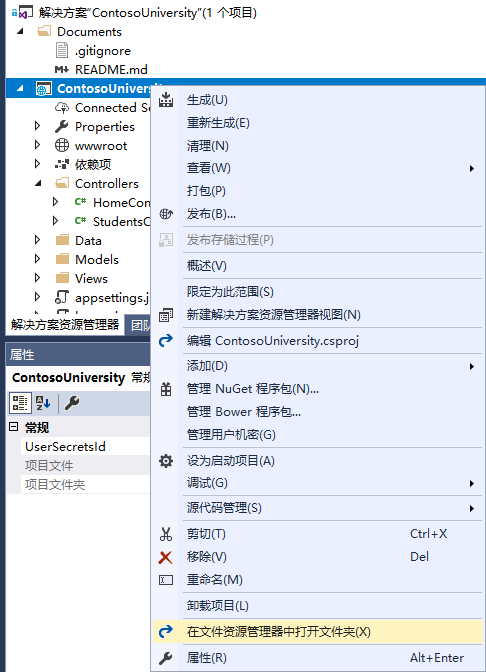
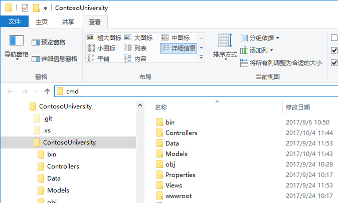
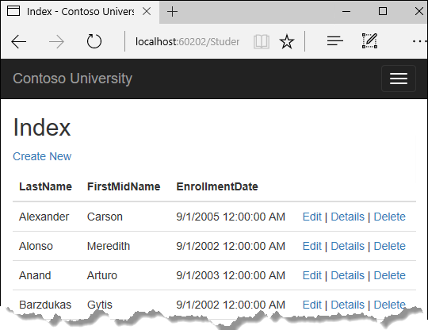

# 迁移 

Contoso 大学示例 Web 应用程序演示如何使用实体框架（EF）Core 2.0 和 Visual Studio 2017 创建 ASP.NET Core 2.0 MVC Web 应用程序。 如欲了解更多本教程相关信息，请参阅 [一、入门](./chapters/start.md)

在本章中，您开始学习使用 EF Core 迁移功能来管理数据模型修改。 在后面的教程中，当您修改数据模型是，将会添加更多的迁移代码。

### 迁移简介

在开发一个新的应用时，你的数据模型频繁更改，每次模型更改，都导致与数据库失去同步。本教程开始的时候，你配置 Entity Framework 在数据库不存在时创建数据库。然后每次当您修改数据模型 -- 添加、删除或者修改实体类或者修改 DbContext 类 -- 您可以删除数据库，然后让 EF 基于数据模型重新创建一个新的数据库，再填充测试数据。

这种保持数据库和数据模型同步的方法在您将应用部署到生产环境前可以适用。一旦应用运行在生产环境，通常您需要保留已存储的数据，并且您也不想每次添加一个列的时候丢失所有数据。 EF Core 迁移功能通过让 EF 更新数据库结构而不是创建一个新的数据库的方式解决此问题。

## 用于进行迁移的 Entity Framework Core NuGet 包

要使用迁移功能， 您可以使用程序包管理器（PMC）或命令行界面（CLI）。在教程中介绍如何使用 CLI 命令。有关使用 PMC 的信息位于教程最后面。

在 ```Microsoft.EntityFrameworkCore.Tools.DotNet``` 中提供了适用于命令行界面（CLI）的 EF 工具。要安装此包，必须将其添加到位于 ```.csproj```文件中的 ```DotNetCliToolReference``` 集合，如下所示。请注意：必须通过编辑 ```.csproj``` 文件来安装此包，不能使用 ```install-package``` 命令或程序包管理器图形界面安装。

``` XML
<ItemGroup>
  <DotNetCliToolReference Include="Microsoft.EntityFrameworkCore.Tools.DotNet" Version="2.0.0" />
  <DotNetCliToolReference Include="Microsoft.VisualStudio.Web.CodeGeneration.Tools" Version="2.0.0" />
</ItemGroup>
```

（示例中的版本号是本教程书写时候的最新版本。）

### 修改连接字符串

在 appsettings.json 文件中，将连接字符串数据库的名称更改为 ContosoUniversity2 或任何未在您计算机使用的其他名称。

``` JSON
{
  "ConnectionStrings": {
    "DefaultConnection": "Server=(localdb)\\mssqllocaldb;Database=ContosoUniversity2;Trusted_Connection=True;MultipleActiveResultSets=true"
  },
```

这个更改的作用是，当我们建立第一次迁移时，将会创建一个新的数据库。使用迁移的话，这不是必须的，但您将很快看到，这是一个不错的主意。

> ### 备注
> 除了修改数据库名称外，你可以使用的一个替代方式是删除数据库。 您可以使用 SQL Server 对象浏览器 （SSOX) 或 ```database drop``` CLI 命令：
> ```console
> dotnet ef database drop
> ``` 
> 以下部分说明如何运行 CLI 命令。

### 创建初始迁移
保存并编译项目。 然后打开命令窗口并导航到项目文件夹。有一种快捷方式是：

* 在解决方案资源管理器，右键单击项目，然后选择 "在文件资源管理器中打开文件夹(X)"。


* 在地址栏中输入 ```cmd``` ，然后按回车键。


在命令窗口中输入以下命令：

``` console
dotnet ef migrations add InitialCreate
```

你将在命令窗口中看到类似如下输出：
``` console
infoDone. To undo this action, use 'ef migrations remove'
```
*译者注： 这部分和原文不同。*


> ### 备注
> 如果您看到一条错误信息 ```No executable found matching command "dotnet-ef"``` ，请参阅 [这篇博客](http://thedatafarm.com/data-access/no-executable-found-matching-command-dotnet-ef/) 进行排错。

如果你看到一条错误消息 ```无法访问文件...ContosoUniversity.dll 由于另一个进程正在使用。```，在 Windows 系统任务栏中，查找 IIS Express 图标并右键单击它，然后单击ContosoUniversity > 停止站点。

### 检查 ```Up``` 和 ```Down``` 方法

当您执行 ```migrations add``` 命令时， EF 生成从头开始创建数据库的代码。代码位于 ```Migrations``` 文件夹， 名为 ```<时间戳>_InitialCreate.cs``` 的文件中。 ```InitialCreate``` 类的 ```Up``` 方法创建对应数据模型实体集的数据库表，```Down``` 方法用于删除这些表，如下面代码中所示：

```cs 
public partial class InitialCreate : Migration
{
    protected override void Up(MigrationBuilder migrationBuilder)
    {
        migrationBuilder.CreateTable(
            name: "Course",
            columns: table => new
            {
                CourseID = table.Column<int>(nullable: false),
                Credits = table.Column<int>(nullable: false),
                Title = table.Column<string>(nullable: true)
            },
            constraints: table =>
            {
                table.PrimaryKey("PK_Course", x => x.CourseID);
            });

        // 更多的代码此处不再显示
    }

    protected override void Down(MigrationBuilder migrationBuilder)
    {
        migrationBuilder.DropTable(
            name: "Enrollment");
        // 更多的代码此处不再显示
    }
}
```

迁移功能在实现一个迁移的数据模型更改时，调用 ```Up``` 方法。当您输入命令要求回滚更新时，迁移功能调用 ```Down``` 方法。

这些代码是当您输入 ```Migrations add InitialCreate``` 命令时用于初始化迁移。 迁移参数 （示例中的"InitialCreate"） 用于构造文件名，如果您愿意，也可以使用其他名称。选择和迁移中正要进行的工作相关的单词或短语是比较好的方式。例如，稍后您可能为一个迁移命名 “AddDepartmentTable" 。

If you created the initial migration when the database already exists, the database creation code is generated but it doesn't have to run because the database already matches the data model. When you deploy the app to another environment where the database doesn't exist yet, this code will run to create your database, so it's a good idea to test it first. That's why you changed the name of the database in the connection string earlier -- so that migrations can create a new one from scratch.

如果您在数据库已存在的情况下创建初始迁移，则会生成数据库创建代码，但无需运行，因为数据库已匹配数据模型。 当您在另外一个环境中部署此应用时，数据库还不存在，这些代码将会运行以创建数据库，因此最好先对这些代码进行测试。这就是为什么前面您在连接字符串中修改数据库名为另外一个名称的原因 -- 这样迁移可以从头开始创建新的数据库。

### 检查数据模型快照

迁移功能同时创建一个当前数据库结构的快照在 ```Migrations/SchoolContextModelSnapshot.cs``` 文件中。代码看起来像下面这样：

``` cs
[DbContext(typeof(SchoolContext))]
partial class SchoolContextModelSnapshot : ModelSnapshot
{
    protected override void BuildModel(ModelBuilder modelBuilder)
    {
        modelBuilder
            .HasAnnotation("ProductVersion", "2.0.0-rtm-26452")
            .HasAnnotation("SqlServer:ValueGenerationStrategy", SqlServerValueGenerationStrategy.IdentityColumn);

        modelBuilder.Entity("ContosoUniversity.Models.Course", b =>
            {
                b.Property<int>("CourseID");

                b.Property<int>("Credits");

                b.Property<string>("Title");

                b.HasKey("CourseID");

                b.ToTable("Course");
            });

        // 此处省略多行代码

        modelBuilder.Entity("ContosoUniversity.Models.Enrollment", b =>
            {
                b.HasOne("ContosoUniversity.Models.Course", "Course")
                    .WithMany("Enrollments")
                    .HasForeignKey("CourseID")
                    .OnDelete(DeleteBehavior.Cascade);

                b.HasOne("ContosoUniversity.Models.Student", "Student")
                    .WithMany("Enrollments")
                    .HasForeignKey("StudentID")
                    .OnDelete(DeleteBehavior.Cascade);
            });
    }
}
```

由于当前数据库结构使用代码表示，在创建迁移的时候， EF Core 无需和数据库进行交互。 当您添加一个迁移时， EF 通过对比数据模型和快照文件来判断修改的内容。 仅当需要更新数据库的时候， EF 才与数据库交互。

快照文件必须保持与创建快照的迁移同步，因此不能通过删除名为 ```<时间戳>_<迁移名称>.cs``` 的文件来移除迁移。 如果你删除该文件，剩余的迁移将与数据库快照文件不同步。 若要删除你添加的最后一个迁移，请使用 ```dotnet ef migrations remove``` 命令。

###  应用迁移到数据库

在命令行窗口，输入以下命令，以创建数据库和表。
```console
dotnet ef database update
```

命令的输出类似于执行 ```migrations add``` 命令时的输出，除了可以看到创建数据库的 SQL 命令日志外。在下面的实例输出中忽略了大部分的内容。如果你不希望查看此级别的日志消息中的详细信息，你可以更改 ```appsettings。Development.json``` 文件中的日志级别。 有关详细信息，请参阅 [Introduction to logging](https://docs.microsoft.com/en-us/aspnet/core/fundamentals/logging) 。

``` console
info: Microsoft.AspNetCore.DataProtection.KeyManagement.XmlKeyManager[0]
      User profile is available. Using 'C:\Users\username\AppData\Local\ASP.NET\DataProtection-Keys' as key repository and Windows DPAPI to encrypt keys at rest.
info: Microsoft.EntityFrameworkCore.Infrastructure[100403]
      Entity Framework Core 2.0.0-rtm-26452 initialized 'SchoolContext' using provider 'Microsoft.EntityFrameworkCore.SqlServer' with options: None
info: Microsoft.EntityFrameworkCore.Database.Command[200101]
      Executed DbCommand (467ms) [Parameters=[], CommandType='Text', CommandTimeout='60']
      CREATE DATABASE [ContosoUniversity2];
info: Microsoft.EntityFrameworkCore.Database.Command[200101]
      Executed DbCommand (20ms) [Parameters=[], CommandType='Text', CommandTimeout='30']
      CREATE TABLE [__EFMigrationsHistory] (
          [MigrationId] nvarchar(150) NOT NULL,
          [ProductVersion] nvarchar(32) NOT NULL,
          CONSTRAINT [PK___EFMigrationsHistory] PRIMARY KEY ([MigrationId])
      );

<logs omitted for brevity>

info: Microsoft.EntityFrameworkCore.Database.Command[200101]
      Executed DbCommand (3ms) [Parameters=[], CommandType='Text', CommandTimeout='30']
      INSERT INTO [__EFMigrationsHistory] ([MigrationId], [ProductVersion])
      VALUES (N'20170816151242_InitialCreate', N'2.0.0-rtm-26452');
Done.
```

像我们在第一章中一样，打开 ```SQL Server 对象资源管理器``` 检查数据库。 您会注意到多了一个 ```__EFMigrationsHistory``` 数据表，这个表用于跟踪已应用于数据库的迁移。查看此表数据，可以看到有一行数据对应刚刚的第一个迁移。 （前面的 CLI 输出示例中的最后一个日志显示的是创建此行的 INSERT 语句。）

运行应用程序，可以看到一切如常运行。



### 命令行界面 (CLI) vs. 程序包管理器控制台 (PMC)

管理迁移的 EF 工具，即可运行于 .NET CLI 命令，也可以运行于 Visual Studio 的程序包控制台 （PMC） 窗口的 PowerShell cmdlets 中。 本教程演示如何使用 CLI， 不过如果你愿意也可以使用 PMC 。

PMC 命令的 EF 命令位于 ```Microsoft.EntityFrameworkCore.Tools``` 包中。 此包已包含在 ```Microsoft.AspNetCore.All``` metapackage，因此你不必另外安装。

**重要** ：这个包和你在 ```.csproj``` 文件中安装的 CLI 不是同一个。 这个包名称以 ```Tools``` 结束， 而 CLI 包中的名称以 ```Tools.DotNet``` 结束。

有关 CLI 命令的详细信息，请参阅  [.NET Core CLI](https://docs.microsoft.com/ef/core/miscellaneous/cli/dotnet)

有关 PMC 命令的详细信息，请参阅 [Package Manager Console (Visual Studio)](https://docs.microsoft.com/ef/core/miscellaneous/cli/powershell) 。

## 小结

在本教程中，您已了解如何创建并应用您的第一个迁移。 在下一步的教程中，您将开始通过扩展数据模型来查看更高级的主题。随着教程的展开，您将创建并应用更多的迁移。


