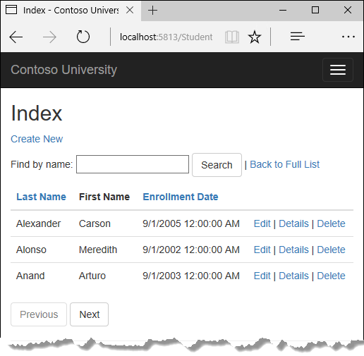
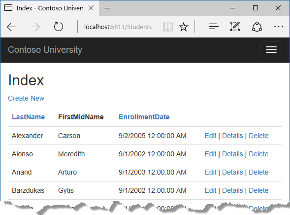
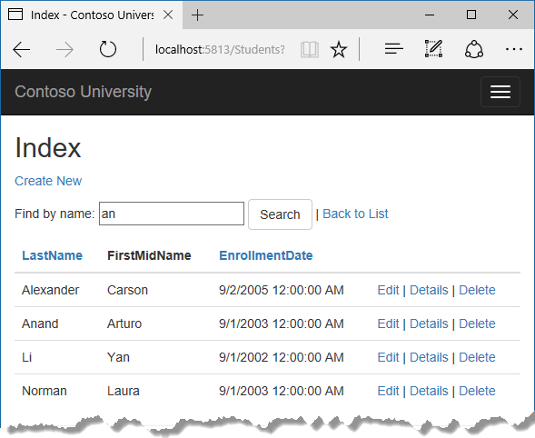

Contoso 大学示例 Web 应用程序演示如何使用实体框架（EF）Core 2.0 和 Visual Studio 2017 创建 ASP.NET Core 2.0 MVC Web 应用程序。 如欲了解更多本教程相关信息，请参阅 [一、入门](./chapters/start.md)

在前面的教程，你实现了一组 Student 实体基本的 CRUD 页面。 在本节中，您将向 Student 列表页添加排序、 筛选和分页功能， 还将创建一个进行简单分组的页面。

下图显示本节中将会完成的页面。 用户可以点击列标题进行排序。 重复点击列标题将排序在升序和降序之间切换。



## 将列排序链接添加到学生索引页 (Student Index)

要在学生索引页中添加排序，需要更改 Students 控制器中的 Index 的方法，并添加代码到 Students Index 视图。

### 在 Index 方法中添加排序功能

在 StudentsController.cs，替换 Index 方法为以下代码：
``` cs
public async Task<IActionResult> Index(string sortOrder)
{
    ViewData["NameSortParm"] = String.IsNullOrEmpty(sortOrder) ? "name_desc" : "";
    ViewData["DateSortParm"] = sortOrder == "Date" ? "date_desc" : "Date";
    var students = from s in _context.Students
                   select s;
    switch (sortOrder)
    {
        case "name_desc":
            students = students.OrderByDescending(s => s.LastName);
            break;
        case "Date":
            students = students.OrderBy(s => s.EnrollmentDate);
            break;
        case "date_desc":
            students = students.OrderByDescending(s => s.EnrollmentDate);
            break;
        default:
            students = students.OrderBy(s => s.LastName);
            break;
    }
    return View(await students.AsNoTracking().ToListAsync());
}
```

代码从 URL 中接收 sortOrder 查询参数，此查询参数由 ASP.NET Core MVC 提供。参数是值为 "Name" 或 "Date" 的字符串，有时候后面会带有下划线和字符串 "desc" 来指定降序顺序。 默认排序顺序为升序。

第一次请求索引页时，没有附加查询字符串。 在默认的 Switch default 方法中按 LastName 排序。 当用户单击列标题，相应的 sortOrder 将会出现在查询字符串中。两个 ViewData 元素 （ NameSortParm 和 DateSortParm ）供视图用于配置列标题超链接查询字符串。

These are ternary statements. The first one specifies that if the sortOrder parameter is null or empty, NameSortParm should be set to "name_desc"; otherwise, it should be set to an empty string. These two statements enable the view to set the column heading hyperlinks as follows:

``` cs
ViewData["NameSortParm"] = String.IsNullOrEmpty(sortOrder) ? "name_desc" : "";
ViewData["DateSortParm"] = sortOrder == "Date" ? "date_desc" : "Date";
```
这是三元选择语句。 如果 sortOrder 参数为 null 或为空，NameSortParm 应设置为 "name_desc"; 否则，设置为一个空字符串。 这两个语句在视图中用于设置列标题超链接，如下所示：

| 当前排序情况 | LastName 链接 | Date 链接 |
|---|---|---|
| LastName 升序 | 降序 | 升序 |
| LastName 降序 | 升序 | 升序 |
| Date 升序 | 升序 | 降序 |
| Date 降序 | 升序 | 升序 |

方法中使用 LINQ to Entities 指定排序列。 在进行 Switch 判断前， 创建 IQueryables 变量， 在判断之后， 调用 ToListAsync 方法。 在创建和修改 IQueryable 变量过程中，查询并不会真正发送到数据库，直到你通过调用一个类似 ToListAsync 的方法将 IQueryable 变量转化为一个集合。 因此，在这段代码中，只当返回 View 语句执行时，查询才真正发生。

这样的代码可能导致出现非常多的列变量，在本系列最后一个教程中将告诉你如何在变量中传递排序列名。

### 在学生索引视图中添加列标题超链接

为了添加列标题超链接，替换 Views/Students/Index.cshtml 文件中的代码为如下代码：
``` html
<th>
    <a asp-action="Index" asp-route-sortOrder = "@ViewData["NameSortParm"]"> @Html.DisplayNameFor(model => model.LastName) </a>
</th>
<th>
    @Html.DisplayNameFor(model => model.FirstMidName)
</th>
<th>
    <a asp-action="Index" asp-route-sortOrder = "@ViewData["DateSortParm"]"> @Html.DisplayNameFor(model => model.EnrollmentDate) </a>
</th>
```

代码使用 ViewData 属性中的信息建立超链接中的查询字符串。

运行应用程序中，选择 Student 菜单，然后单击 Last name 和 Enrollement Date 列标题，以验证排序是否生效。



## 在学生索引视图中添加搜索框

要在学生索引页面中添加过滤功能，您需要在视图中添加一个文本框和一个提交按钮，并在 Index 方法中做相应修改。 文本框中，你将输入要在名字和姓氏字段中搜索的字符串。

### 在 Index 方法中添加过滤功能

在StudentsController.cs，替换 Index 方法替换为以下代码 
``` cs
public async Task<IActionResult> Index(string sortOrder, string searchString)
{
    ViewData["NameSortParm"] = String.IsNullOrEmpty(sortOrder) ? "name_desc" : "";
    ViewData["DateSortParm"] = sortOrder == "Date" ? "date_desc" : "Date";
    ViewData["CurrentFilter"] = searchString;

    var students = from s in _context.Students
                   select s;
    if (!String.IsNullOrEmpty(searchString))
    {
        students = students.Where(s => s.LastName.Contains(searchString)
                               || s.FirstMidName.Contains(searchString));
    }
    switch (sortOrder)
    {
        case "name_desc":
            students = students.OrderByDescending(s => s.LastName);
            break;
        case "Date":
            students = students.OrderBy(s => s.EnrollmentDate);
            break;
        case "date_desc":
            students = students.OrderByDescending(s => s.EnrollmentDate);
            break;
        default:
            students = students.OrderBy(s => s.LastName);
            break;
    }
    return View(await students.AsNoTracking().ToListAsync());
}
```

在 Index 方法中添加 searchString 参数，此参数值来自刚刚加入视图中的文本框。同时，在 LINQ 语句中添加一个 Where 子句来选择名字 （first name 和 last name）中包含查询字符串的学生。Where 子句仅当查询字符串中有值时才生效。

> ### Note
> 在这里， 您在 IQueryable 对象上调用 Where 方法， 过滤将在服务器上进行。某些情况下，您也可能是对内存集合调用 Where 方法。（例如，假设你将 _context.Students 的引用，从 EF Dataset 修改为一个返回 IEnumerable 的仓储方法。）查询结果通常是相同的，但在某些情况下可能会有所不同。  
> 例如，.NET Framework 实现的 Contains 方法默认区分大小写。但 SQL Server 中这取决于 SQL Server 实例的排序规则设置，该设置默认为不区分大小写。 您可以调用 ToUpper 来进行测试显式不区分大小写的方法：```Where (s = > s.LastName.ToUpper()。Contains(searchString.ToUpper())```。 这将确保如果稍后你修改代码为使用返回 IEnumerable 对象的仓储 Repository，而不是返回 IQueryable 对象时，结果保持相同。 (当您在 IEnumerable 集合上调用 Contains 方法时，使用的是 .NET Framework 实现; 而在 IQueryable 对象上，则使用 database provider 实现。) 但是，这个解决方案将对性能产生负面影响。 ```ToUpper``` 代码将在 TSQL 查询语句的 Where 条件中加入函数调用，进而导致 SQL 优化器停止使用索引。 假设 SQL 主要安装为不区分大小写，最好是避免 ToUpper 代码，直到您迁移到区分大小写的数据存储区。

### 在 Index 视图中添加搜索框
在Views/Student/Index.cshtml，在 ```<Table>``` 标签前加入如下代码，创建一个标题、一个文本框和一个搜索按钮。
``` html
<form asp-action="Index" method="get">
    <div class="form-actions no-color">
        <p>
            Find by name: <input type="text" name="SearchString" value="@ViewData["currentFilter"]" />
            <input type="submit" value="Search" class="btn btn-default" /> |
            <a asp-action="Index">Back to Full List</a>
        </p>
    </div>
</form>
```

代码使用 ```<form>``` 标签，添加搜索文本框和按钮。默认情况下，```<form>``` 标签使用 ```POST``` 方法进行数据提交，参数在消息正文而不是 URL 查询字符串中传递。通过指定使用 ```GET``` 方法，窗体数据通过 URL 查询字符串进行传递，这是的用户可以对 URL 创建书签。 W3C 准则建议，在未导致更新的操作中，使用 ```GET``` 方法。

运行应用程序中，选择 Student 菜单，输入任意搜索字符，并点击“搜索”按钮，以验证过滤功能生效。



请注意在 URL 中包含了搜索字符串。

``` html
http://localhost:5813/Students?SearchString=an
```

如果您将本页面加入书签，下次使用书签时，您将得到过滤后的列表。在 ```Form``` 标签中添加的 ```method="get"``` 是产生查询字符串的原因。

在此阶段，如果您单击列标题进行排序，你将丢失搜索框中输入的过滤查询。 在下一部分中将修复此问题。

## 在学生索引视图中添加分页功能

要在学生索引页中添加分页功能，您将创建一个 ```PaginatedList``` 类，在类中使用 ```Skip``` 和 ```Take``` 语句实现在服务器过滤数据，而不是获取数据表的所有数据行。然后再对 ```Index``` 做一些更改，再 ```Index``` 视图中添加分页按钮。下图中展示了分页按钮。


在项目文件夹中，创建 ```PaginatedList.cs```，然后键入下面的代码。
``` cs
using System;
using System.Collections.Generic;
using System.Linq;
using System.Threading.Tasks;
using Microsoft.EntityFrameworkCore;

namespace ContosoUniversity
{
    public class PaginatedList<T> : List<T>
    {
        public int PageIndex { get; private set; }
        public int TotalPages { get; private set; }

        public PaginatedList(List<T> items, int count, int pageIndex, int pageSize)
        {
            PageIndex = pageIndex;
            TotalPages = (int)Math.Ceiling(count / (double)pageSize);

            this.AddRange(items);
        }

        public bool HasPreviousPage
        {
            get
            {
                return (PageIndex > 1);
            }
        }

        public bool HasNextPage
        {
            get
            {
                return (PageIndex < TotalPages);
            }
        }

        public static async Task<PaginatedList<T>> CreateAsync(IQueryable<T> source, int pageIndex, int pageSize)
        {
            var count = await source.CountAsync();
            var items = await source.Skip((pageIndex - 1) * pageSize).Take(pageSize).ToListAsync();
            return new PaginatedList<T>(items, count, pageIndex, pageSize);
        }
    }
}
```

代码中，```CreateAsync``` 方法获取分页大小及页码，再 ```IQueryable``` 对象上使用相应的 ```Skip``` 和 ```Take``` 语句。 在 ```IQueryable``` 上调用 ```ToListAsync``` 后， 返回一个只包含请求页的列表。 属性 ```HasPreviousPage``` 及 ```HasNextPage``` 用于启用或禁用 “上一页” 和 “下一页” 按钮。

在 ```PaginatedList<T>``` 中使用 ```CreateAsync``` 方法而不是构造函数的原因是构造函数无法运行异步代码。

ACreateAsync方法用于而不是一个构造函数创建PaginatedList<T>对象，因为构造函数不能运行异步代码。

### 在 ```Index``` 方法中添加分页功能

在 ```StudentsController.cs```，替换 ```Index``` 方法替换为以下代码。

``` cs
public async Task<IActionResult> Index(
    string sortOrder,
    string currentFilter,
    string searchString,
    int? page)
{
    ViewData["CurrentSort"] = sortOrder;
    ViewData["NameSortParm"] = String.IsNullOrEmpty(sortOrder) ? "name_desc" : "";
    ViewData["DateSortParm"] = sortOrder == "Date" ? "date_desc" : "Date";

    if (searchString != null)
    {
        page = 1;
    }
    else
    {
        searchString = currentFilter;
    }

    ViewData["CurrentFilter"] = searchString;

    var students = from s in _context.Students
                   select s;
    if (!String.IsNullOrEmpty(searchString))
    {
        students = students.Where(s => s.LastName.Contains(searchString)
                               || s.FirstMidName.Contains(searchString));
    }
    switch (sortOrder)
    {
        case "name_desc":
            students = students.OrderByDescending(s => s.LastName);
            break;
        case "Date":
            students = students.OrderBy(s => s.EnrollmentDate);
            break;
        case "date_desc":
            students = students.OrderByDescending(s => s.EnrollmentDate);
            break;
        default:
            students = students.OrderBy(s => s.LastName);
            break;
    }

    int pageSize = 3;
    return View(await PaginatedList<Student>.CreateAsync(students.AsNoTracking(), page ?? 1, pageSize));
}
```

代码在方法中添加了 page, sortOrder, currentFilter 三个参数。

第一次显示页面，或如果用户未单击分页或排序链接，则所有参数将都为 ```null```。 单击分页链接时，如果页变量将包含要显示的页码。

ViewData("CurrentSort") 保存当前排序以供视图使用。在视图的分页链接中包含排序，翻页的时候才能保持排序不变。

ViewData("CurrentFilter")保存当前过滤字符串以供视图使用。在视图的分页链接中包含过滤字符串，翻页额时候才能保持过滤不变。

如果在分页期间，搜索字符串被更改，因为新的过滤导致显示不同的数据，页码必须被重置为第一页。在文本框中输入并按下提交按钮时，搜索字符串改变。在这种情况下，searchString 参数不为空。

``` cs
if (searchString != null)
{
    page = 1;
}
else
{
    searchString = currentFilter;
}
```

在 ```Index``` 方法结尾， ```PaginatedList.CreateAsync``` 方法转化学生查询至一个支持分页功能的单页学生集合，然后这个集合被传递给视图。

``` cs
return View(await PaginatedList<Student>.CreateAsync(students.AsNoTracking(), page ?? 1, pageSize));
```

```PaginatedList.CreateAsync``` 方法使用参数 ```page``` （页码）和```pageSize``` （页大小）作为参数。 ```page``` 参数后的两个 ```?``` 代表 ```null 合并运算符``` 。```null 合并运算符``` 定义了可为空类型的默认值；```page ?? 1``` 表达式意味着，如果 ```page``` 具有一个值（不为空），则返回 ```page```， 如果为空则返回 ```1``` 。

###  在 ```Index``` 视图中添加分页链接

在 ```Views/Students/Index.cshtml```，替换为以下代码。

``` html
@model PaginatedList<ContosoUniversity.Models.Student>

@{
    ViewData["Title"] = "Index";
}

<h2>Index</h2>

<p>
    <a asp-action="Create">Create New</a>
</p>

<form asp-action="Index" method="get">
    <div class="form-actions no-color">
        <p>
            Find by name: <input type="text" name="SearchString" value="@ViewData["currentFilter"]" />
            <input type="submit" value="Search" class="btn btn-default" /> |
            <a asp-action="Index">Back to Full List</a>
        </p>
    </div>
</form>

<table class="table">
    <thead>
        <tr>
            <th>
                <a asp-action="Index" asp-route-sortOrder="@ViewData["NameSortParm"]" asp-route-currentFilter="@ViewData["CurrentFilter"]">Last Name</a>
            </th>
            <th>
                First Name
            </th>
            <th>
                <a asp-action="Index" asp-route-sortOrder="@ViewData["DateSortParm"]" asp-route-currentFilter="@ViewData["CurrentFilter"]">Enrollment Date</a>
            </th>
            <th></th>
        </tr>
    </thead>
    <tbody>
        @foreach (var item in Model)
        {
            <tr>
                <td>
                    @Html.DisplayFor(modelItem => item.LastName)
                </td>
                <td>
                    @Html.DisplayFor(modelItem => item.FirstMidName)
                </td>
                <td>
                    @Html.DisplayFor(modelItem => item.EnrollmentDate)
                </td>
                <td>
                    <a asp-action="Edit" asp-route-id="@item.ID">Edit</a> |
                    <a asp-action="Details" asp-route-id="@item.ID">Details</a> |
                    <a asp-action="Delete" asp-route-id="@item.ID">Delete</a>
                </td>
            </tr>
        }
    </tbody>
</table>

@{
    var prevDisabled = !Model.HasPreviousPage ? "disabled" : "";
    var nextDisabled = !Model.HasNextPage ? "disabled" : "";
}

<a asp-action="Index"
   asp-route-sortOrder="@ViewData["CurrentSort"]"
   asp-route-page="@(Model.PageIndex - 1)"
   asp-route-currentFilter="@ViewData["CurrentFilter"]"
   class="btn btn-default @prevDisabled">
    Previous
</a>
<a asp-action="Index"
   asp-route-sortOrder="@ViewData["CurrentSort"]"
   asp-route-page="@(Model.PageIndex + 1)"
   asp-route-currentFilter="@ViewData["CurrentFilter"]"
   class="btn btn-default @nextDisabled">
    Next
</a>
```
*译者注：Markdown 语法无法实现代码内高亮，如不清楚修改的位置，请参考微软原文。* 

页面顶部的 ```@model``` 指定视图现在获取 ```PaginatedList<T>``` 对象而不是 ```List<T>``` 对象。

列标题上的链接使用查询字符串将当前的搜索字符串传递到控制器，以便用户可以在过滤后的结果中进行排序：

``` html
<a asp-action="Index" asp-route-sortOrder="@ViewData["DateSortParm"]" asp-route-currentFilter ="@ViewData["CurrentFilter"]">Enrollment Date</a>
```

The paging buttons are displayed by tag helpers:
分页按钮使用 ```tag helpers``` 进行显示
``` html
<a asp-action="Index"
   asp-route-sortOrder="@ViewData["CurrentSort"]"
   asp-route-page="@(Model.PageIndex - 1)"
   asp-route-currentFilter="@ViewData["CurrentFilter"]"
   class="btn btn-default @prevDisabled">
   Previous
</a>
```

运行应用并转到 Student 页面。


在不同排序状态下点击分页链接，以确认分页功能正常工作。然后尝试搜索后再分页，验证分页功能在不同排序和过滤条件下都正常工作。

## 创建一个显示学生统计信息的关于页面

在 Contoso 大学网站的 ```About``` 页面， 将显示每天有多少学生进行注册，这需要对数据进行分组，并在分组上做计算。要完成此任务，您需要执行以下操作：
* 创建一个用于传递数据到视图的 ViewModel 类。

* 修改 ```HomeController``` 中的 ```About``` 方法。

* 修改 ```About``` 视图。

### 创建 ViewModel 类

在 ```Models``` 文件夹中创建一个 ```SchoolViewModels``` 文件夹
在这个新的文件夹中，添加一个文件名为 ```EnrollmentDateGroup.cs``` 的类，并输入以下代码：
``` cs
using System;
using System.ComponentModel.DataAnnotations;

namespace ContosoUniversity.Models.SchoolViewModels
{
    public class EnrollmentDateGroup
    {
        [DataType(DataType.Date)]
        public DateTime? EnrollmentDate { get; set; }

        public int StudentCount { get; set; }
    }
}

```

### 修改 HomeController

在 ```HomeController.cs``` 文件, 顶部加入如下语句：

``` cs
using Microsoft.EntityFrameworkCore;
using ContosoUniversity.Data;
using ContosoUniversity.Models.SchoolViewModels;
```

在类中添加一个数据库上下文变量 _context， ASP.NET Core 依赖注入将为此变量提供实例。

``` cs
public class HomeController : Controller
{
    private readonly SchoolContext _context;

    public HomeController(SchoolContext context)
    {
        _context = context;
    }
```

将 About 方法替换为以下代码：
``` cs
public async Task<ActionResult> About()
{
    IQueryable<EnrollmentDateGroup> data = 
        from student in _context.Students
        group student by student.EnrollmentDate into dateGroup
        select new EnrollmentDateGroup()
        {
            EnrollmentDate = dateGroup.Key,
            StudentCount = dateGroup.Count()
        };
    return View(await data.AsNoTracking().ToListAsync());
}
```

LINQ 语句将 Student 实体进行分组，计算每个分组中的实体数量，并将结果存放在 ```EnrollmentDateGroup``` ViewModel 对象中。

> ### 备注
> 在 EF Core 1.0 版本中， 整个结果集返回到客户端，并在客户端上进行分组。在某些情况下，这会导致性能问题。请使用实际生产环境规模的数据测试性能，如有必要，使用原始 SQL 在服务器进行分组。 有关如何使用原始的 SQL 的信息，请参阅本系列最后一个教程。

### 修改 ```About``` 视图

替换 Views/Home/About.cshtml 为如下代码：

``` html
@model IEnumerable<ContosoUniversity.Models.SchoolViewModels.EnrollmentDateGroup>

@{
    ViewData["Title"] = "Student Body Statistics";
}

<h2>Student Body Statistics</h2>

<table>
    <tr>
        <th>
            Enrollment Date
        </th>
        <th>
            Students
        </th>
    </tr>

    @foreach (var item in Model)
    {
        <tr>
            <td>
                @Html.DisplayFor(modelItem => item.EnrollmentDate)
            </td>
            <td>
                @item.StudentCount
            </td>
        </tr>
    }
</table>
```

运行应用，转至 About 页面。 每个日期的学生注册数量显示于表格中。


## 小结

在本教程中，你已了解如何执行排序、 筛选、 分页和分组。 在下一步的教程中，你将了解如何通过使用迁移来处理数据模型更改。