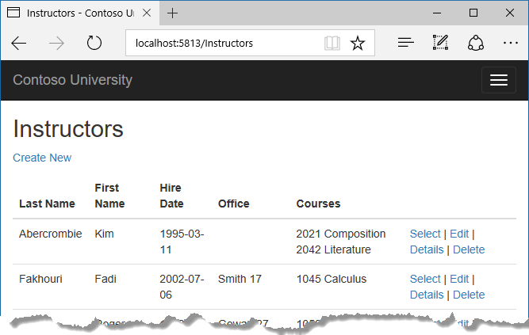
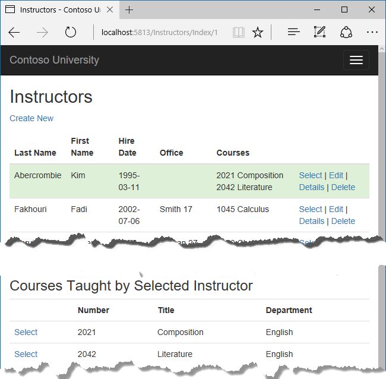

# 读取相关数据

Contoso 大学示例 Web 应用程序演示如何使用实体框架（EF）Core 2.0 和 Visual Studio 2017 创建 ASP.NET Core 2.0 MVC Web 应用程序。 如欲了解更多本教程相关信息，请参阅 [一、入门](./chapters/start.md)

在上一教程中，您完成了学校数据模型。在本章中，您将读取和展示相关数据 -- 即，实体框架加载到导航属性的数据。

以下图片展示了您即将完成的页面。


### 相关数据的 Eager Loading （贪婪加载）, Explicit Loading （显式加载）, 和 Lazy Loading （懒加载）

ORM （对象关系映射）框架，例如说 Entity Framework， 通常有多种方式用于加载实体的导航属性。

* Eager loading -- 贪婪加载。 当读取实体的时候，也读取实体相关的数据。这通常导致一个单一连接查询，来取出所以需要的数据。在 Entity Framework 使用 ```Include``` 和 ```ThenInclude``` 方法来指定贪婪加载。
  
您可以在分离的查询中检索其中一些数据， 然后让 EF “修复” 导航属性。 也就是说， EF 会自动将分离查询中的实体添加到之前读取到的实体导航属性中。 对于检索相关数据的查询， 您可以使用 Load 方法代替那些返回一个 ```list``` 或 ```object``` 的方法，比如说 ```ToList``` 或 ```Single``` 。


* Explicit loading -- 显示加载。第一次读取实体时， 相关的数据没有被检索。当您需要的时候，您需要写代码来检索相关数据。 如同在贪婪加载中使用分离查询一样，显示加载将形成多个查询送往数据库。不同之处在于，使用显示加载，代码指定的是要加载的导航属性。在 Entity Framework 1.1 中您可以使用 ```Load``` 方法来执行显示加载。例如：


* Lazy loading -- 懒加载，或延迟加载。第一次读取实体时， 相关的数据没有被检索。但是，当您尝试访问导航属性时，导航属性相关的数据将会被自动检索出。当您首次访问导航属性时，将有一个查询发往数据库。 Entity Framework Core 1.0 不支持 ```Lazy loading``` 。

#### 性能注意事项

如果您事先知道，对于每个实体，需要相关的数据的话，贪婪加载通常提供了最佳性能，因为发送到数据库的一个查询通常比多个查询更有效率。 例如，假设每个部门有十个相关的课程，贪婪加载方法使用了一条查询加载一个部门的所有相关数据，只需要一次数据库往返。而对每个部门单独查询课程，将导致出现十一个数据库往返。多余的数据库往返在延迟较高时对性能特别不利。

另一方面，在某些情况下，单独查询会更加高效。 贪婪加载可能会导致非常复杂的联结查询以至于 SQL Server 无法有效处理。 或者，您只需要对一个实体集的某个子集访问其导航属性，单独查询将可能比贪婪加载表现得更好，因为贪婪加载加载了超出您需要的数据的原因。 如果性能对您非常重要的话，最好对两种方式都进行测试来做出最佳的选择。

### 创建课程页，其中显示部门名称。

```Course``` 实体包含一个导航属性，对应课程所分配部门的 ```Department``` 实体。 若要在 ```Course``` （课程）列表中显示所分配 ```Department``` （部门）的名称，您需要从 ```Course.Department``` 导航属性连接的 ```Department``` 实体中取得 ```Name``` 属性。

为 ```Course``` 实体类型创建一个控制器，命名为 CoursesController，使用前面教程中用于创建 Students 控制器时用的脚手架，相同的选项 -- “视图使用 Entity Framework 的 MVC 控制器”。如下所示：


打开 ```CoursesController.cs``` 文件，检查 ```Index``` 方法。脚手架已自动使用 ```Include``` 方法指定 ```Department``` 导航属性为贪婪加载。

将 ```Index``` 方法替换为以下代码， 使用一个更合适的名称命名返回 ```Course``` 实体的 ```IQueryable``` 对象。

```cs 
public async Task<IActionResult> Index()
{
    var courses = _context.Courses
        .Include(c => c.Department)
        .AsNoTracking();
    return View(await courses.ToListAsync());
}
```

打开 ```Views/Courses/Index.cshtl```，并使用以下代码替换模板代码。 

``` html
@model IEnumerable<ContosoUniversity.Models.Course>
@{
    ViewData["Title"] = "Courses";
}
<h2>Courses</h2>

<p>
    <a asp-action="Create">Create New</a>
</p>
<table class="table">
    <thead>
        <tr>
            <th>
                @Html.DisplayNameFor(model => model.CourseID)
            </th>
            <th>
                @Html.DisplayNameFor(model => model.Title)
            </th>
            <th>
                @Html.DisplayNameFor(model => model.Credits)
            </th>
            <th>
                @Html.DisplayNameFor(model => model.Department)
            </th>
            <th></th>
        </tr>
    </thead>
    <tbody>
        @foreach (var item in Model)
        {
            <tr>
                <td>
                    @Html.DisplayFor(modelItem => item.CourseID)
                </td>
                <td>
                    @Html.DisplayFor(modelItem => item.Title)
                </td>
                <td>
                    @Html.DisplayFor(modelItem => item.Credits)
                </td>
                <td>
                    @Html.DisplayFor(modelItem => item.Department.Name)
                </td>
                <td>
                    <a asp-action="Edit" asp-route-id="@item.CourseID">Edit</a> |
                    <a asp-action="Details" asp-route-id="@item.CourseID">Details</a> |
                    <a asp-action="Delete" asp-route-id="@item.CourseID">Delete</a>
                </td>
            </tr>
        }
    </tbody>
</table>
```

您对脚手架生成的代码作了如下更改：

* 修改了课程 ```Index``` 页面的标题

* 添加了一列用于显示 ```CourseID``` 属性。 默认情况下， 主键不会出现在脚手架代码中，因为它们通常对最终用户无意义。 然而， 在这儿，主键是有意义的，您打算显示出来。

* 修改 ```Department``` 列以显示部门名称。 代码显示加载到 ```Department``` 导航属性中 ```Department``` 实体的 ```Name``` 属性。   
```cs
@Html.DisplayFor(modelItem => item.Department.Name)
```

运行应用程序，选择 ```Course``` 菜单以查看含有部门名称的列表。


### 创建一个教师页面，其中显示课程及学生注册情况

在本节中，您将会为 ```Instructor``` 实体创建一个控制器和视图用于展示教师。


本页面使用以下方法读取并展示相关数据：

* 教师列表展示来自 ```OfficeAssignment``` 实体的相关数据。 ```Instructor``` 和 ```OfficeeAssignment``` 实体是 一 对 零或一 关系，对 ```OfficeAssignment``` 实体将使用贪婪加载方式。 如前所述， 当您需要主表所有行的相关数据时，贪婪加载是最高效的。 在这种情况下， 你希望显示所有教师分配的办公室。

* 当用户选择一个教师时，相关的课程实体将会显示。 教师和课程实体是 “多对多” 关系。您将对课程及相关的部门实体使用贪婪加载。此时，单独的查询可能会更加高效，因为您只需要所选择教师相关的课程。 不过，这个示例主要用于展示如何对导航属性使用贪婪加载，以及对导航属性内的实体进行贪婪加载。

* 当用户选择一个课程时，相关的注册实体将会显示。 课程和注册实体是 “一对多” 关系。 您将会使用单独的查询来应对注册实体和相关的学生实体。

#### 创建教师索引视图的视图模型

教师页显示三个不同的表中的数据。因此，你创建的视图模型将包括三个属性，每个属性包含一个表的数据。

在 SchoolViewModels 文件夹中，创建 InstructorIndexData.cs 并替换为以下代码：

```cs 
using System;
using System.Collections.Generic;
using System.Linq;
using System.Threading.Tasks;

namespace ContosoUniversity.Models.SchoolViewModels
{
    public class InstructorIndexData
    {
        public IEnumerable<Instructor> Instructors { get; set; }
        public IEnumerable<Course> Courses { get; set; }
        public IEnumerable<Enrollment> Enrollments { get; set; }
    }
}
```
#### 创建教师控制器和视图

使用包含 EF 读/写 操作的控制器模板创建一个教师控制器，如下图所示：


打开 InstructorsController.cs 和添加 Viewmodel 命名空间引用：

```cs 
using ContosoUniversity.Models.SchoolViewModels;
```

使用以下代码替换 Index 方法，以达到相关数据的贪婪加载，并放入视图模型中。

``` cs
public async Task<IActionResult> Index(int? id, int? courseID)
{
    var viewModel = new InstructorIndexData();
    viewModel.Instructors = await _context.Instructors
          .Include(i => i.OfficeAssignment)
          .Include(i => i.CourseAssignments)
            .ThenInclude(i => i.Course)
                .ThenInclude(i => i.Enrollments)
                    .ThenInclude(i => i.Student)
          .Include(i => i.CourseAssignments)
            .ThenInclude(i => i.Course)
                .ThenInclude(i => i.Department)
          .AsNoTracking()
          .OrderBy(i => i.LastName)
          .ToListAsync();
    
    if (id != null)
    {
        ViewData["InstructorID"] = id.Value;
        Instructor instructor = viewModel.Instructors.Where(
            i => i.ID == id.Value).Single();
        viewModel.Courses = instructor.CourseAssignments.Select(s => s.Course);
    }

    if (courseID != null)
    {
        ViewData["CourseID"] = courseID.Value;
        viewModel.Enrollments = viewModel.Courses.Where(
            x => x.CourseID == courseID).Single().Enrollments;
    }

    return View(viewModel);
}
```

方法接受可选路由数据(id)和一个查询字符串参数(courseID)，分别对应选择的教师和选择的课程。参数从页面的超链接中而来。

代码首先创建一个视图模型的实例，并在其中加入教师列表。 代码指定对 ```Instrator.OfficeAssignment``` 和 ```CourseAssignments``` 导航属性使用贪婪加载。 在 ```CourseAssignments``` 属性中，```Course``` 属性将被加载， 然后在 ```Course``` 属性中， ```Enrollments``` 和 ```Department``` 属性将会被加载，同时在每个 ```Enrollment``` 实体中， ```Student``` 属性将会被加载。

```cs 
viewModel.Instructors = await _context.Instructors
      .Include(i => i.OfficeAssignment)
      .Include(i => i.CourseAssignments)
        .ThenInclude(i => i.Course)
            .ThenInclude(i => i.Enrollments)
                .ThenInclude(i => i.Student)
      .Include(i => i.CourseAssignments)
        .ThenInclude(i => i.Course)
            .ThenInclude(i => i.Department)
      .AsNoTracking()
      .OrderBy(i => i.LastName)
      .ToListAsync();
```

由于视图始终需要 ```OfficeAssignmet``` 实体，因此在同一个查询中获取它更有效。 当在网页中选择教师时，课程实体是必需的，因此只有当页面以不是没有选择的课程更频繁地显示时，单个查询才会比多个查询更好。

代码中，```CourseAssignments``` 和 ```Course``` 重复出现，因为您需要 ```Course``` 的两个属性。 在第一个 ```ThenInclude``` 中获取 ```CourseAssignment.Course```, ```Course.Enrollements```, 及 ```Enrollment.Student``` 。

<pre>
viewModel.Instructors = await _context.Instructors
      .Include(i => i.OfficeAssignment)
      <span style="background-color: #ffc;">.Include(i => i.CourseAssignments)
        .ThenInclude(i => i.Course)
            .ThenInclude(i => i.Enrollments)
                .ThenInclude(i => i.Student)</span>
      .Include(i => i.CourseAssignments)
        .ThenInclude(i => i.Course)
            .ThenInclude(i => i.Department)
      .AsNoTracking()
      .OrderBy(i => i.LastName)
      .ToListAsync();
</pre>

在代码中的那一点，另一个 ```ThenInclude``` 将用于学生的导航属性，您不需要它。 但是，调用 ```Include``` 是由 ```Instructor``` ```属性开始的，所以你必须重新遍历整个链条，通过指定Course.Department``` 而不是 ````Course.Enrollments```` 。

<pre>
viewModel.Instructors = await _context.Instructors
      .Include(i => i.OfficeAssignment)
      .Include(i => i.CourseAssignments)
        .ThenInclude(i => i.Course)
            .ThenInclude(i => i.Enrollments)
                .ThenInclude(i => i.Student)
      <span style="background-color: #ffc;">.Include(i => i.CourseAssignments)
        .ThenInclude(i => i.Course)
            .ThenInclude(i => i.Department)</span>
      .AsNoTracking()
      .OrderBy(i => i.LastName)
      .ToListAsync();
</pre>

在选择了一个教师时，将执行下面的代码。 从教师视图模型中的列表中检索所选的教师。 然后视图模型的```Courses``` 属性和课程实体从该教师的 ```CourseAssignments``` 导航属性中一起被加载。

```cs
if (id != null)
{
    ViewData["InstructorID"] = id.Value;
    Instructor instructor = viewModel.Instructors.Where(
        i => i.ID == id.Value).Single();
    viewModel.Courses = instructor.CourseAssignments.Select(s => s.Course);
}
```

```Where``` 方法返回一个集合，但在本例中，传递给该方法的条件只会返回一个 ```Instructor``` 实体。 ```Single``` 方法将集合转换为单个 ```Instructor``` 实体， 这样一来，您就可以访问该实体的 ```CourseAssignments``` 属性。 ```CourseAssignments``` 包含 ```CourseAssignments``` 实体集合，从中得到相关的 ```Course``` 实体集。


当您知道集合将只有一个项目时，您可以在集合上使用 ```Single``` `方法。如果传递给它的集合为空，或者有多个项目， ```Single``` 方法会抛出异常。一个替代方法是 ```SingleOrDefault``` ，如果集合是空的，它返回一个默认值（在这种情况下为null）。 但是，在这种情况下，仍然会导致异常（尝试在空引用上查找Courses属性），并且异常消息将不太清楚地指出问题的原因。 当您调用 ```Single``` 方法时，您还可以传递 ```Where``` 条件，而无需单独调用 ```Where``` 方法：

```cs
.Single(i => i.ID == id.Value)
```
而不是
``` cs
.Where(I => i.ID == id.Value).Single()
```

接下来，如果选择课程，则从视图模型中的课程列表中检索所选课程。 然后，视图模型的 “Enrollments” 属性将加载该课程的 “Enrollments” 导航属性中的 “Enrollment” 实体。

```cs
if (courseID != null)
{
    ViewData["CourseID"] = courseID.Value;
    viewModel.Enrollments = viewModel.Courses.Where(
        x => x.CourseID == courseID).Single().Enrollments;
}
```

#### 修改 “教师索引” 视图

在 Views/Instructors/Index.cshtml 文件中，使用以下代码替换。

``` html
@model ContosoUniversity.Models.SchoolViewModels.InstructorIndexData

@{
    ViewData["Title"] = "Instructors";
}

<h2>Instructors</h2>

<p>
    <a asp-action="Create">Create New</a>
</p>
<table class="table">
    <thead>
        <tr>
            <th>Last Name</th>
            <th>First Name</th>
            <th>Hire Date</th>
            <th>Office</th>
            <th>Courses</th>
            <th></th>
        </tr>
    </thead>
    <tbody>
        @foreach (var item in Model.Instructors)
        {
            string selectedRow = "";
            if (item.ID == (int?)ViewData["InstructorID"])
            {
                selectedRow = "success";
            }
            <tr class="@selectedRow">
                <td>
                    @Html.DisplayFor(modelItem => item.LastName)
                </td>
                <td>
                    @Html.DisplayFor(modelItem => item.FirstMidName)
                </td>
                <td>
                    @Html.DisplayFor(modelItem => item.HireDate)
                </td>
                <td>
                    @if (item.OfficeAssignment != null)
                    {
                        @item.OfficeAssignment.Location
                    }
                </td>
                <td>
                    @{
                        foreach (var course in item.CourseAssignments)
                        {
                            @course.Course.CourseID @:  @course.Course.Title <br />
                        }
                    }
                </td>
                <td>
                    <a asp-action="Index" asp-route-id="@item.ID">Select</a> |
                    <a asp-action="Edit" asp-route-id="@item.ID">Edit</a> |
                    <a asp-action="Details" asp-route-id="@item.ID">Details</a> |
                    <a asp-action="Delete" asp-route-id="@item.ID">Delete</a>
                </td>
            </tr>
           }
    </tbody>
</table>
```

你对现有代码做出以下更改：

* 修改页面 model 类为 ```InstructorIndexData```。

* 修改页面标题为 ```Instructors``` 。

* 在 ```item.OfficeAssignment``` 不为空的情况下，才添加一个 ```Office``` 列，显示 ```item.OfficeAssignment.Location``` 。 （因为这是一个 "一 对 零或一" 的关系，可能没有相关的 ```OfficeAssignment``` 实体。）
  ```cs
  @if (item.OfficeAssignment != null)
  {
      @item.OfficeAssignment.Location
  }
  ```

* 添加了一个课程列，显示每个教师所教授的课程。 请参阅 [使用 @: 的显式行转换](https://docs.microsoft.com/en-us/aspnet/core/mvc/views/razor#explicit-line-transition-with-) 有关此 Razor 语法的更多信息。

* 添加的代码动态地将 ```class =“success”``` 添加到所选教师的 ```tr``` 元素中。 这将会通过 Bootstrap 类为选择行设置一个背景颜色。
  ``` html
  string selectedRow = "";
  if (item.ID == (int?)ViewData["InstructorID"])
  {
     selectedRow = "success";
  }
  <tr class="@selectedRow">
  ```

* 在每行中的其他链接前，添加一个新的超链接 "Select" ，将所选教师的 ```ID``` 发送到 ```Index``` 方法。
  ```html
  <a asp-action="Index" asp-route-id="@item.ID">Select</a> |
  ```


运行应用程序，选择 ```Instructor``` 链接。  当没有相关的 ```OfficeAssignment``` 实体时，该页面显示相关 ```OfficeAssignment``` 实体的 ```Location``` 属性和一个空表单元格。



在 ```Views/Instructors/Index.cshtml``` 文件中，在 </table> 标签（文件末尾）后添加以下代码。 该代码显示了当教师选择时与教练相关的课程列表。

``` html
@if (Model.Courses != null)
{
    <h3>Courses Taught by Selected Instructor</h3>
    <table class="table">
        <tr>
            <th></th>
            <th>Number</th>
            <th>Title</th>
            <th>Department</th>
        </tr>

        @foreach (var item in Model.Courses)
        {
            string selectedRow = "";
            if (item.CourseID == (int?)ViewData["CourseID"])
            {
                selectedRow = "success";
            }
            <tr class="@selectedRow">
                <td>
                    @Html.ActionLink("Select", "Index", new { courseID = item.CourseID })
                </td>
                <td>
                    @item.CourseID
                </td>
                <td>
                    @item.Title
                </td>
                <td>
                    @item.Department.Name
                </td>
            </tr>
        }

    </table>
}
```

此代码读取视图模型的 ```Courses``` 属性以显示课程列表。它还提供一个选择超链接，将所选课程的 ```ID``` 发送到 ```Index``` 操作方法。

刷新页面并选择一个教练。 现在，您看到一个网格，显示分配给所选教师的课程，并且每个课程都会看到所分配部门的名称。



在您刚刚添加的代码块之后，添加以下代码。 这将显示在选择课程时注册该课程的学生列表。

```html 
@if (Model.Enrollments != null)
{
    <h3>
        Students Enrolled in Selected Course
    </h3>
    <table class="table">
        <tr>
            <th>Name</th>
            <th>Grade</th>
        </tr>
        @foreach (var item in Model.Enrollments)
        {
            <tr>
                <td>
                    @item.Student.FullName
                </td>
                <td>
                    @Html.DisplayFor(modelItem => item.Grade)
                </td>
            </tr>
        }
    </table>
}
```

该代码读取视图模型的 ```Enrollments``` 属性，以显示在课程中注册的学生列表。

再次刷新页面并选择一个教师。 然后选择一个课程，查看注册学生及其成绩的列表。


### 显式加载

当您在 ```InstructorsController.cs``` 中检索到教师列表时，您为 ```CourseAssignments``` 导航属性指定了贪婪加载。

假设您期望用户很少想要在选定的教练和课程中看到注册。 在这种情况下，您可能只需要请求加载注册数据。 要查看如何进行显式加载的示例，请使用以下代码替换 ```Index``` 方法，这将删除 ```Enrollments``` 的贪婪加载然后显式加载该属性。 更改的代码高亮显示。

<pre>
public async Task<IActionResult> Index(int? id, int? courseID)
{
    var viewModel = new InstructorIndexData();
    viewModel.Instructors = await _context.Instructors
          .Include(i => i.OfficeAssignment)
          .Include(i => i.CourseAssignments)
            .ThenInclude(i => i.Course)
                .ThenInclude(i => i.Department)
          .OrderBy(i => i.LastName)
          .ToListAsync();

    if (id != null)
    {
        ViewData["InstructorID"] = id.Value;
        Instructor instructor = viewModel.Instructors.Where(
            i => i.ID == id.Value).Single();
        viewModel.Courses = instructor.CourseAssignments.Select(s => s.Course);
    }

    if (courseID != null)
    {
        ViewData["CourseID"] = courseID.Value;
        <span style="background-color: #ffc;">var selectedCourse = viewModel.Courses.Where(x => x.CourseID == courseID).Single();
        await _context.Entry(selectedCourse).Collection(x => x.Enrollments).LoadAsync();
        foreach (Enrollment enrollment in selectedCourse.Enrollments)
        {
            await _context.Entry(enrollment).Reference(x => x.Student).LoadAsync();
        }
        viewModel.Enrollments = selectedCourse.Enrollments;</span>
    }

    return View(viewModel);
}
</pre>


新代码从用于检索教师实体的代码中删除 ```Enrollment``` 数据的 ```ThenInclude``` 方法调用。如果选择了教员和课程，高亮部分的代码将检索所选课程的注册实体，以及每个注册的学生实体。

运行应用程序，选择 ```Instructor``` 链接。 可以看到，虽然您已经更改了数据的检索方式， 页面上显示的内容并没有任何区别于之前的。

### 小结

您现在已经使用贪婪加载，在一个查询及多个查询中用于读取相关数据到导航属性。 在下一个教程中，您将学习如何更新相关数据。
