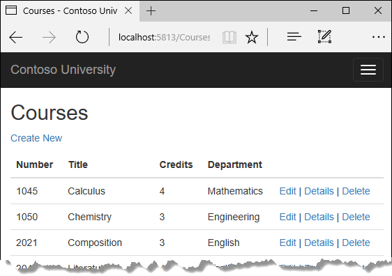
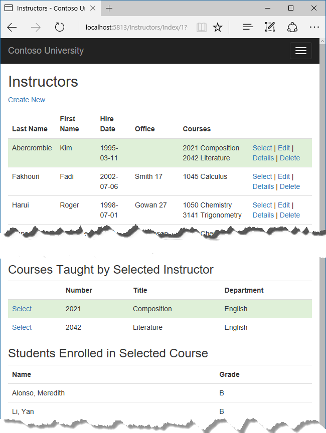

# 读取相关数据

Contoso 大学示例 Web 应用程序演示如何使用实体框架（EF）Core 2.0 和 Visual Studio 2017 创建 ASP.NET Core 2.0 MVC Web 应用程序。 如欲了解更多本教程相关信息，请参阅 [一、入门](./chapters/start.md)

在上一教程中，您完成了学校数据模型。在本章中，您将读取和展示相关数据 -- 即，实体框架加载到导航属性的数据。

以下图片展示了您即将完成的页面。

## 相关数据的 Eager Loading （贪婪加载）, Explicit Loading （显式加载）, 和 Lazy Loading （懒加载）

There are several ways that Object-Relational Mapping (ORM) software such as Entity Framework can load related data into the navigation properties of an entity:

