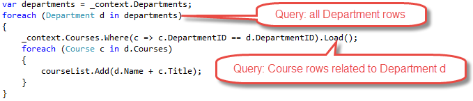

# 读取相关数据

Contoso 大学示例 Web 应用程序演示如何使用实体框架（EF）Core 2.0 和 Visual Studio 2017 创建 ASP.NET Core 2.0 MVC Web 应用程序。 如欲了解更多本教程相关信息，请参阅 [一、入门](./chapters/start.md)

在上一教程中，您完成了学校数据模型。在本章中，您将读取和展示相关数据 -- 即，实体框架加载到导航属性的数据。

以下图片展示了您即将完成的页面。


### 相关数据的 Eager Loading （贪婪加载）, Explicit Loading （显式加载）, 和 Lazy Loading （懒加载）

ORM （对象关系映射）框架，例如说 Entity Framework， 通常有多种方式用于加载实体的导航属性。

* Eager loading -- 贪婪加载。 当读取实体的时候，也读取实体相关的数据。这通常导致一个单一连接查询，来取出所以需要的数据。在 Entity Framework 使用 ```Include``` 和 ```ThenInclude``` 方法来指定贪婪加载。
  
您可以在分离的查询中检索其中一些数据， 然后让 EF “修复” 导航属性。 也就是说， EF 会自动将分离查询中的实体添加到之前读取到的实体导航属性中。 对于检索相关数据的查询， 您可以使用 Load 方法代替那些返回一个 ```list``` 或 ```object``` 的方法，比如说 ```ToList``` 或 ```Single``` 。


* Explicit loading -- 显示加载。第一次读取实体时， 相关的数据没有被检索。当您需要的时候，您需要写代码来检索相关数据。 如同在贪婪加载中使用分离查询一样，显示加载将形成多个查询送往数据库。不同之处在于，使用显示加载，代码指定的是要加载的导航属性。在 Entity Framework 1.1 中您可以使用 ```Load``` 方法来执行显示加载。例如：


* Lazy loading -- 懒加载，或延迟加载。第一次读取实体时， 相关的数据没有被检索。但是，当您尝试访问导航属性时，导航属性相关的数据将会被自动检索出。当您首次访问导航属性时，将有一个查询发往数据库。 Entity Framework Core 1.0 不支持 ```Lazy loading``` 。

#### 性能注意事项

如果您事先知道，对于每个实体，需要相关的数据的话，贪婪加载通常提供了最佳性能，因为发送到数据库的一个查询通常比多个查询更有效率。 例如，假设每个部门有十个相关的课程，贪婪加载方法使用了一条查询加载一个部门的所有相关数据，只需要一次数据库往返。而对每个部门单独查询课程，将导致出现十一个数据库往返。多余的数据库往返在延迟较高时对性能特别不利。

另一方面，在某些情况下，单独查询会更加高效。 贪婪加载可能会导致非常复杂的联结查询以至于 SQL Server 无法有效处理。 或者，您只需要对一个实体集的某个子集访问其导航属性，单独查询将可能比贪婪加载表现得更好，因为贪婪加载加载了超出您需要的数据的原因。 如果性能对您非常重要的话，最好对两种方式都进行测试来做出最佳的选择。

### 创建显示部门名称的课程页

```Course``` 实体包含一个导航属性，对应课程所分配部门的 ```Department``` 实体。 若要在 ```Course``` （课程）列表中显示所分配 ```Department``` （部门）的名称，您需要从 ```Course.Department``` 导航属性连接的 ```Department``` 实体中取得 ```Name``` 属性。

为 ```Course``` 实体类型创建一个控制器，命名为 CoursesController，使用前面教程中用于创建 Students 控制器时用的脚手架，相同的选项 -- “视图使用 Entity Framework 的 MVC 控制器”。如下所示：


打开 ```CoursesController.cs``` 文件，检查 ```Index``` 方法。脚手架已自动使用 ```Include``` 方法指定 ```Department``` 导航属性为贪婪加载。

将 ```Index``` 方法替换为以下代码， 使用一个更合适的名称命名返回 ```Course``` 实体的 ```IQueryable``` 对象。

```cs 
public async Task<IActionResult> Index()
{
    var courses = _context.Courses
        .Include(c => c.Department)
        .AsNoTracking();
    return View(await courses.ToListAsync());
}
```

打开 ```Views/Courses/Index.cshtl```，并使用以下代码替换模板代码。 

``` html
@model IEnumerable<ContosoUniversity.Models.Course>
@{
    ViewData["Title"] = "Courses";
}
<h2>Courses</h2>

<p>
    <a asp-action="Create">Create New</a>
</p>
<table class="table">
    <thead>
        <tr>
            <th>
                @Html.DisplayNameFor(model => model.CourseID)
            </th>
            <th>
                @Html.DisplayNameFor(model => model.Title)
            </th>
            <th>
                @Html.DisplayNameFor(model => model.Credits)
            </th>
            <th>
                @Html.DisplayNameFor(model => model.Department)
            </th>
            <th></th>
        </tr>
    </thead>
    <tbody>
        @foreach (var item in Model)
        {
            <tr>
                <td>
                    @Html.DisplayFor(modelItem => item.CourseID)
                </td>
                <td>
                    @Html.DisplayFor(modelItem => item.Title)
                </td>
                <td>
                    @Html.DisplayFor(modelItem => item.Credits)
                </td>
                <td>
                    @Html.DisplayFor(modelItem => item.Department.Name)
                </td>
                <td>
                    <a asp-action="Edit" asp-route-id="@item.CourseID">Edit</a> |
                    <a asp-action="Details" asp-route-id="@item.CourseID">Details</a> |
                    <a asp-action="Delete" asp-route-id="@item.CourseID">Delete</a>
                </td>
            </tr>
        }
    </tbody>
</table>
```

您对脚手架生成的代码作了如下更改：

* 修改了课程 ```Index``` 页面的标题

* 添加了一列用于显示 ```CourseID``` 属性。 默认情况下， 主键不会出现在脚手架代码中，因为它们通常对最终用户无意义。 然而， 在这儿，主键是有意义的，您打算显示出来。

* 修改 ```Department``` 列以显示部门名称。 代码显示加载到 ```Department``` 导航属性中 ```Department``` 实体的 ```Name``` 属性。   
```cs
@Html.DisplayFor(modelItem => item.Department.Name)
```

运行应用程序，选择 ```Course``` 菜单以查看含有部门名称的列表。


### 创建一个教师页面，其中显示课程及学生注册情况

在本节中，您将会为 ```Instructor``` 实体创建一个控制器和视图用于展示教师。


本页面使用以下方法读取并展示相关数据：

* 教师列表展示来自 ```OfficeAssignment``` 实体的相关数据。 ```Instructor``` 和 ```OfficeeAssignment``` 实体是 一 对 零或一 关系，对 ```OfficeAssignment``` 实体将使用贪婪加载方式。 如前所述， 当您需要主表所有行的相关数据时，贪婪加载是最高效的。 在这种情况下， 你希望显示所有教师分配的办公室。

* 当用户选择一个教师时，相关的课程实体将会显示。 教师和课程实体是 “多对多” 关系。您将对课程及相关的部门实体使用贪婪加载。此时，单独的查询可能会更加高效，因为您只需要所选择教师相关的课程。 However, this example shows how to use eager loading for navigation properties within entities that are themselves in navigation properties.（To do: 这话有点意思，回头翻译）

* 当用户选择一个课程时，相关的注册实体将会显示。 课程和注册实体是 “一对多” 关系。 您将会使用单独的查询来应对注册实体和相关的学生实体。

#### 创建教师索引视图的视图模型

教师页显示三个不同的表中的数据。因此，你创建的视图模型将包括三个属性，每个属性包含一个表的数据。

在 SchoolViewModels 文件夹中，创建 InstructorIndexData.cs 并替换为以下代码：

```cs 
using System;
using System.Collections.Generic;
using System.Linq;
using System.Threading.Tasks;

namespace ContosoUniversity.Models.SchoolViewModels
{
    public class InstructorIndexData
    {
        public IEnumerable<Instructor> Instructors { get; set; }
        public IEnumerable<Course> Courses { get; set; }
        public IEnumerable<Enrollment> Enrollments { get; set; }
    }
}
```
#### 创建教师控制器和视图

使用包含 EF 读/写 操作的控制器模板创建一个教师控制器，如下图所示：


打开 InstructorsController.cs 和添加 Viewmodel 命名空间引用：

```cs 
using ContosoUniversity.Models.SchoolViewModels;
```

使用以下代码替换 Index 方法，以达到相关数据的贪婪加载，并放入视图模型中。

``` cs
public async Task<IActionResult> Index(int? id, int? courseID)
{
    var viewModel = new InstructorIndexData();
    viewModel.Instructors = await _context.Instructors
          .Include(i => i.OfficeAssignment)
          .Include(i => i.CourseAssignments)
            .ThenInclude(i => i.Course)
                .ThenInclude(i => i.Enrollments)
                    .ThenInclude(i => i.Student)
          .Include(i => i.CourseAssignments)
            .ThenInclude(i => i.Course)
                .ThenInclude(i => i.Department)
          .AsNoTracking()
          .OrderBy(i => i.LastName)
          .ToListAsync();
    
    if (id != null)
    {
        ViewData["InstructorID"] = id.Value;
        Instructor instructor = viewModel.Instructors.Where(
            i => i.ID == id.Value).Single();
        viewModel.Courses = instructor.CourseAssignments.Select(s => s.Course);
    }

    if (courseID != null)
    {
        ViewData["CourseID"] = courseID.Value;
        viewModel.Enrollments = viewModel.Courses.Where(
            x => x.CourseID == courseID).Single().Enrollments;
    }

    return View(viewModel);
}
```

方法接受可选路由数据(id)和一个查询字符串参数(courseID)，分别对应选择的教师和选择的课程。参数从页面的超链接中而来。

代码首先创建一个视图模型的实例，并在其中加入教师列表。 代码指定对 ```Instrator.OfficeAssignment``` 和 ```CourseAssignments``` 导航属性使用贪婪加载。 在 ```CourseAssignments``` 属性中，```Course``` 属性将被加载， 然后在 ```Course``` 属性中， ```Enrollments``` 和 ```Department``` 属性将会被加载，同时在每个 ```Enrollment``` 实体中， ```Student``` 属性将会被加载。

```cs 
viewModel.Instructors = await _context.Instructors
      .Include(i => i.OfficeAssignment)
      .Include(i => i.CourseAssignments)
        .ThenInclude(i => i.Course)
            .ThenInclude(i => i.Enrollments)
                .ThenInclude(i => i.Student)
      .Include(i => i.CourseAssignments)
        .ThenInclude(i => i.Course)
            .ThenInclude(i => i.Department)
      .AsNoTracking()
      .OrderBy(i => i.LastName)
      .ToListAsync();
```

由于视图需要 ```OfficeAssignmet``` 实体数据， 在同一个查询中加载将会更有效率。当在网页中选择一个教师时， 需要相关的课程实体，
Course entities are required when an instructor is selected in the web page, so a single query is better than multiple queries only if the page is displayed more often with a course selected than without.
