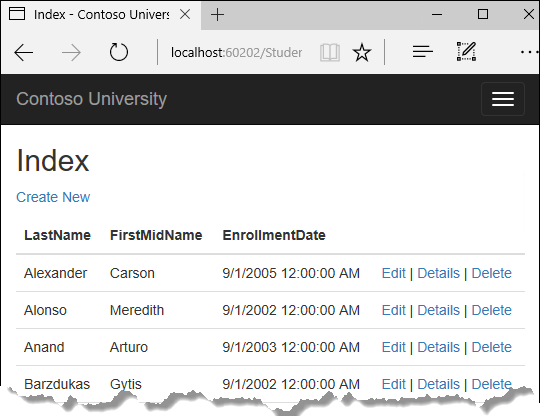
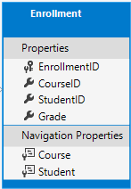

# 入门

Contoso 大学示例 Web 应用程序演示如何使用实体框架（EF）Core 2.0 和 Visual Studio 2017 创建 ASP.NET Core 2.0 MVC Web 应用程序。 

示例应用程序是虚构的Contoso大学的网站。 它包括学生入学，课程创建和教师任务等功能。 这是一系列教程中的第一章，介绍如何从头构建Contoso大学示例应用程序。  

[下载或查看完成的应用程序](https://github.com/aspnet/Docs/tree/master/aspnetcore/data/ef-mvc/intro/samples/cu-final)。

EF Core 2.0 是EF的最新版本，但还没有包括所有的 EF 6.x 功能。 有关 EF 6.x 和 EF Core 之间如何选择的信息，请参阅 [EF Core vs. EF6.x](https://docs.microsoft.com/ef/efcore-and-ef6/)。 如果您选择 EF 6.x ，请参阅本教程系列的[以前版本](https://docs.microsoft.com/aspnet/mvc/overview/getting-started/getting-started-with-ef-using-mvc/creating-an-entity-framework-data-model-for-an-asp-net-mvc-application)。  

> **注意事项**
> * 对于本教程的 ASP.NET Core 1.1 版本，请参阅PDF格式的[本教程的 VS 2017 Update 2版本](https://github.com/aspnet/Docs/blob/master/aspnetcore/data/ef-mvc/intro/_static/efmvc1.1.pdf)。
> * 对于本教程的 Visual Studio 2015 版本，请参阅PDF格式的 [VS 2015 版本的 ASP.NET Core 文档](https://github.com/aspnet/Docs/blob/master/aspnetcore/common/_static/aspnet-core-project-json.pdf)。

## 开发环境
安装如下工具：  
* [.NET Core 2.0.0 SDK](https://www.microsoft.com/net/core) 或更新版本。
* [Visual Studio 2017](https://www.visualstudio.com/downloads/) V15.3 或更高版本，安装 ASP.NET 和 Web 开发工具。

## 故障排除
如果遇到问题，您无法解决，通常可以通过将代码与完成的项目进行比较来找到解决方案。 有关常见错误和解决方法的列表，请参阅本系列最后一个教程的故障排除部分。 如果您没有找到所需的内容，您也可以在 StackOverflow.com 上提问。

> **小贴士**  
>
> 本系列包含10个教程，每个教程都建立在早期教程中的基础之上。 在成功完成每个教程之后，请考虑保存项目的副本。 然后，如果遇到问题，您可以从上一个教程重新开始，无需从头开始。

## Contoso 大学网站应用
教程中构建的是一个简单的大学网站。  
用户可以查看和更新学生，课程和教师信息。 下面是您将要创建的一些页面。



网站的 UI 风格与内置模板生成的 UI 风格保持一致，本教程主要关注如何使用 Entity Framework。

## 创建 ASP.NET Core MVC 网站应用
打开 Visual Studio 并创建名为 “ContosoUniversity” 的新 ASP.NET Core C＃ web 项目。
* 从文件菜单中，选择新建>项目。
* 从左窗格中选择 已安装 -> Visual C＃ -> Web 。
* 中间窗格选择 ASP.NET Core Web 应用程序。
* 输入 ContosoUniversity 作为项目名称，然后单击确定。

* 等待 "新建 ASP.NET Core Web 应用程序" 对话框出现
* 选择 ASP.NET Core 2.0 和 Web应用程序(模型视图控制器)模板。
* 注意：本教程需要 ASP.NET Core 2.0 和 EF Core 2.0 或更高版本 - 确保未选择ASP.NET Core 1.1。
* 确保认证设置为“不进行身份验证”。
* 单击 “确定” 按钮。


## 设置网站样式
简单修改几个位置，设置站点菜单，布局和主页。  
打开 Views/Shared/_Layout.cshtml 文件，进行以下更改：
* 将三处 “ContosoUniversity” 文字修改为“Contoso University”。   
* 添加 学生、课程、教师和部门菜单，删除联系人菜单。   

主要的修改如下
``` html
<html>
......
    <title>@ViewData["Title"] - Contoso University</title>
......
                class="navbar-brand">Contoso University</a>
            <div class="navbar-collapse collapse">
                <ul class="nav navbar-nav">
                    <li><a asp-area="" asp-controller="Home" asp-action="Index">Home</a></li>
                    <li><a asp-area="" asp-controller="Home" asp-action="About">About</a></li>
                    <li><a asp-area="" asp-controller="Students" asp-action="Index">Students</a></li>
                    <li><a asp-area="" asp-controller="Courses" asp-action="Index">Courses</a></li>
                    <li><a asp-area="" asp-controller="Instructors" asp-action="Index">Instructors</a></li>
                    <li><a asp-area="" asp-controller="Departments" asp-action="Index">Departments</a></li>
                </ul>
            </div>
        </div>
    </nav>
    <div class="container body-content">
        @RenderBody()
        <hr />
        <footer>
            <p>&copy; 2017 - Contoso University</p>
        </footer>
    </div>
</body>
</html>
```
在 Views/Home/Index.cshtml 文件，使用以下代码替换文件的内容：
``` html
@{
    ViewData["Title"] = "Home Page";
}

<div class="jumbotron">
    <h1>Contoso University</h1>
</div>
<div class="row">
    <div class="col-md-4">
        <h2>Welcome to Contoso University</h2>
        <p>
            Contoso University is a sample application that
            demonstrates how to use Entity Framework Core in an
            ASP.NET Core MVC web application.
        </p>
    </div>
    <div class="col-md-4">
        <h2>Build it from scratch</h2>
        <p>You can build the application by following the steps in a series of tutorials.</p>
        <p><a class="btn btn-default" href="https://docs.asp.net/en/latest/data/ef-mvc/intro.html">See the tutorial &raquo;</a></p>
    </div>
    <div class="col-md-4">
        <h2>Download it</h2>
        <p>You can download the completed project from GitHub.</p>
        <p><a class="btn btn-default" href="https://github.com/aspnet/Docs/tree/master/aspnetcore/data/ef-mvc/intro/samples/cu-final">See project source code &raquo;</a></p>
    </div>
</div>
```

按 CTRL+F5 运行项目或从菜单中选择 调试-> 开始执行（不调试）， 您将在浏览器中看到本教程中实现的首页。


## Entity Framework Core NuGet packages 
*译者注： 此标题不翻译好过翻译*  
要在项目中添加 EF Core 支持，需要安装相应的数据库实现。本教程使用 SQL Server 数据库，所需要的程序包 Microsoft.EntityFrameworkCore.SqlServer 已经内置于 Microsoft.AspNetCore.All 包中，因此我们现在什么都不必做。  

这个程序包 (Microsoft.EntityFrameworkCore) 及其依赖项 （Microsoft.EntityFrameworkCore.Relational) 提供了EF运行时支持。在稍后的 ”数据库迁移“教程中，你将会学习添加一个工具包。

有关可用于 Entity Framework Core 的其他数据库支持程序的信息，请参阅 [Data Providers](https://docs.microsoft.com/ef/core/providers/)。

### 创建数据模型
接下来，您将为Contoso大学应用程序创建实体课程。 您将从以下三个实体开始。


在 Student 与 Enrollement 实体间是一个一对多的关系， 在 Course 与 Enrollment 间也存在一对多关系。 换句话说，学生可以参加任意数量的课程，课程可以有任意数量的学生注册。

在以下部分中，您将为每个实体创建一个类。

#### Student 实体
在 Models 文件夹中，创建一个名为 Student.cs 的类文件，并使用以下代码替换模板代码。

``` csharp
using System;
using System.Collections.Generic;

namespace ContosoUniversity.Models
{
    public class Student
    {
        public int ID { get; set; }
        public string LastName { get; set; }
        public string FirstMidName { get; set; }
        public DateTime EnrollmentDate { get; set; }

        public ICollection<Enrollment> Enrollments { get; set; }
    }
}
```

```ID``` 属性将成为对应数据表的主键。默认情况下，Entity Framework 将名为 ID 或 {类名}ID 的属性解释为主键。

```Enrollments``` 属性是导航属性。导航属性用于关联其他实体。对于一个学生实体（数据）来说，其中的 Enrollments 属性包含所有与该学生相关联的 Enrollment 实体（数据）。也就是说，如果数据库中的一个学生行数据关联两个注册行数据（一对多，在 Enrollment 表中外键关联StudentID 值为该学生的主键值），则 Student 实体中的 Enrollments 导航属性将包含这两个 Enrollment 实体。

如果导航属性可以容纳多个实体（在多对多或一对多关系中），则其类型必须是可以添加，删除和更新条目的列表，例如ICollection <T>。您可以指定ICollection <T>或类型，如List <T>或HashSet <T>。如果指定ICollection <T>，EF默认创建一个HashSet <T>集合。

#### Enrollment 实体



在 Models 文件夹中，创建一个名为 Student.cs 的类文件，并使用以下代码替换模板代码。
``` cs
namespace ContosoUniversity.Models
{
    public enum Grade
    {
        A, B, C, D, F
    }

    public class Enrollment
    {
        public int EnrollmentID { get; set; }
        public int CourseID { get; set; }
        public int StudentID { get; set; }
        public Grade? Grade { get; set; }

        public Course Course { get; set; }
        public Student Student { get; set; }
    }
}
```

```EnrollmentID``` 属性将成为主键。本实体使用 {类名}ID 模式代替在 Studnet 实体中使用的 ID 模式。 通常你会只选择一种模式，并在整个数据模型中使用。 在这里，不同的模式是为了演示，说明您可以使用任一模式。 在后面的教程中，您将看到如何使用没有类名的 ID 可以更容易地在数据模型中实现继承。

```Grade (等级)``` 属性是一个枚举类型。 ```Grade``` 类型声明后的 ```?``` 表示 可为空类型。 一个空的等级和一个值为0的等级是不同的 -- 空表示等级未知或者尚未被赋值。

```StudentID``` 属性是外键，相应的导航属性是 ```Student```。 一个 ```Enrollment``` 实体与一个 ```Student``` 实体相关联，因此该属性只能持有保存单个 ```Studnet``` 实体（与您之前看到的可以包含多个注册实体的 ```Student.Enrollments``` 导航属性不同）。

```CourseID``` 属性是外键, 对应的导航属性是 ```Course```。 一个 ```Enrollment``` 实体与一个 ```Course``` 实体相关联。

当一个属性名称符合模式 <导航属性名><主键名> , EF 将属性解析为外键属性（例如，```StudentID``` 对应 ```Student``` 导航属性，因为 ```Student``` 实体的主键是 ```ID```）。 外键属性也可以简单地使用 <主键属性名称>（例如，```CourseID```，因为课程实体的主键是 ```CourseID```）。

#### Course 实体


在 Models 文件夹中，创建一个名为 Course.cs 的类文件，并使用以下代码替换模板代码。
``` cs
using System.Collections.Generic;
using System.ComponentModel.DataAnnotations.Schema;

namespace ContosoUniversity.Models
{
    public class Course
    {
        [DatabaseGenerated(DatabaseGeneratedOption.None)]
        public int CourseID { get; set; }
        public string Title { get; set; }
        public int Credits { get; set; }

        public ICollection<Enrollment> Enrollments { get; set; }
    }
}
```


```Enrollments``` 属性是导航属性。一个 ```Course``` 实体可以关联到任意多个 ```Enrollment``` 实体。

我们将在本系列的后续教程中详细介绍 ```DatabaseGenerated``` 特性。 此特性允许您指定 ```Course``` 的主键名，而不是让数据库生成它。

#### 创建数据库上下文 Database Context

将数据模型与 Entity Framework 功能协同工作的主要类是数据库上下文类。 通过从 Microsoft.EntityFrameworkCore.DbContext 类派生来创建此类。 在代码中，可以指定数据模型中包含哪些实体。 还可以自定义某些 Entity Framework 行为。 在这个项目中，该类被命名为 ```SchoolContext```。

在项目文件夹中，创建一个名为Data的文件夹。

在 Data 文件夹中创建一个名为 SchoolContext.cs 的新类，并用以下代码替换模板代码：

``` cs
using ContosoUniversity.Models;
using Microsoft.EntityFrameworkCore;

namespace ContosoUniversity.Data
{
    public class SchoolContext : DbContext
    {
        public SchoolContext(DbContextOptions<SchoolContext> options) : base(options)
        {
        }

        public DbSet<Course> Courses { get; set; }
        public DbSet<Enrollment> Enrollments { get; set; }
        public DbSet<Student> Students { get; set; }
    }
}
```

