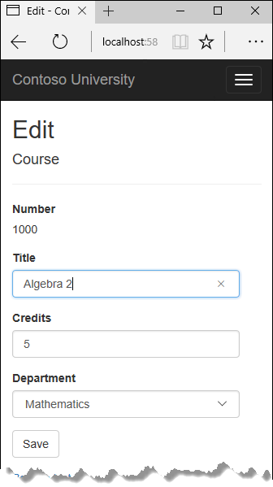
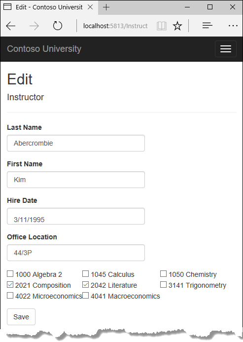
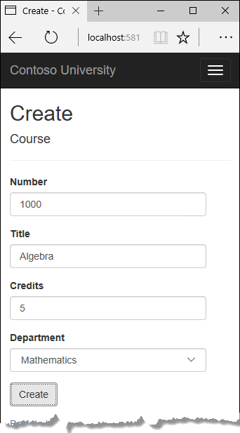
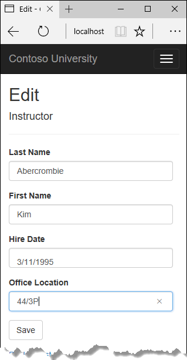

# 更新相关数据

Contoso 大学示例 Web 应用程序演示如何使用实体框架（EF）Core 2.0 和 Visual Studio 2017 创建 ASP.NET Core 2.0 MVC Web 应用程序。 如欲了解更多本教程相关信息，请参阅 [一、入门](./chapters/start.md)

在上一个教程中，您学习了显示相关数据。本教程中， 您将通过更新外键字段和导航属性来更新相关数据。
以下图片显示了您将用到的一些页面。





## 自定义课程的 "创建" 和 "编辑" 页面

创建新的课程实体时，必须关联到一个现有的部门。为了方便起见，脚手架代码包括控制器方法和创建和编辑视图，其中包含用于选择部门的下拉列表。 下拉列表设置 ```Course.DepartmentID``` 外键属性，而这正是 Entity Framework 需要以便加载 ```Department``` 导航属性及其对应的 ```Department``` 实体。您将使用脚手架代码，但稍稍更改以添加错误处理并对下拉列表进行排序。

在 ```CoursesController.cs``` 中，删除四个 ```Create``` 和 ```Edit``` 方法，并使用以下代码替换它们：

``` cs
public IActionResult Create()
{
    PopulateDepartmentsDropDownList();
    return View();
}

[HttpPost]
[ValidateAntiForgeryToken]
public async Task<IActionResult> Create([Bind("CourseID,Credits,DepartmentID,Title")] Course course)
{
    if (ModelState.IsValid)
    {
        _context.Add(course);
        await _context.SaveChangesAsync();
        return RedirectToAction(nameof(Index));
    }
    PopulateDepartmentsDropDownList(course.DepartmentID);
    return View(course);
}


public async Task<IActionResult> Edit(int? id)
{
    if (id == null)
    {
        return NotFound();
    }

    var course = await _context.Courses
        .AsNoTracking()
        .SingleOrDefaultAsync(m => m.CourseID == id);
    if (course == null)
    {
        return NotFound();
    }
    PopulateDepartmentsDropDownList(course.DepartmentID);
    return View(course);
}

[HttpPost, ActionName("Edit")]
[ValidateAntiForgeryToken]
public async Task<IActionResult> EditPost(int? id)
{
    if (id == null)
    {
        return NotFound();
    }

    var courseToUpdate = await _context.Courses
        .SingleOrDefaultAsync(c => c.CourseID == id);

    if (await TryUpdateModelAsync<Course>(courseToUpdate,
        "",
        c => c.Credits, c => c.DepartmentID, c => c.Title))
    {
        try
        {
            await _context.SaveChangesAsync();
        }
        catch (DbUpdateException /* ex */)
        {
            //Log the error (uncomment ex variable name and write a log.)
            ModelState.AddModelError("", "Unable to save changes. " +
                "Try again, and if the problem persists, " +
                "see your system administrator.");
        }
        return RedirectToAction(nameof(Index));
    }
    PopulateDepartmentsDropDownList(courseToUpdate.DepartmentID);
    return View(courseToUpdate);
}
```

在 ```Edit``` (HttpPost) 方法后， 创建一个新方法用于加载部门下拉列表。

```cs 
private void PopulateDepartmentsDropDownList(object selectedDepartment = null)
{
    var departmentsQuery = from d in _context.Departments
                           orderby d.Name
                           select d;
    ViewBag.DepartmentID = new SelectList(departmentsQuery.AsNoTracking(), "DepartmentID", "Name", selectedDepartment);
}
```

`PopulateDepartmentsDropDownList` 首先获取一个基于名称排序的部门列表，再创建一个 `SelectList` 集合用于下拉列表，并此集合放在 ViewBag 中。 方法中 `selectedDepartment` 参数是可选的，允许调用代码指定下拉列表默认选中项目。视图中将 `DepartmentID` 属性传递到 `<select>` 标记帮助器，帮助器知道如何在 ViewBag 对象中寻找一个名为 "DepartmentID" 的 `SelectList`。  
HttpGet  `Create` 方法调用 `PopulateDepartmentsDropDownList` 方法，未设置选择项目， 因为在一个新的课程中，相关的部门尚未被创建。  
``` cs
public IActionResult Create()
{
    PopulateDepartmentsDropDownList();
    return View();
}
```

HttpGet ```Edit``` 方法使用课程分配的部门ID来设置 `选中` 的项目。
``` cs
public async Task<IActionResult> Edit(int? id)
{
    if (id == null)
    {
        return NotFound();
    }

    var course = await _context.Courses
        .AsNoTracking()
        .SingleOrDefaultAsync(m => m.CourseID == id);
    if (course == null)
    {
        return NotFound();
    }
    PopulateDepartmentsDropDownList(course.DepartmentID);
    return View(course);
}
```

```Create``` 及```Edit``` 方法(HttpPost) 中还包含了当页面出现错误时，用于重新显示页面时设置 `选中` 项目的代码， 以确保当页面显示错误信息时，不管原来选中的部门是什么，仍然保持选中的状态。


### 添加 `.AsNoTracking` 到 `Details` 及 `Delete` 方法  
为优化 `Details` 及 `Delete` 页面的性能，在方法中添加 `AsNoTracking` 调用。
``` cspublic async Task<IActionResult> Details(int? id)
{
    if (id == null)
    {
        return NotFound();
    }

    var course = await _context.Courses
        .Include(c => c.Department)
        .AsNoTracking()
        .SingleOrDefaultAsync(m => m.CourseID == id);
    if (course == null)
    {
        return NotFound();
    }

    return View(course);
}

public async Task<IActionResult> Delete(int? id)
{
    if (id == null)
    {
        return NotFound();
    }

    var course = await _context.Courses
        .Include(c => c.Department)
        .AsNoTracking()
        .SingleOrDefaultAsync(m => m.CourseID == id);
    if (course == null)
    {
        return NotFound();
    }

    return View(course);
}
```

### 修改 `Course (课程)` 视图
在 `Views/Courses/Create.cshtml` 文件中， 添加一个 `Select Department` 选项到 `Department (部门)` 下拉框， 将标题从 `DepartmentID` 修改为 `Department`，并加入验证信息显示项目。

``` html
<div class="form-group">
    <label asp-for="Department" class="control-label"></label>
    <select asp-for="DepartmentID" class="form-control" asp-items="ViewBag.DepartmentID">
        <option value="">-- Select Department --</option>
    </select>
    <span asp-validation-for="DepartmentID" class="text-danger" />
```

在 `Views/Courses/Edit.cshtml` ，进行和更改在 `Create.cshtml` 中一样的修改。  
同时， 在 `Title` 字段前添加一个 `课程号码` 字段，由于课程号码是主键， 只用于显示，不能被修改。
``` html
<div class="form-group">
    <label asp-for="CourseID" class="control-label"></label>
    <div>@Html.DisplayFor(model => model.CourseID)</div>
</div>
```
在 `Edit` 视图中，有一个隐藏的课程号码字段（`<input type="hidden"`）。添加 `<label>` 标签后，隐藏字段仍然有用，因为在用户点击保存时，此字段将包含在提交的数据中。  
在 `Views/Courses/Delete.cshtl` 文件中， 在顶部添加一个 `课程号码` 字段，并修改 `部门ID` 为 `部门名称` 。
``` html
@model ContosoUniversity.Models.Course

@{
    ViewData["Title"] = "Delete";
}

<h2>Delete</h2>

<h3>Are you sure you want to delete this?</h3>
<div>
    <h4>Course</h4>
    <hr />
    <dl class="dl-horizontal">
        <dt>
            @Html.DisplayNameFor(model => model.CourseID)
        </dt>
        <dd>
            @Html.DisplayFor(model => model.CourseID)
        </dd>
        <dt>
            @Html.DisplayNameFor(model => model.Title)
        </dt>
        <dd>
            @Html.DisplayFor(model => model.Title)
        </dd>
        <dt>
            @Html.DisplayNameFor(model => model.Credits)
        </dt>
        <dd>
            @Html.DisplayFor(model => model.Credits)
        </dd>
        <dt>
            @Html.DisplayNameFor(model => model.Department)
        </dt>
        <dd>
            @Html.DisplayFor(model => model.Department.Name)
        </dd>
    </dl>
    
    <form asp-action="Delete">
        <div class="form-actions no-color">
            <input type="submit" value="Delete" class="btn btn-default" /> |
            <a asp-action="Index">Back to List</a>
        </div>
    </form>
</div>
```

在 `Views/Courses/Details.cshtml` 文件中，做同样的修改。

### 测试 `Course (课程)` 页面
运行应用， 选择 `Courses` 菜单， 点击 `Create New`， 并输入一个新课程数据。

点击 `Create` 按钮， 新课程添加到列表并显示于 `Index` 页面。 列表中的部门名称来自于导航属性， 可以看出关系已正确建立。  
在 `Index` 页面点击其中一个课程的 `Edit` 按钮。

修改页面中的数据，点击 `Save` 。 可以看到 `Index` 页面显示的是更改修改过的数据。

## 添加讲师的编辑页面
当你在编辑一个讲师的记录时，希望同时可以更新讲师的办公室。讲师实体包含一个和办公室分配实体的 `一 对 零或一` 关系， 这意味着代码中必须处理以下情况：  
* 如果用户去除了办公室分配，而原来是有办公室分配的，则需要删除 `OfficeAssignment` 实体。
* 如果用户输入了办公室分配，而原先是空值，则需要创建一个 `OfficeAssignment` 实体。
* 如果用户修改了办公室分配的值，则需要相应修改现存的 `OfficeAssignment` 实体。

### 修改讲师控制器
在 `InstructorsController.cs ` 文件中， 修改 `Edit` (HttpGet) 方法的代码，以同时获取 讲师实体的 `OfficeAssignment` 导航属性并调用 `AsNoTracking` ：
``` cs
public async Task<IActionResult> Edit(int? id)
{
    if (id == null)
    {
        return NotFound();
    }

    var instructor = await _context.Instructors
        .Include(i => i.OfficeAssignment)
        .AsNoTracking()
        .SingleOrDefaultAsync(m => m.ID == id);
    if (instructor == null)
    {
        return NotFound();
    }
    return View(instructor);
}
```
用以下代码替换 HttpPost `Edit` 方法， 以处理 Office Assignment 的数据更新：
``` cs
[HttpPost, ActionName("Edit")]
[ValidateAntiForgeryToken]
public async Task<IActionResult> EditPost(int? id)
{
    if (id == null)
    {
        return NotFound();
    }

    var instructorToUpdate = await _context.Instructors
        .Include(i => i.OfficeAssignment)
        .SingleOrDefaultAsync(s => s.ID == id);

    if (await TryUpdateModelAsync<Instructor>(
        instructorToUpdate,
        "",
        i => i.FirstMidName, i => i.LastName, i => i.HireDate, i => i.OfficeAssignment))
    {
        if (String.IsNullOrWhiteSpace(instructorToUpdate.OfficeAssignment?.Location))
        {
            instructorToUpdate.OfficeAssignment = null;
        }
        try
        {
            await _context.SaveChangesAsync();
        }
        catch (DbUpdateException /* ex */)
        {
            //Log the error (uncomment ex variable name and write a log.)
            ModelState.AddModelError("", "Unable to save changes. " +
                "Try again, and if the problem persists, " +
                "see your system administrator.");
        }
        return RedirectToAction(nameof(Index));
    }
    return View(instructorToUpdate);
}
```
代码中，实现了如下述中修改：
* 修改方法名为 `EditPost` ，由于方法签名和 HttpGet `Edit` 一样，方法名必须不同（C#语法要求）。通过 `ActionName` 特性标签以指明仍使用 `/Edit/` 超链接。
* 从数据库中获取当前讲师实体时，使用贪婪加载同时获取 `OfficeAssignment` 导航属性。这个处理和 HttpGet `Edit` 方法中的一致。
* 使用模型绑定器中的数据更新获取的讲师实体。 `TryUpdateMOdel` 重载允许你指定属性白名单。 这可以防止 `Over-Posting` 攻击。（详情请查看 [第二章](./crud.md) ）。
``` cs
if (await TryUpdateModelAsync<Instructor>(
    instructorToUpdate,
    "",
    i => i.FirstMidName, i => i.LastName, i => i.HireDate, i => i.OfficeAssignment))
```
* 如果办公室地点是空值， 则设置 `Instructor.OfficeAssignment ` 属性为空，这样一来，在OfficeAssignment 数据表中的相关记录行将会被删除。
``` cs 
if (String.IsNullOrWhiteSpace(instructorToUpdate.OfficeAssignment?.Location))
{
    instructorToUpdate.OfficeAssignment = null;
}
```
* 保存更改到数据库。

*** 更新讲师编辑视图  
在 `Views/Instructors/Edit.cshtml` 文件中， 添加一个新字段，用于编辑 `办公室地点` 。 放在 `Save` 按钮之前。
``` html
<div class="form-group">
    <label asp-for="OfficeAssignment.Location" class="control-label"></label>
    <input asp-for="OfficeAssignment.Location" class="form-control" />
    <span asp-validation-for="OfficeAssignment.Location" class="text-danger" />
</div>
```
运行应用，选择 `Instructors` 菜单， 点击任意一个讲师行中的 `Edit` ， 修改 Office Location 数据并点击 `Save` 按钮：


### 在讲师编辑页面添加课程安排
讲师可能教授任意数目的课程。 你现在要修改讲师编辑页面，使用一组复选框来添加课程分配功能，如下图所示：

课程和讲师之间的关系是多对多。 为了添加和移除关系，你可以通过从 `CourseAssignments` 连接实体集中添加和移除实体来实现。
用户界面通过一组复选框来让你修改讲师分配到的课程。 数据库中的所有课程都以一个复选框的形式显示， 同时当前已被分配到讲师的课程将会处于选中状态。 用户通过选中或者去除复选框的选择状态来修改课程分配。 如果课程数目很多的话，你可能需要使用另外一种视图展示方式，但你还是可以使用同一个方法创建和删除关系。

### 修改讲师控制器
为了给视图中的复选框提供数据，你将使用视图模型。  
在 `SchoolViewModels` 文件夹中创建 `AssignedCourseData.cs` 文件， 并键入如下代码：
``` cs
using System;
using System.Collections.Generic;
using System.Linq;
using System.Threading.Tasks;

namespace ContosoUniversity.Models.SchoolViewModels
{
    public class AssignedCourseData
    {
        public int CourseID { get; set; }
        public string Title { get; set; }
        public bool Assigned { get; set; }
    }
}
```
在 `InstructorsController.cs` 中， 使用如下代码替换 HttpGet `Edit` 方法：
``` cs
public async Task<IActionResult> Edit(int? id)
{
    if (id == null)
    {
        return NotFound();
    }

    var instructor = await _context.Instructors
        .Include(i => i.OfficeAssignment)
        .Include(i => i.CourseAssignments).ThenInclude(i => i.Course)
        .AsNoTracking()
        .SingleOrDefaultAsync(m => m.ID == id);
    if (instructor == null)
    {
        return NotFound();
    }
    PopulateAssignedCourseData(instructor);
    return View(instructor);
}

private void PopulateAssignedCourseData(Instructor instructor)
{
    var allCourses = _context.Courses;
    var instructorCourses = new HashSet<int>(instructor.CourseAssignments.Select(c => c.CourseID));
    var viewModel = new List<AssignedCourseData>();
    foreach (var course in allCourses)
    {
        viewModel.Add(new AssignedCourseData
        {
            CourseID = course.CourseID,
            Title = course.Title,
            Assigned = instructorCourses.Contains(course.CourseID)
        });
    }
    ViewData["Courses"] = viewModel;
}
```
代码添加了 `Course` 导航属性的贪婪加载，并调用 `PopulateAssignedCourseData` 方法以使用 `AssignedCoursData` 视图模型。  
代码中的 `PopulateAssignedCourseData` 方法遍历所有的课程实体。 对于每一个课程，代码检查课程是否在当前讲师的课程导航属性中。 在检查课程是否分配到讲师时，为了实现高效的查找，讲师分配的课程被放入一个 Hashset 集合。 分配给讲师的课程对应的 `Assigned` 属性设置为 `True`。 视图将使用此属性确定哪些复选框必须显示为 `已选中` 状态。最后面，该列表通过 ViewData 传递到视图。
接下来， 添加用户点击 `Save` 时将会执行的代码。 使用以下代码替换 `EditPost` 方法， 并添加一个用于更新讲师实体中课程导航属性的方法。
``` cs
[HttpPost]
[ValidateAntiForgeryToken]
public async Task<IActionResult> Edit(int? id, string[] selectedCourses)
{
    if (id == null)
    {
        return NotFound();
    }

    var instructorToUpdate = await _context.Instructors
        .Include(i => i.OfficeAssignment)
        .Include(i => i.CourseAssignments)
            .ThenInclude(i => i.Course)
        .SingleOrDefaultAsync(m => m.ID == id);

    if (await TryUpdateModelAsync<Instructor>(
        instructorToUpdate,
        "",
        i => i.FirstMidName, i => i.LastName, i => i.HireDate, i => i.OfficeAssignment))
    {
        if (String.IsNullOrWhiteSpace(instructorToUpdate.OfficeAssignment?.Location))
        {
            instructorToUpdate.OfficeAssignment = null;
        }
        UpdateInstructorCourses(selectedCourses, instructorToUpdate);
        try
        {
            await _context.SaveChangesAsync();
        }
        catch (DbUpdateException /* ex */)
        {
            //Log the error (uncomment ex variable name and write a log.)
            ModelState.AddModelError("", "Unable to save changes. " +
                "Try again, and if the problem persists, " +
                "see your system administrator.");
        }
        return RedirectToAction(nameof(Index));
    }
    UpdateInstructorCourses(selectedCourses, instructorToUpdate);
    PopulateAssignedCourseData(instructorToUpdate);
    return View(instructorToUpdate);
}

private void UpdateInstructorCourses(string[] selectedCourses, Instructor instructorToUpdate)
{
    if (selectedCourses == null)
    {
        instructorToUpdate.CourseAssignments = new List<CourseAssignment>();
        return;
    }

    var selectedCoursesHS = new HashSet<string>(selectedCourses);
    var instructorCourses = new HashSet<int>
        (instructorToUpdate.CourseAssignments.Select(c => c.Course.CourseID));
    foreach (var course in _context.Courses)
    {
        if (selectedCoursesHS.Contains(course.CourseID.ToString()))
        {
            if (!instructorCourses.Contains(course.CourseID))
            {
                instructorToUpdate.CourseAssignments.Add(new CourseAssignment { InstructorID = instructorToUpdate.ID, CourseID = course.CourseID });
            }
        }
        else
        {

            if (instructorCourses.Contains(course.CourseID))
            {
                CourseAssignment courseToRemove = instructorToUpdate.CourseAssignments.SingleOrDefault(i => i.CourseID == course.CourseID);
                _context.Remove(courseToRemove);
            }
        }
    }
}
```
方法签名现在与 HttpGet `Edit` 方法不同，所以方法名称可以从 `EditPost` 更改回 `Edit` 。
由于视图中不包含课程实体集合， 模型绑定器无法自动更新 `CourseAssignments` 导航属性。 要取代用模型绑定器更新 `CourseAssignments` 导航属性， 你需要一个新的 `UpdateInstructorCourses` 方法。 因此，你需要从模型绑定中排除 `CourseAssignments` 属性。这不需要对调用 `TryUpdateModel` 的代码进行任何更改，因为您使用的是白名单超载，而 `CourseAssignments` 不在包含列表中。
如果未选中复选框，则 `UpdateInstructorCourses` 中的代码将使用空集合初始化 `CourseAssignments` 导航属性，并结束方法调用：
``` cs
private void UpdateInstructorCourses(string[] selectedCourses, Instructor instructorToUpdate)
{
    if (selectedCourses == null)
    {
        instructorToUpdate.CourseAssignments = new List<CourseAssignment>();
        return;
    }

    var selectedCoursesHS = new HashSet<string>(selectedCourses);
    var instructorCourses = new HashSet<int>
        (instructorToUpdate.CourseAssignments.Select(c => c.Course.CourseID));
    foreach (var course in _context.Courses)
    {
        if (selectedCoursesHS.Contains(course.CourseID.ToString()))
        {
            if (!instructorCourses.Contains(course.CourseID))
            {
                instructorToUpdate.CourseAssignments.Add(new CourseAssignment { InstructorID = instructorToUpdate.ID, CourseID = course.CourseID });
            }
        }
        else
        {

            if (instructorCourses.Contains(course.CourseID))
            {
                CourseAssignment courseToRemove = instructorToUpdate.CourseAssignments.SingleOrDefault(i => i.CourseID == course.CourseID);
                _context.Remove(courseToRemove);
            }
        }
    }
}
```
代码循环遍历数据库中的所有课程，然后代码循环遍历数据库中的所有课程，并检查每个课程与当前分配给教师的课程，还是在视图中选择的课程。 为了便于高效查找，后两个集合存储在HashSet对象中。  
如果有一个课程的复选框被选中，但该课程不在 `Instructor.CourseAssignments` 导航属性中，则该课程将添加到导航属性的集合中。
``` cs
private void UpdateInstructorCourses(string[] selectedCourses, Instructor instructorToUpdate)
{
    if (selectedCourses == null)
    {
        instructorToUpdate.CourseAssignments = new List<CourseAssignment>();
        return;
    }

    var selectedCoursesHS = new HashSet<string>(selectedCourses);
    var instructorCourses = new HashSet<int>
        (instructorToUpdate.CourseAssignments.Select(c => c.Course.CourseID));
    foreach (var course in _context.Courses)
    {
        if (selectedCoursesHS.Contains(course.CourseID.ToString()))
        {
            if (!instructorCourses.Contains(course.CourseID))
            {
                instructorToUpdate.CourseAssignments.Add(new CourseAssignment { InstructorID = instructorToUpdate.ID, CourseID = course.CourseID });
            }
        }
        else
        {

            if (instructorCourses.Contains(course.CourseID))
            {
                CourseAssignment courseToRemove = instructorToUpdate.CourseAssignments.SingleOrDefault(i => i.CourseID == course.CourseID);
                _context.Remove(courseToRemove);
            }
        }
    }
}
```
### 更改 Instructor 视图
在 `Views/Instrucotrs/Edit.cshtml` 中， 使用一组复选框添加一个 `Courses` 字段，在 `Office` 字段 `div` 元素之后， `Save` 按钮的 `div` 元素之前加入如下代码：

> ### 备注
> 当你将代码粘贴到 Visual Studio 时，分行符将会更改从而导致代码出现问题。 通过按一次 Ctrl + Z 撤消自动格式设置。 这将修复分行符，使它们看起来像你在这儿看到的一样。 缩进可能不甚完美，但 @</tr><tr>， @:<td>， @:</td>，和 @:</tr> 等行都必须在单独的行中出现，要不然你将发现一个运行时错误。 在选中新代码块的情况下，按 tab 键三次以对齐新代码与现有代码的行。你可以在 [这儿](https://developercommunity.visualstudio.com/content/problem/147795/razor-editor-malforms-pasted-markup-and-creates-in.html) 查看与此问题相关的信息。

``` html
<div class="form-group">
    <div class="col-md-offset-2 col-md-10">
        <table>
            <tr>
                @{
                    int cnt = 0;
                    List<ContosoUniversity.Models.SchoolViewModels.AssignedCourseData> courses = ViewBag.Courses;

                    foreach (var course in courses)
                    {
                        if (cnt++ % 3 == 0)
                        {
                            @:</tr><tr>
                        }
                        @:<td>
                            <input type="checkbox"
                                   name="selectedCourses"
                                   value="@course.CourseID"
                                   @(Html.Raw(course.Assigned ? "checked=\"checked\"" : "")) />
                                   @course.CourseID @:  @course.Title
                        @:</td>
                    }
                    @:</tr>
                }
        </table>
    </div>
</div>
```
此代码将创建一个 HTML 表格，包含三列。 每列中包含 课程编号、标题及一个复选框。 所有的复选框使用同一个名称 `selectedCourses` ，这种情况下模型绑定器将它们视为同一组复选框。 每个复选框的值属性设置为的值 `CourseID` 。当页面提交时，模型绑定器将选中的复选框中包含的 CourseID 值作为一个数组发送到控制器。  
当复选框初次渲染时，那些被分配到讲师的课程有 `Checked` 特性， 从而以选中样式显示。  
运行应用，选择 Instructors 链接， 然后点击其中一个讲师的 `Edit` 链接，查看编辑页面。

改变一些课程的分配，点击 `Save` 保存修改。 你所做的修改将会反映在 `Index` 页面中。  
> 备注  
> 此处，因为课程数量有限，编辑课程数据的方法运作良好。对于相对大很多的数据集合，将需要使用不同的 UI 和不同的更新方法。  
### 更改删除页面
在 `InstructorsController.cs` 文件中， 删除 `DeleteConfirmed` 方法，并插入如下代码：
``` cs
[HttpPost, ActionName("Delete")]
[ValidateAntiForgeryToken]
public async Task<IActionResult> DeleteConfirmed(int id)
{
    Instructor instructor = await _context.Instructors
        .Include(i => i.CourseAssignments)
        .SingleAsync(i => i.ID == id);

    var departments = await _context.Departments
        .Where(d => d.InstructorID == id)
        .ToListAsync();
    departments.ForEach(d => d.InstructorID = null);

    _context.Instructors.Remove(instructor);

    await _context.SaveChangesAsync();
    return RedirectToAction(nameof(Index));
}
```
这段代码做了如下更改：
* 对 `CourseAssignments` 导航属性使用贪婪加载。 你必须包括这个属性，要不然 EF 不会知道还存在相关的 `CourseAssignments` 实体从而也不会删除这些相关的实体。 要避免读取这些数据，你可以通过在数据库中配置级联删除达到同样的目的。
* 如果要删除的讲师被指定为任何部门的管理员，从这些部门中移除这个讲师分配。

### 添加 办公室位置和课程到 `Create` 页面
在 `InstructorsController.cs` 文件中， 删除 HttpGet 及 HttpPost `Create` 方法，加入如下代码：
``` cs
public IActionResult Create()
{
    var instructor = new Instructor();
    instructor.CourseAssignments = new List<CourseAssignment>();
    PopulateAssignedCourseData(instructor);
    return View();
}

// POST: Instructors/Create
[HttpPost]
[ValidateAntiForgeryToken]
public async Task<IActionResult> Create([Bind("FirstMidName,HireDate,LastName,OfficeAssignment")] Instructor instructor, string[] selectedCourses)
{
    if (selectedCourses != null)
    {
        instructor.CourseAssignments = new List<CourseAssignment>();
        foreach (var course in selectedCourses)
        {
            var courseToAdd = new CourseAssignment { InstructorID = instructor.ID, CourseID = int.Parse(course) };
            instructor.CourseAssignments.Add(courseToAdd);
        }
    }
    if (ModelState.IsValid)
    {
        _context.Add(instructor);
        await _context.SaveChangesAsync();
        return RedirectToAction(nameof(Index));
    }
    PopulateAssignedCourseData(instructor);
    return View(instructor);
}
```
这段代码和你在 `Edit` 方法中看到的差不多，除了没有初始选择的课程外。 HttpGet `Create` 方法调用 `PopulateAssignedCourseData` 方法不是因为可能存在的课程选择，而是为了给视图中的 `foreach` 循环提供一个空集合（要不然视图代码将会抛出一个空引用异常）。  
HttpPost `Create` 方法在检查验证错误前，添加课程到 `CourseAssignments` 导航属性，然后将新的讲师添加到数据库中。 即使存在模型错误时，课程也将被添加，这样一来，当发现模型错误时（举例来说，用户输入一个无效的日期），页面将会被重新显示并包含一个错误信息，而之前选择的课程也将自动还原到选择状态。  
请注意，为了可以添加课程到 `CourseAssignments` 导航属性，你必须将属性初始化为一个空集合。
``` cs
instructor.CourseAssignments = new List<CourseAssignment>();
```
如要避免在控制器中出现类似代码，可行的替换方法是在 Instructor 实体模型中修改属性的 `getter` 方法，当集合不存在时，自动创建。
``` cs 
private ICollection<CourseAssignment> _courseAssignments;
public ICollection<CourseAssignment> CourseAssignments
{
    get
    {
        return _courseAssignments ?? (_courseAssignments = new List<CourseAssignment>());
    }
    set
    {
        _courseAssignments = value;
    }
}
```
如果你对 `CourseAssignments` 属性作此修改，则可以删除控制器中的显示属性初始化代码。   
在 `Views/Instrucotr/Create.cshtml` 文件，`Submit` 按钮前，添加一个 `办公地点` 文本框，一组课程复选框。 如同前面的编辑页面一样。
``` html
<div class="form-group">
    <label asp-for="OfficeAssignment.Location" class="control-label"></label>
    <input asp-for="OfficeAssignment.Location" class="form-control" />
    <span asp-validation-for="OfficeAssignment.Location" class="text-danger" />
</div>

<div class="form-group">
    <div class="col-md-offset-2 col-md-10">
        <table>
            <tr>
                @{
                    int cnt = 0;
                    List<ContosoUniversity.Models.SchoolViewModels.AssignedCourseData> courses = ViewBag.Courses;

                    foreach (var course in courses)
                    {
                        if (cnt++ % 3 == 0)
                        {
                            @:</tr><tr>
                        }
                        @:<td>
                            <input type="checkbox"
                                   name="selectedCourses"
                                   value="@course.CourseID"
                                   @(Html.Raw(course.Assigned ? "checked=\"checked\"" : "")) />
                                   @course.CourseID @:  @course.Title
                            @:</td>
                    }
                    @:</tr>
                }
        </table>
    </div>
</div>
```
运行应用进行测试，创建一个讲师。

## 处理事务
正如在 [CRUD 教程](./crud.md) 中所解释的，实体框架隐式实现了事务。 如你需要更多更好的控制 -- 例如，你希望在事务中包含在实体框架之外完成的操作 - 请参阅 [事务](https://docs.microsoft.com/ef/core/saving/transactions)。

## 小结
你现在已经完成了如何处理相关数据工作的介绍。 在下一个教程中，你将看到如何处理并发冲突。
